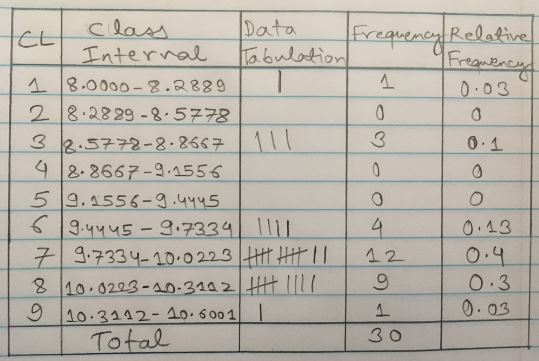

```{r setup, include=FALSE}
knitr::opts_chunk$set(echo = TRUE)
```

#Question 1 Grading Pattern
```
    Assignments - 4 (15%)
    Labs - 16 (10%)
    Project - 1 (10%)
    Clicker Quizzes (10%)
    Chapter Quizzes (5%)
    Midterm Exam - 2 (20%)
    Final Exam - 30%
    Grades - A - 90s B - 80s C - 70s & 60s D - 50s F - <50s
```
#Question 2
##Coplot
```{r}
getwd()
DDT = read.csv("DDT.csv", header=TRUE, sep=",")
head(DDT)
m=with(DDT, as.numeric(levels(factor(MILE))))
colm = c()
for (i in 1:length(DDT$MILE)) {
colm[i]=which(DDT$MILE[i]==m)
}
coplot(LENGTH~WEIGHT|RIVER*SPECIES,data=DDT,col=colm)
```

##Interpret lower left three
```
we are able to get the information about LENGTH vs WEIGHT while we compare the CCATFISH(SPECIES) with the RIVERS(FCM,LCM and SCM).
```

##Line A
```{r line A}
m=with(DDT, as.numeric(levels(factor(MILE))))
m
```

```
Line A is creating vector with distinct values of MILE without repetition in ascending order.
```

##Line B
```
which gets the index of the element and sorts it into it's specific column it goes in.
```

##Mean of the value
```{r}
ddt = read.csv("DDT.csv", header=TRUE, sep=",")
m=ddt[ddt$RIVER=="FCM" & ddt$SPECIES=="CCATFISH",]
m
mean(m$DDT)
```
```
The mean of DDT for CCATFISH found in FCM river is `r mean(m$DDT)`
```

#Question 3 MS1.14 Pg:8
```
a. Length of maximum span (feet) : Quantitative
b. Number of vehicle lanes : Quantitative
c. Toll bridge (yes or no) : Qualitative
d. Average daily traffic : Quantitative
e. Condition of deck (good, fair, or poor) : Qualitative
f. Bypass or detour length (miles) : Quantitative
g. Route type (interstate, U.S., state, county, or city) : Qualitative
```

#Question 4
##Four Random Sampling Designs
```
Simple random sample
Stratified random sampling
Cluster sampling
Systematic sampling
```
##Brief Description


**Simple random sample**: n experimental units is a sample selected from the population in such a way that every different sample of size n has an equal chance of selection. 

**Stratified random sampling:** typically used when the experimental units associated with the population can be separated into two or more groups of units, called strata, where the characteristics of the experimental units are more similar within strata then across strata.

**Cluster sampling**: sample natural groupings (clusters) of experimental units first,
then collect data from all experimental units within each cluster.

**Systematic sampling**: involves systematically selecting every kth experimental
unit from a list of all experimental units.

#Question 5
##Omit NA's
```{r}
mtbe=read.csv("MTBE.csv")
head(mtbe) # First six lines
dim(mtbe) # rows and columns
ind=sample(1:223,5,replace=FALSE) # random indices
mtbe[ind,]

mtbeo=na.omit(mtbe)
head(mtbeo)
```

##SD of Aquifier='Bedrock'
```{r}
depth=mtbeo[mtbeo$Aquifier=="Bedrock",]$Depth
sd(depth)
```


#Question 6
##Plot of sample
```{r}
eq=read.csv("EARTHQUAKE.csv")
head(eq) # First six lines
dim(eq) # rows and columns
ind=sample(1:2500,30,replace=FALSE) # random indices
eq[ind,]

plot(ts(eq$MAG))
```

##Median of Magnitude
```{r}
median(eq$MAGNITUDE)
```


#Question 7

__(a).__ Data selection method: stratified sample method.

__(b).__ population: fish in the Tennessee River and tributaries.

__(c).__ Qualitative variables in DDT are: Location of capture and species(Flint Creek, Limestone Creek, Spring Creek, channel catfish, largemouth bass, smallmouth buffalo fish)


#Question 8
##Textbook Questions

__(a).__ Type of graph: BAR PLOT


__(b).__ Types of ROBOTIC LIMBS is the variable measured for each of 106 robot designs.


__(c).__ LEGS ONLY is the currently the most used social robot design.


__(d).__ Relative frequencies for each categories:


>
  1. None = 15/106 = 0.1415
  2. Both = 8/106 = 0.0754
  3. Legs ONLY = 63/106 = 0.5943 
  4. Wheels ONLY = 20/106 = 0.2359

##Pareto Graph
```{r}
pareto<-function(x,mn="Pareto barplot",...){  # x is a vector
  x.tab=table(x)
  xx.tab=sort(x.tab, decreasing=TRUE,index.return=FALSE)
  cumsum(as.vector(xx.tab))->cs
  length(x.tab)->lenx
  bp<-barplot(xx.tab,ylim=c(0,max(cs)),las=2)
  lb<-seq(0,cs[lenx],l=11)
  axis(side=4,at=lb,labels=paste(seq(0,100,length=11),"%",sep=""),las=1,line=-1,col="Blue",col.axis="Red")
  for(i in 1:(lenx-1)){
    segments(bp[i],cs[i],bp[i+1],cs[i+1],col=i,lwd=2)
  }
  title(main=mn,...)
  
}
freq=c(15,8,63,20)
RL=c("None", "Both", "LegsOnly", "WheelsOnly")
l=rep(RL, freq)
pareto(l)
```

#Question 9
##Pie Chart
```{r}
office=12
windows=32
explorer=6
pieData <- c(office,windows,explorer)
pie(pieData, col=2:4, main="Microsoft Products with Security Issues", labels=c("Office", "Windows", "Explorer"))
```

##Pareto Diagram
```{r}
freq=c(6,8,22,3,11)
Names=c("Denial of Service","Information Disclosure","Remote Code Execution","Spoofing","Privilege Elevation")
n=rep(Names,freq)
pareto(n, mn="Security Bulletins")
```


#Question 10
```{r}
swd=read.csv("SWDEFECTS.csv")
head(swd) 
library(plotrix) 
tab=table(swd$defect) 
rtab=tab/sum(tab) 
round(rtab,2) 
pie3D(rtab,labels=list("OK","Defective"),main="pie plot of SWD")
```

#Question 11

{ width=80% }

##1Frequency Histogram
```{r}
voltage.df=read.csv("VOLTAGE.csv")
new<-subset(voltage.df,subset=LOCATION=="OLD") 
new$VOLTAGE->vtn 
lept<-min(vtn)-0.05 
rept<-max(vtn)+0.05 
rnge<-rept-lept 
inc<-rnge/9 
seq(lept, rept,by=inc)->cl 
cvtn<-cut(vtn,breaks=cl)
new.tab1=table(cvtn)
barplot(new.tab1,space=0,main="Frequency Histogram(OLD)",las=2) 
```


##2
```{r}
vol=read.csv("VOLTAGE.csv")
ovol=with(vol,vol[LOCATION=="OLD",])
v=ovol$VOLTAGE
stem(v)
```

##3
```{r}
voltage.df=read.csv("VOLTAGE.csv")
new<-subset(voltage.df,subset=LOCATION=="NEW") 
new$VOLTAGE->vtn 
lept<-min(vtn)-0.05 
rept<-max(vtn)+0.05 
rnge<-rept-lept 
inc<-rnge/9 
seq(lept, rept,by=inc)->cl 
cvtn<-cut(vtn,breaks=cl) 
new.tab2=table(cvtn) 
barplot(new.tab2,space=0,main="Frequency Histogram(NEW)",las=2) 
```

##4
```{r}
layout(matrix(1:2, nr=1,nc=2))
barplot(new.tab1,space=0,main="Frequency Histogram(OLD)",las=2) 
barplot(new.tab2,space=0,main="Frequency Histogram(NEW)",las=2) 
```

##5 Old Data & New Data
**Old Data**
```{r}
ovol=with(voltage.df,voltage.df[LOCATION=="OLD",])
oldv=ovol$VOLTAGE
mean(oldv)
median(oldv)
getmode <- function(v) {
   uniqv <- unique(v)
   uniqv[which.max(tabulate(match(v, uniqv)))]
}
getmode(oldv)
```

**New Data**
```{r}
ovol=with(voltage.df,voltage.df[LOCATION=="NEW",])
newv=ovol$VOLTAGE
mean(newv)
median(newv)
getmode <- function(v) {
   uniqv <- unique(v)
   uniqv[which.max(tabulate(match(v, uniqv)))]
}
getmode(newv)
```

##6
```{r}
zscore=(10.50-mean(oldv))/sd(oldv)
zscore
```

##7
```{r}
newzscore=(10.50-mean(newv))/sd(newv)
newzscore
```

##8

The new location because the z-score is farther away from the mean, encompassing more data.

##9
```{r}
with(voltage.df,boxplot(oldv,ylab="OLD",col="Blue",notch=TRUE))
```

There are 4 outliers

##10
```{r}
z=scale(oldv)
#Possibe outliers
oldv[abs(z)>=2 & abs(z)<=3]

#Outliers
oldv[abs(z)> 3]
```

##11
```{r}
with(voltage.df,boxplot(newv,ylab="NEW",col="Red",notch=TRUE))
```

There are no outliers here.

##12
```{r}
z=scale(newv)
#Possibe outliers
newv[abs(z)>=2 & abs(z)<=3]

#Outliers
newv[abs(z)> 3]
```

##13
```{r}
layout(matrix(1:2, nr=1,nc=2))
boxplot(oldv,col="Blue",main="Old Location",ylab="Volts", notch=TRUE)
boxplot(newv,col="RED",main="New Location",ylab="Volts", notch=TRUE)
```

##14

In old location, we have a very narrow distribution and contain outliers. New Location has a broader disribution and contains no outliers. Median voltage is more at the old location than new location.


#Question 12
```{r}
rpipe=read.csv("ROUGHPIPE.csv")
head(rpipe)

m <- mean(rpipe$ROUGH)
m
sd <- sd(rpipe$ROUGH)
sd
n <- length(rpipe$ROUGH)
n
error <- qnorm(0.95)*sd/sqrt(n)
error
left <- m-error
right <- m+error
left
right
```

The interval which contains 95% of all the coated pipe roughness is (`r left`,`r right`)

#Question 13
```{r}
gobi=read.csv("GOBIANTS.csv")
head(gobi)

mean(gobi$AntSpecies)
median(gobi$AntSpecies)
getmode <- function(v) {
   uniqv <- unique(v)
   uniqv[which.max(tabulate(match(v, uniqv)))]
}
getmode(gobi$AntSpecies)
```

The average number of species found per site is `r mean(gobi$AntSpecies)`.

The middle number of species found per site is `r median(gobi$AntSpecies)`.

The mode is `r getmode(gobi$AntSpecies)`.

On Average, `r mean(gobi$AntSpecies)` species were attracted to the 11 study sites. The middle values from this observation was `r median(gobi$AntSpecies)` species. Finally, `r getmode(gobi$AntSpecies)` was the most occuring number of species.

##b

Median because median gives the middle number when the set of measurements are arranged in order.

##c DrySteppe
```{r}
ds=with(gobi,gobi[Region=="Dry Steppe ",])

drysteppe = ds$PlantCov
mean(drysteppe)
median(drysteppe)
getmode <- function(v) {
   uniqv <- unique(v)
   uniqv[which.max(tabulate(match(v, uniqv)))]
}
getmode(drysteppe)
```

##d Gobi Desert
```{r}
ds=with(gobi,gobi[Region=="Gobi Desert",])

plant = ds$PlantCov
mean(plant)
median(plant)
getmode <- function(v) {
   uniqv <- unique(v)
   uniqv[which.max(tabulate(match(v, uniqv)))]
}
getmode(plant)
```

##e
Yes, the total plant cover percentage is different for the two regions as the mean are different.


#Question 14
##a
```{r}
gxy=read.csv("GALAXY2.csv")
head(gxy)
hist(gxy$VELOCITY,col=1:7)
```

##b

There appears to be two modes in the graph. So there is evidence to support double cluster theory.


##c
```{r}
mean(gxy$VELOCITY)
sd(gxy$VELOCITY)

#For cluster 1
gxya=with(gxy,gxy[VELOCITY<21000,])
mean(gxya)
sd(gxya)

#For cluster 2
gxyb=with(gxy,gxy[VELOCITY>=21000,])
mean(gxyb)
sd(gxyb)
```

##d

This galaxy belongs to cluster A1775A as it is near to the mean of the cluster A1775A

#Question 15
```{r}
library(ggplot2)
p10 = qplot(RIVER,LENGTH,data=DDT,fill=SPECIES,geom="boxplot")
p10 + labs(title = "Prithviraj Kadiyala")
```


