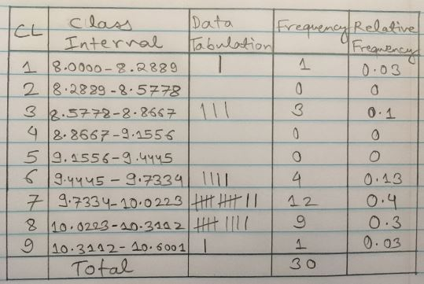

#Question 1 Grading Pattern
```
    Assignments - 4 (15%)
    Labs - 16 (10%)
    Project - 1 (10%)
    Clicker Quizzes (10%)
    Chapter Quizzes (5%)
    Midterm Exam - 2 (20%)
    Final Exam - 30%
    Grades - A - 90s B - 80s C - 70s & 60s D - 50s F - <50s
```
#Question 2
##Coplot

```r
getwd()
```

```
## [1] "C:/Users/prith/OneDrive/Documents/MATH4753_FA18/Assignment 1"
```

```r
DDT = read.csv("DDT.csv", header=TRUE, sep=",")
head(DDT)
```

```
##   RIVER MILE  SPECIES LENGTH WEIGHT DDT
## 1   FCM    5 CCATFISH   42.5    732  10
## 2   FCM    5 CCATFISH   44.0    795  16
## 3   FCM    5 CCATFISH   41.5    547  23
## 4   FCM    5 CCATFISH   39.0    465  21
## 5   FCM    5 CCATFISH   50.5   1252  50
## 6   FCM    5 CCATFISH   52.0   1255 150
```

```r
m=with(DDT, as.numeric(levels(factor(MILE))))
colm = c()
for (i in 1:length(DDT$MILE)) {
colm[i]=which(DDT$MILE[i]==m)
}
coplot(LENGTH~WEIGHT|RIVER*SPECIES,data=DDT,col=colm)
```

<!-- -->

##Interpret lower left three
```
we are able to get the information about LENGTH vs WEIGHT while we compare the CCATFISH(SPECIES) with the RIVERS(FCM,LCM and SCM).
```

##Line A

```r
m=with(DDT, as.numeric(levels(factor(MILE))))
m
```

```
##  [1]   1   3   5 275 280 285 290 295 300 305 310 315 320 325 330 340 345
```

```
Line A is creating vector with distinct values of MILE without repetition in ascending order.
```

##Line B
```
which gets the index of the element and sorts it into it's specific column it goes in.
```

##Mean of the value

```r
ddt = read.csv("DDT.csv", header=TRUE, sep=",")
m=ddt[ddt$RIVER=="FCM" & ddt$SPECIES=="CCATFISH",]
m
```

```
##   RIVER MILE  SPECIES LENGTH WEIGHT DDT
## 1   FCM    5 CCATFISH   42.5    732  10
## 2   FCM    5 CCATFISH   44.0    795  16
## 3   FCM    5 CCATFISH   41.5    547  23
## 4   FCM    5 CCATFISH   39.0    465  21
## 5   FCM    5 CCATFISH   50.5   1252  50
## 6   FCM    5 CCATFISH   52.0   1255 150
```

```r
mean(m$DDT)
```

```
## [1] 45
```
```
The mean of DDT for CCATFISH found in FCM river is 45
```

#Question 3 MS1.14 Pg:8
```
a. Length of maximum span (feet) : Quantitative
b. Number of vehicle lanes : Quantitative
c. Toll bridge (yes or no) : Qualitative
d. Average daily traffic : Quantitative
e. Condition of deck (good, fair, or poor) : Qualitative
f. Bypass or detour length (miles) : Quantitative
g. Route type (interstate, U.S., state, county, or city) : Qualitative
```

#Question 4
##Four Random Sampling Designs
```
Simple random sample
Stratified random sampling
Cluster sampling
Systematic sampling
```
##Brief Description


**Simple random sample**: n experimental units is a sample selected from the population in such a way that every different sample of size n has an equal chance of selection. 

**Stratified random sampling:** typically used when the experimental units associated with the population can be separated into two or more groups of units, called strata, where the characteristics of the experimental units are more similar within strata then across strata.

**Cluster sampling**: sample natural groupings (clusters) of experimental units first,
then collect data from all experimental units within each cluster.

**Systematic sampling**: involves systematically selecting every kth experimental
unit from a list of all experimental units.

#Question 5
##Omit NA's

```r
mtbe=read.csv("MTBE.csv")
head(mtbe) # First six lines
```

```
##     pH SpConduct DissOxy RoadsPct IndPct UrbanPct DevPct WellClass
## 1 7.87     290.0    0.58     1.34      0    17.77  17.77   Private
## 2 8.63     225.9    0.84     0.72      0    10.43  10.43   Private
## 3 7.11     157.4    8.37     1.92      0    29.62  50.01   Private
## 4 7.98     723.6    0.41     2.76      0    41.65  41.65   Private
## 5 7.88     148.7    1.44     3.51      0    51.21  51.21   Private
## 6 8.36     198.2    0.18     1.48      0    22.49  29.19   Private
##   Aquifier   Depth SafeYld Distance MTBE.Detect MTBE.Level HouseDen PopDen
## 1  Bedrock  60.960      NA  2386.29 Below Limit        0.2   131.16  43.19
## 2  Bedrock  36.576      NA  3667.69 Below Limit        0.2    47.69  24.52
## 3  Bedrock 152.400      NA  2324.15 Below Limit        0.2    85.16  33.32
## 4  Bedrock      NA      NA   788.88 Below Limit        0.2   134.77  46.61
## 5  Bedrock  91.440      NA  1337.88 Below Limit        0.2   198.54  78.58
## 6  Bedrock 115.824      NA  2396.74 Below Limit        0.2   206.73  59.47
```

```r
dim(mtbe) # rows and columns
```

```
## [1] 223  16
```

```r
ind=sample(1:223,5,replace=FALSE) # random indices
mtbe[ind,]
```

```
##       pH SpConduct DissOxy RoadsPct IndPct UrbanPct DevPct WellClass
## 146 7.44     144.0    0.39     2.95   0.00    40.82  43.10    Public
## 71  6.26    1130.0    6.99     4.20   1.37    47.01  47.01   Private
## 128 6.28     360.3    2.98     2.33   0.00    27.50  29.67    Public
## 80  7.13     536.6    0.40     4.80   2.15    56.99  56.99   Private
## 17  8.14     209.3    0.59     2.93   0.00    49.47  49.47   Private
##     Aquifier    Depth  SafeYld Distance MTBE.Detect MTBE.Level HouseDen
## 146  Bedrock 200.5584 105.9803   405.78      Detect       1.29   314.98
## 71   Bedrock 103.6320       NA  1579.30 Below Limit       0.20   431.12
## 128  Bedrock  77.7240 151.4005  1978.78      Detect       0.35   221.41
## 80   Bedrock  91.4400       NA  2407.70      Detect       1.60   215.44
## 17   Bedrock  92.9640       NA  2652.00 Below Limit       0.20   159.78
##     PopDen
## 146 224.98
## 71  130.34
## 128  92.23
## 80   77.05
## 17    0.00
```

```r
mtbeo=na.omit(mtbe)
head(mtbeo)
```

```
##       pH SpConduct DissOxy RoadsPct IndPct UrbanPct DevPct WellClass
## 104 7.43     663.2    0.56     2.26   0.00    27.42  27.42    Public
## 105 7.76     919.3    6.63    10.62  22.41    72.02  72.71    Public
## 106 7.01     409.9    5.94     1.58   0.84    20.88  20.88    Public
## 107 6.55     248.6    7.07     2.09   1.34    40.59  49.97    Public
## 108 7.91     223.0   10.60     4.10   6.54    43.08  43.08    Public
## 109 7.51     428.5    7.94     1.95   0.00    35.42  51.90    Public
##      Aquifier   Depth   SafeYld Distance MTBE.Detect MTBE.Level HouseDen
## 104 Unconsoli 15.2400 1514.0045  1142.56      Detect       0.25    17.71
## 105 Unconsoli 15.2400 1324.7540   274.61 Below Limit       0.20   132.22
## 106 Unconsoli 19.2024 1052.2332   775.40 Below Limit       0.20    92.24
## 107 Unconsoli 15.2400  946.2528   685.17 Below Limit       0.20   375.34
## 108 Unconsoli 14.6304  946.2528  3192.79 Below Limit       0.20    77.01
## 109 Unconsoli 24.9936  946.2528  2440.35      Detect       1.06   146.11
##     PopDen
## 104   7.38
## 105  46.20
## 106  33.89
## 107 114.84
## 108  34.23
## 109  52.56
```

##SD of Aquifier='Bedrock'

```r
depth=mtbeo[mtbeo$Aquifier=="Bedrock",]$Depth
sd(depth)
```

```
## [1] 56.45357
```


#Question 6
##Plot of sample

```r
eq=read.csv("EARTHQUAKE.csv")
head(eq) # First six lines
```

```
##   YEAR MONTH DAY HOUR MINUTE MAGNITUDE
## 1 1994     1  17   12     30       6.7
## 2 1994     1  17   12     31       5.5
## 3 1994     1  17   12     32       3.3
## 4 1994     1  17   12     34       4.2
## 5 1994     1  17   12     36       3.8
## 6 1994     1  17   12     37       3.7
```

```r
dim(eq) # rows and columns
```

```
## [1] 2929    6
```

```r
ind=sample(1:2500,30,replace=FALSE) # random indices
eq[ind,]
```

```
##      YEAR MONTH DAY HOUR MINUTE MAGNITUDE
## 1709 1994     1  25   16     23       0.2
## 1448 1994     1  24    3     44       1.9
## 1111 1994     1  22    9      3       3.1
## 2178 1994     1  28   22      2       1.9
## 594  1994     1  20    2     57       2.4
## 249  1994     1  18    9     41       3.7
## 1992 1994     1  27   11     45       1.8
## 883  1994     1  21    8     43       2.0
## 1368 1994     1  23   16     57       2.2
## 449  1994     1  19   13     14       1.9
## 972  1994     1  21   17     41       2.2
## 1623 1994     1  25    5     25       2.2
## 769  1994     1  20   20     45       2.7
## 2471 1994     2   1   22     37       1.6
## 2141 1994     1  28   15     59       1.2
## 1937 1994     1  27    2     44       1.3
## 1428 1994     1  24    1     39       1.7
## 808  1994     1  21    0     57       2.1
## 1809 1994     1  26    7     38       1.3
## 1729 1994     1  25   19     54       1.6
## 328  1994     1  18   18     35       3.4
## 1361 1994     1  23   15     59       3.2
## 2341 1994     1  31    9     35       2.6
## 2277 1994     1  29   15     24       2.0
## 1131 1994     1  22   12     15       1.7
## 1658 1994     1  25   10     21       3.2
## 1712 1994     1  25   17      3       1.6
## 470  1994     1  19   15     46       2.2
## 437  1994     1  19   11     29       2.1
## 966  1994     1  21   17     21       1.8
```

```r
plot(ts(eq$MAG))
```

<!-- -->

##Median of Magnitude

```r
median(eq$MAGNITUDE)
```

```
## [1] 2
```


#Question 7

__(a).__ Data selection method: stratified sample method.

__(b).__ population: fish in the Tennessee River and tributaries.

__(c).__ Qualitative variables in DDT are: Location of capture and species(Flint Creek, Limestone Creek, Spring Creek, channel catfish, largemouth bass, smallmouth buffalo fish)


#Question 8
##Textbook Questions

__(a).__ Type of graph: BAR PLOT


__(b).__ Types of ROBOTIC LIMBS is the variable measured for each of 106 robot designs.


__(c).__ LEGS ONLY is the currently the most used social robot design.


__(d).__ Relative frequencies for each categories:


>
  1. None = 15/106 = 0.1415
  2. Both = 8/106 = 0.0754
  3. Legs ONLY = 63/106 = 0.5943 
  4. Wheels ONLY = 20/106 = 0.2359

##Pareto Graph

```r
pareto<-function(x,mn="Pareto barplot",...){  # x is a vector
  x.tab=table(x)
  xx.tab=sort(x.tab, decreasing=TRUE,index.return=FALSE)
  cumsum(as.vector(xx.tab))->cs
  length(x.tab)->lenx
  bp<-barplot(xx.tab,ylim=c(0,max(cs)),las=2)
  lb<-seq(0,cs[lenx],l=11)
  axis(side=4,at=lb,labels=paste(seq(0,100,length=11),"%",sep=""),las=1,line=-1,col="Blue",col.axis="Red")
  for(i in 1:(lenx-1)){
    segments(bp[i],cs[i],bp[i+1],cs[i+1],col=i,lwd=2)
  }
  title(main=mn,...)
  
}
freq=c(15,8,63,20)
RL=c("None", "Both", "LegsOnly", "WheelsOnly")
l=rep(RL, freq)
pareto(l)
```

<!-- -->

#Question 9
##Pie Chart

```r
office=12
windows=32
explorer=6
pieData <- c(office,windows,explorer)
pie(pieData, col=2:4, main="Microsoft Products with Security Issues", labels=c("Office", "Windows", "Explorer"))
```

<!-- -->

##Pareto Diagram

```r
freq=c(6,8,22,3,11)
Names=c("Denial of Service","Information Disclosure","Remote Code Execution","Spoofing","Privilege Elevation")
n=rep(Names,freq)
pareto(n, mn="Security Bulletins")
```

<!-- -->


#Question 10

```r
swd=read.csv("SWDEFECTS.csv")
head(swd) 
```

```
##   Mloc Mvg Mevg Mivg   Hn  Hvol Hpgmlen Hdiff Hintell Heffort   Hb Htime
## 1  1.1 1.4  1.4  1.4  1.3   1.3    1.30  1.30    1.30       1 1.30     1
## 2  1.0 1.0  1.0  1.0  1.0   1.0    1.00  1.00    1.00       1 1.00     1
## 3 24.0 5.0  1.0  3.0 63.0 309.1    0.11  9.50   32.54    2937 0.10   163
## 4 20.0 4.0  4.0  2.0 47.0 215.5    0.06 16.00   13.47    3448 0.07   192
## 5 24.0 6.0  6.0  2.0 72.0 346.1    0.06 17.33   19.97    6000 0.12   333
## 6 24.0 6.0  6.0  2.0 72.0 346.1    0.06 17.33   19.97    6000 0.12   333
##   Hloc Hcomm Hblank loc.comm uniOp uniOpnd totOp totOpnd brnchcnt defect
## 1    2     2      2        2   1.2     1.2   1.2     1.2      1.4  FALSE
## 2    1     1      1        1   1.0     1.0   1.0     1.0      1.0   TRUE
## 3    1     0      6        0  15.0    15.0  44.0    19.0      9.0  FALSE
## 4    0     0      3        0  16.0     8.0  31.0    16.0      7.0  FALSE
## 5    0     0      3        0  16.0    12.0  46.0    26.0     11.0  FALSE
## 6    0     0      3        0  16.0    12.0  46.0    26.0     11.0  FALSE
##   predict.vg.10 predict.evg.14.5 predict.ivg.9.2 predict.loc.50
## 1            no               no              no             no
## 2            no               no              no             no
## 3            no               no              no             no
## 4            no               no              no             no
## 5            no               no              no             no
## 6            no               no              no             no
```

```r
library(plotrix) 
```

```
## Warning: package 'plotrix' was built under R version 3.4.4
```

```r
tab=table(swd$defect) 
rtab=tab/sum(tab) 
round(rtab,2) 
```

```
## 
## FALSE  TRUE 
##   0.9   0.1
```

```r
pie3D(rtab,labels=list("OK","Defective"),main="pie plot of SWD")
```

<!-- -->

#Question 11

{ width=80% }

##1Frequency Histogram

```r
voltage.df=read.csv("VOLTAGE.csv")
new<-subset(voltage.df,subset=LOCATION=="OLD") 
new$VOLTAGE->vtn 
lept<-min(vtn)-0.05 
rept<-max(vtn)+0.05 
rnge<-rept-lept 
inc<-rnge/9 
seq(lept, rept,by=inc)->cl 
cvtn<-cut(vtn,breaks=cl)
new.tab1=table(cvtn)
barplot(new.tab1,space=0,main="Frequency Histogram(OLD)",las=2) 
```

<!-- -->


##2

```r
vol=read.csv("VOLTAGE.csv")
ovol=with(vol,vol[LOCATION=="OLD",])
v=ovol$VOLTAGE
stem(v)
```

```
## 
##   The decimal point is at the |
## 
##    8 | 1
##    8 | 778
##    9 | 
##    9 | 677888899
##   10 | 0000000011122333
##   10 | 6
```

##3

```r
voltage.df=read.csv("VOLTAGE.csv")
new<-subset(voltage.df,subset=LOCATION=="NEW") 
new$VOLTAGE->vtn 
lept<-min(vtn)-0.05 
rept<-max(vtn)+0.05 
rnge<-rept-lept 
inc<-rnge/9 
seq(lept, rept,by=inc)->cl 
cvtn<-cut(vtn,breaks=cl) 
new.tab2=table(cvtn) 
barplot(new.tab2,space=0,main="Frequency Histogram(NEW)",las=2) 
```

<!-- -->

##4

```r
layout(matrix(1:2, nr=1,nc=2))
barplot(new.tab1,space=0,main="Frequency Histogram(OLD)",las=2) 
barplot(new.tab2,space=0,main="Frequency Histogram(NEW)",las=2) 
```

<!-- -->

##5 Old Data & New Data
**Old Data**

```r
ovol=with(voltage.df,voltage.df[LOCATION=="OLD",])
oldv=ovol$VOLTAGE
mean(oldv)
```

```
## [1] 9.803667
```

```r
median(oldv)
```

```
## [1] 9.975
```

```r
getmode <- function(v) {
   uniqv <- unique(v)
   uniqv[which.max(tabulate(match(v, uniqv)))]
}
getmode(oldv)
```

```
## [1] 9.98
```

**New Data**

```r
ovol=with(voltage.df,voltage.df[LOCATION=="NEW",])
newv=ovol$VOLTAGE
mean(newv)
```

```
## [1] 9.422333
```

```r
median(newv)
```

```
## [1] 9.455
```

```r
getmode <- function(v) {
   uniqv <- unique(v)
   uniqv[which.max(tabulate(match(v, uniqv)))]
}
getmode(newv)
```

```
## [1] 8.82
```

##6

```r
zscore=(10.50-mean(oldv))/sd(oldv)
zscore
```

```
## [1] 1.287324
```

##7

```r
newzscore=(10.50-mean(newv))/sd(newv)
newzscore
```

```
## [1] 2.25041
```

##8

The new location because the z-score is farther away from the mean, encompassing more data.

##9

```r
with(voltage.df,boxplot(oldv,ylab="OLD",col="Blue",notch=TRUE))
```

<!-- -->

There are 4 outliers

##10

```r
z=scale(oldv)
#Possibe outliers
oldv[abs(z)>=2 & abs(z)<=3]
```

```
## [1] 8.72 8.72
```

```r
#Outliers
oldv[abs(z)> 3]
```

```
## [1] 8.05
```

##11

```r
with(voltage.df,boxplot(newv,ylab="NEW",col="Red",notch=TRUE))
```

<!-- -->

There are no outliers here.

##12

```r
z=scale(newv)
#Possibe outliers
newv[abs(z)>=2 & abs(z)<=3]
```

```
## numeric(0)
```

```r
#Outliers
newv[abs(z)> 3]
```

```
## numeric(0)
```

##13

```r
layout(matrix(1:2, nr=1,nc=2))
boxplot(oldv,col="Blue",main="Old Location",ylab="Volts", notch=TRUE)
boxplot(newv,col="RED",main="New Location",ylab="Volts", notch=TRUE)
```

<!-- -->

##14

In old location, we have a very narrow distribution and contain outliers. New Location has a broader disribution and contains no outliers. Median voltage is more at the old location than new location.


#Question 12

```r
rpipe=read.csv("ROUGHPIPE.csv")
head(rpipe)
```

```
##   ROUGH
## 1  1.72
## 2  2.57
## 3  2.50
## 4  2.64
## 5  2.16
## 6  1.26
```

```r
m <- mean(rpipe$ROUGH)
m
```

```
## [1] 1.881
```

```r
sd <- sd(rpipe$ROUGH)
sd
```

```
## [1] 0.5239114
```

```r
n <- length(rpipe$ROUGH)
n
```

```
## [1] 20
```

```r
error <- qnorm(0.95)*sd/sqrt(n)
error
```

```
## [1] 0.1926949
```

```r
left <- m-error
right <- m+error
left
```

```
## [1] 1.688305
```

```r
right
```

```
## [1] 2.073695
```

The interval which contains 95% of all the coated pipe roughness is (1.6883051,2.0736949)

#Question 13

```r
gobi=read.csv("GOBIANTS.csv")
head(gobi)
```

```
##   Site      Region Rain Temp PlantCov AntSpecies Diversity
## 1    1 Dry Steppe   196  5.7       40          3      0.89
## 2    2 Dry Steppe   196  5.7       52          3      0.83
## 3    3 Dry Steppe   179  7.0       40         52      1.31
## 4    4 Dry Steppe   197  8.0       43          7      1.48
## 5    5 Dry Steppe   149  8.5       27          5      0.97
## 6    6 Gobi Desert  112 10.7       30         49      0.46
```

```r
mean(gobi$AntSpecies)
```

```
## [1] 12.81818
```

```r
median(gobi$AntSpecies)
```

```
## [1] 5
```

```r
getmode <- function(v) {
   uniqv <- unique(v)
   uniqv[which.max(tabulate(match(v, uniqv)))]
}
getmode(gobi$AntSpecies)
```

```
## [1] 5
```

The average number of species found per site is 12.8181818.

The middle number of species found per site is 5.

The mode is 5.

On Average, 12.8181818 species were attracted to the 11 study sites. The middle values from this observation was 5 species. Finally, 5 was the most occuring number of species.

##b

Median because median gives the middle number when the set of measurements are arranged in order.

##c DrySteppe

```r
ds=with(gobi,gobi[Region=="Dry Steppe ",])

drysteppe = ds$PlantCov
mean(drysteppe)
```

```
## [1] 40.4
```

```r
median(drysteppe)
```

```
## [1] 40
```

```r
getmode <- function(v) {
   uniqv <- unique(v)
   uniqv[which.max(tabulate(match(v, uniqv)))]
}
getmode(drysteppe)
```

```
## [1] 40
```

##d Gobi Desert

```r
ds=with(gobi,gobi[Region=="Gobi Desert",])

plant = ds$PlantCov
mean(plant)
```

```
## [1] 28
```

```r
median(plant)
```

```
## [1] 26
```

```r
getmode <- function(v) {
   uniqv <- unique(v)
   uniqv[which.max(tabulate(match(v, uniqv)))]
}
getmode(plant)
```

```
## [1] 30
```

##e
Yes, the total plant cover percentage is different for the two regions as the mean are different.


#Question 14
##a

```r
gxy=read.csv("GALAXY2.csv")
head(gxy)
```

```
##   VELOCITY
## 1    22922
## 2    20210
## 3    21911
## 4    19225
## 5    18792
## 6    21993
```

```r
hist(gxy$VELOCITY,col=1:7)
```

<!-- -->

##b

There appears to be two modes in the graph. So there is evidence to support double cluster theory.


##c

```r
mean(gxy$VELOCITY)
```

```
## [1] 21448.25
```

```r
sd(gxy$VELOCITY)
```

```
## [1] 1764.103
```

```r
#For cluster 1
gxya=with(gxy,gxy[VELOCITY<21000,])
mean(gxya)
```

```
## [1] 19462.24
```

```r
sd(gxya)
```

```
## [1] 532.2868
```

```r
#For cluster 2
gxyb=with(gxy,gxy[VELOCITY>=21000,])
mean(gxyb)
```

```
## [1] 22838.47
```

```r
sd(gxyb)
```

```
## [1] 560.9767
```

##d

This galaxy belongs to cluster A1775A as it is near to the mean of the cluster A1775A

#Question 15

```r
library(ggplot2)
```

```
## Warning: package 'ggplot2' was built under R version 3.4.4
```

```r
p10 = qplot(RIVER,LENGTH,data=DDT,fill=SPECIES,geom="boxplot")
p10 + labs(title = "Prithviraj Kadiyala")
```

<!-- -->


