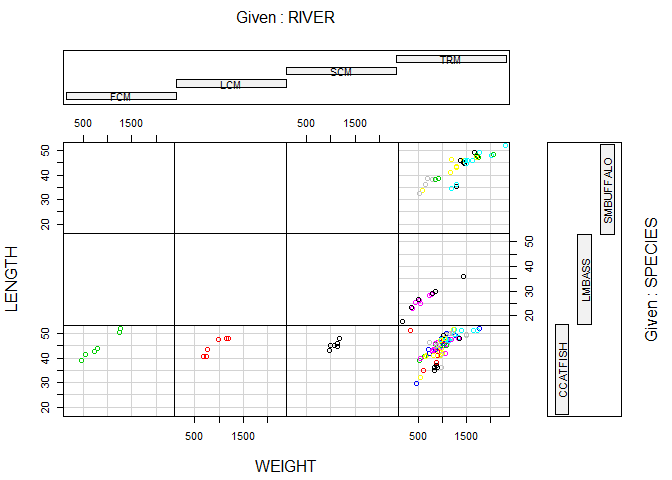

#Question 1 Grading Pattern
```
    Assignments - 4 (15%)
    Labs - 16 (10%)
    Project - 1 (10%)
    Clicker Quizzes (10%)
    Chapter Quizzes (5%)
    Midterm Exam - 2 (20%)
    Final Exam - 30%
    Grades - A - 90s B - 80s C - 70s & 60s D - 50s F - <50s
```
#Question 2
##Coplot

```r
getwd()
```

```
## [1] "C:/Users/prith/OneDrive/Documents/MATH4753_FA18/Assignment 1"
```

```r
DDT = read.csv("DDT.csv", header=TRUE, sep=",")
head(DDT)
```

```
##   RIVER MILE  SPECIES LENGTH WEIGHT DDT
## 1   FCM    5 CCATFISH   42.5    732  10
## 2   FCM    5 CCATFISH   44.0    795  16
## 3   FCM    5 CCATFISH   41.5    547  23
## 4   FCM    5 CCATFISH   39.0    465  21
## 5   FCM    5 CCATFISH   50.5   1252  50
## 6   FCM    5 CCATFISH   52.0   1255 150
```

```r
m=with(DDT, as.numeric(levels(factor(MILE))))
colm = c()
for (i in 1:length(DDT$MILE)) {
colm[i]=which(DDT$MILE[i]==m)
}
coplot(LENGTH~WEIGHT|RIVER*SPECIES,data=DDT,col=colm)
```

<!-- -->

##Interpret lower left three
```
we are able to get the information about LENGTH vs WEIGHT while we compare the CCATFISH(SPECIES) with the RIVERS(FCM,LCM and SCM).
```

##Line A

```r
m=with(DDT, as.numeric(levels(factor(MILE))))
m
```

```
##  [1]   1   3   5 275 280 285 290 295 300 305 310 315 320 325 330 340 345
```

```
Line A is creating vector with distinct values of MILE without repetition in ascending order.
```

##Line B
```
which gets the index of the element and sorts it into it's specific column it goes in.
```

##Mean of the value

```r
ddt = read.csv("DDT.csv", header=TRUE, sep=",")
m=ddt[ddt$RIVER=="FCM" & ddt$SPECIES=="CCATFISH",]
m
```

```
##   RIVER MILE  SPECIES LENGTH WEIGHT DDT
## 1   FCM    5 CCATFISH   42.5    732  10
## 2   FCM    5 CCATFISH   44.0    795  16
## 3   FCM    5 CCATFISH   41.5    547  23
## 4   FCM    5 CCATFISH   39.0    465  21
## 5   FCM    5 CCATFISH   50.5   1252  50
## 6   FCM    5 CCATFISH   52.0   1255 150
```

```r
mean(m$DDT)
```

```
## [1] 45
```
```
The mean of DDT for CCATFISH found in FCM river is 45
```

#Question 3 MS1.14 Pg:8
```
a. Length of maximum span (feet) : Quantitative
b. Number of vehicle lanes : Quantitative
c. Toll bridge (yes or no) : Qualitative
d. Average daily traffic : Quantitative
e. Condition of deck (good, fair, or poor) : Qualitative
f. Bypass or detour length (miles) : Quantitative
g. Route type (interstate, U.S., state, county, or city) : Qualitative
```

#Question 4
##Four Random Sampling Designs
```
Simple random sample
Stratified random sampling
Cluster sampling
Systematic sampling
```
##Brief Description


**Simple random sample**: n experimental units is a sample selected from the population in such a way that every different sample of size n has an equal chance of selection. 

**Stratified random sampling:** typically used when the experimental units associated with the population can be separated into two or more groups of units, called strata, where the characteristics of the experimental units are more similar within strata then across strata.

**Cluster sampling**: sample natural groupings (clusters) of experimental units first,
then collect data from all experimental units within each cluster.

**Systematic sampling**: involves systematically selecting every kth experimental
unit from a list of all experimental units.

#Question 5
##Omit NA's

```r
mtbe=read.csv("MTBE.csv")
head(mtbe) # First six lines
```

```
##     pH SpConduct DissOxy RoadsPct IndPct UrbanPct DevPct WellClass
## 1 7.87     290.0    0.58     1.34      0    17.77  17.77   Private
## 2 8.63     225.9    0.84     0.72      0    10.43  10.43   Private
## 3 7.11     157.4    8.37     1.92      0    29.62  50.01   Private
## 4 7.98     723.6    0.41     2.76      0    41.65  41.65   Private
## 5 7.88     148.7    1.44     3.51      0    51.21  51.21   Private
## 6 8.36     198.2    0.18     1.48      0    22.49  29.19   Private
##   Aquifier   Depth SafeYld Distance MTBE.Detect MTBE.Level HouseDen PopDen
## 1  Bedrock  60.960      NA  2386.29 Below Limit        0.2   131.16  43.19
## 2  Bedrock  36.576      NA  3667.69 Below Limit        0.2    47.69  24.52
## 3  Bedrock 152.400      NA  2324.15 Below Limit        0.2    85.16  33.32
## 4  Bedrock      NA      NA   788.88 Below Limit        0.2   134.77  46.61
## 5  Bedrock  91.440      NA  1337.88 Below Limit        0.2   198.54  78.58
## 6  Bedrock 115.824      NA  2396.74 Below Limit        0.2   206.73  59.47
```

```r
dim(mtbe) # rows and columns
```

```
## [1] 223  16
```

```r
ind=sample(1:223,5,replace=FALSE) # random indices
mtbe[ind,]
```

```
##       pH SpConduct DissOxy RoadsPct IndPct UrbanPct DevPct WellClass
## 9   7.55    1077.0    3.93     1.50   0.00    16.79  16.79   Private
## 207 7.62     579.6    2.57     2.50   0.00    25.85  32.34    Public
## 222 7.75     863.7    0.50     3.17  14.92    41.62  47.58    Public
## 71  6.26    1130.0    6.99     4.20   1.37    47.01  47.01   Private
## 218 7.69     400.8    1.48     2.52  17.61    23.11  24.88    Public
##     Aquifier   Depth SafeYld Distance MTBE.Detect MTBE.Level HouseDen
## 9    Bedrock      NA      NA  1672.33      Detect       1.32    86.89
## 207  Bedrock  45.720      NA  1307.40      Detect       0.37   136.41
## 222  Bedrock  45.720      NA  1358.67 Below Limit       0.20   216.79
## 71   Bedrock 103.632      NA  1579.30 Below Limit       0.20   431.12
## 218  Bedrock      NA      NA   418.25 Below Limit       0.20   183.11
##     PopDen
## 9    26.61
## 207   0.00
## 222  64.02
## 71  130.34
## 218  58.01
```

```r
mtbeo=na.omit(mtbe)
head(mtbeo)
```

```
##       pH SpConduct DissOxy RoadsPct IndPct UrbanPct DevPct WellClass
## 104 7.43     663.2    0.56     2.26   0.00    27.42  27.42    Public
## 105 7.76     919.3    6.63    10.62  22.41    72.02  72.71    Public
## 106 7.01     409.9    5.94     1.58   0.84    20.88  20.88    Public
## 107 6.55     248.6    7.07     2.09   1.34    40.59  49.97    Public
## 108 7.91     223.0   10.60     4.10   6.54    43.08  43.08    Public
## 109 7.51     428.5    7.94     1.95   0.00    35.42  51.90    Public
##      Aquifier   Depth   SafeYld Distance MTBE.Detect MTBE.Level HouseDen
## 104 Unconsoli 15.2400 1514.0045  1142.56      Detect       0.25    17.71
## 105 Unconsoli 15.2400 1324.7540   274.61 Below Limit       0.20   132.22
## 106 Unconsoli 19.2024 1052.2332   775.40 Below Limit       0.20    92.24
## 107 Unconsoli 15.2400  946.2528   685.17 Below Limit       0.20   375.34
## 108 Unconsoli 14.6304  946.2528  3192.79 Below Limit       0.20    77.01
## 109 Unconsoli 24.9936  946.2528  2440.35      Detect       1.06   146.11
##     PopDen
## 104   7.38
## 105  46.20
## 106  33.89
## 107 114.84
## 108  34.23
## 109  52.56
```

##SD of Aquifier='Bedrock'

```r
depth=mtbeo[mtbeo$Aquifier=="Bedrock",]$Depth
sd(depth)
```

```
## [1] 56.45357
```


#Question 6
##Plot of sample

```r
eq=read.csv("EARTHQUAKE.csv")
head(eq) # First six lines
```

```
##   YEAR MONTH DAY HOUR MINUTE MAGNITUDE
## 1 1994     1  17   12     30       6.7
## 2 1994     1  17   12     31       5.5
## 3 1994     1  17   12     32       3.3
## 4 1994     1  17   12     34       4.2
## 5 1994     1  17   12     36       3.8
## 6 1994     1  17   12     37       3.7
```

```r
dim(eq) # rows and columns
```

```
## [1] 2929    6
```

```r
ind=sample(1:2500,30,replace=FALSE) # random indices
eq[ind,]
```

```
##      YEAR MONTH DAY HOUR MINUTE MAGNITUDE
## 1089 1994     1  22    6     41       1.9
## 1400 1994     1  23   21     42       1.7
## 816  1994     1  21    1     38       2.1
## 2363 1994     1  29   14      2       1.7
## 1531 1994     1  24   14     59       2.0
## 2411 1994     2   1    7     13       1.5
## 343  1994     1  18   21     14       3.1
## 212  1994     1  18    2     26       2.9
## 1027 1994     1  21   22     31       1.8
## 593  1994     1  20    2     45       2.6
## 585  1994     1  20    2     22       2.9
## 5    1994     1  17   12     36       3.8
## 650  1994     1  20    8     41       2.2
## 1180 1994     1  22   16     46       2.5
## 460  1994     1  19   14     44       2.2
## 1155 1994     1  22   14     40       1.6
## 1070 1994     1  22    3     49       1.9
## 1238 1994     1  22   22     53       1.8
## 2462 1994     2   1   20     29       2.0
## 438  1994     1  19   11     32       2.3
## 1648 1994     1  25    9     13       1.6
## 80   1994     1  17   15     24       3.5
## 251  1994     1  18    9     47       2.7
## 277  1994     1  18   13     33       3.1
## 2143 1994     1  28   16     24       1.6
## 380  1994     1  19    3     31       2.8
## 1403 1994     1  23   21     58       1.9
## 339  1994     1  18   20     37       2.6
## 1387 1994     1  23   19     16       1.7
## 2394 1994     2   1    2     13       1.8
```

```r
plot(ts(eq$MAG))
```

<!-- -->

##Median of Magnitude

```r
median(eq$MAGNITUDE)
```

```
## [1] 2
```


#Question 7

__(a).__ Data selection method: stratified sample method.

__(b).__ population: fish in the Tennessee River and tributaries.

__(c).__ Qualitative variables in DDT are: Location of capture and species(Flint Creek, Limestone Creek, Spring Creek, channel catfish, largemouth bass, smallmouth buffalo fish)


#Question 8
##Textbook Questions

__(a).__ Type of graph: BAR PLOT


__(b).__ Types of ROBOTIC LIMBS is the variable measured for each of 106 robot designs.


__(c).__ LEGS ONLY is the currently the most used social robot design.


__(d).__ Relative frequencies for each categories:


>
  1. None = 15/106 = 0.1415
  2. Both = 8/106 = 0.0754
  3. Legs ONLY = 63/106 = 0.5943 
  4. Wheels ONLY = 20/106 = 0.2359

##Pareto Graph

```r
pareto<-function(x,mn="Pareto barplot",...){  # x is a vector
  x.tab=table(x)
  xx.tab=sort(x.tab, decreasing=TRUE,index.return=FALSE)
  cumsum(as.vector(xx.tab))->cs
  length(x.tab)->lenx
  bp<-barplot(xx.tab,ylim=c(0,max(cs)),las=2)
  lb<-seq(0,cs[lenx],l=11)
  axis(side=4,at=lb,labels=paste(seq(0,100,length=11),"%",sep=""),las=1,line=-1,col="Blue",col.axis="Red")
  for(i in 1:(lenx-1)){
    segments(bp[i],cs[i],bp[i+1],cs[i+1],col=i,lwd=2)
  }
  title(main=mn,...)
  
}
freq=c(15,8,63,20)
RL=c("None", "Both", "LegsOnly", "WheelsOnly")
l=rep(RL, freq)
pareto(l)
```

<!-- -->

#Question 9
##Pie Chart

```r
office=12
windows=32
explorer=6
pieData <- c(office,windows,explorer)
pie(pieData, col=2:4, main="Microsoft Products with Security Issues", labels=c("Office", "Windows", "Explorer"))
```

<!-- -->

##Pareto Diagram

```r
freq=c(6,8,22,3,11)
Names=c("Denial of Service","Information Disclosure","Remote Code Execution","Spoofing","Privilege Elevation")
n=rep(Names,freq)
pareto(n, mn="Security Bulletins")
```

<!-- -->


