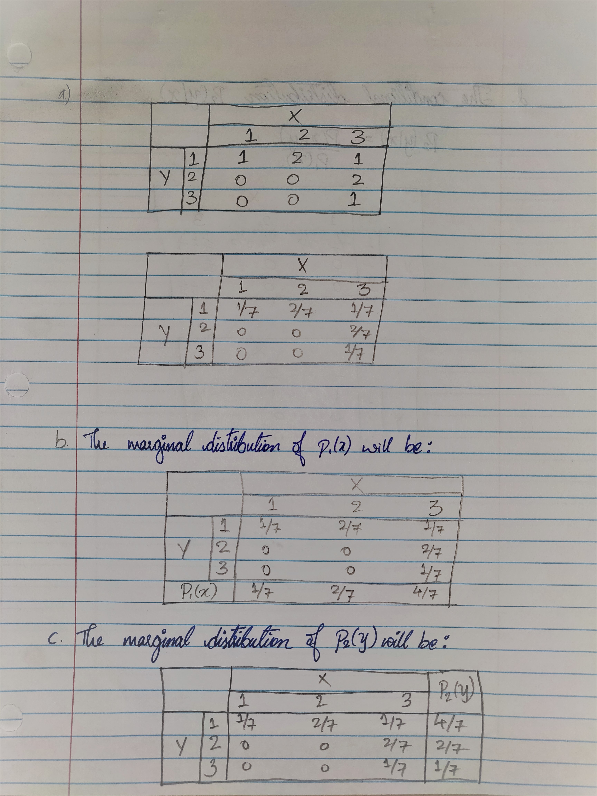

#Questions{16/16}

##Question 1
###a 

```r
pexp(120, 1/95, lower.tail = FALSE)
```

```
## [1] 0.2827597
```

###b

```r
PH = read.csv("PHISHING.csv")
hist(PH$INTTIME,main = "Phishing ")
```

<!-- -->

```r
hist(rexp(267, rate = 1/95))
```

<!-- -->

The two graphs are very similar to each other.

Yes, the data appears to follow an exponential distribution.

##Question 2
###a

```r
alpha=3
beta=0.07
mean1=alpha*beta
mean1
```

```
## [1] 0.21
```

```r
var1=alpha*beta^2
var1
```

```
## [1] 0.0147
```

###b

```r
alpha=3
beta=0.07
mean1=alpha*beta
var1=alpha*beta^2
lower=mean1-3*var1^0.5
upper=mean1+3*var1^0.5
paste("Interval is","(",lower,",",upper,")")
```

```
## [1] "Interval is ( -0.153730669589464 , 0.573730669589464 )"
```

##Question 3
###a

```r
alpha1=2
beta1=2
mean1=alpha1*beta1
var1=alpha1*beta1^2
mean1
```

```
## [1] 4
```

```r
var1
```

```
## [1] 8
```

```r
alpha2=1
beta2=4
mean2=alpha2*beta2
var2=alpha2*beta2^2
mean2
```

```
## [1] 4
```

```r
var2
```

```
## [1] 16
```

###b

```r
#Formula A
p1=pgamma(1,shape=2,scale = 2)
p1
```

```
## [1] 0.09020401
```

```r
#Formula B
p2=pgamma(1,shape=1,scale = 4)
p2
```

```
## [1] 0.2211992
```

Therefore, Formula B has higher probability of generating a human reaction in less than 1 minute. 

##Question 4
###a

```r
pweibull(2,shape = 4, scale = 2)
```

```
## [1] 0.6321206
```

### b

```r
alpha=2
beta=4
mean1=beta^(1/alpha)*gamma((alpha+1)/alpha)
var1=beta^(2/alpha)*(gamma((alpha+2)/alpha)- (gamma((alpha+1)/alpha))^2)
sd1=sqrt(var1)
mean1
```

```
## [1] 1.772454
```

```r
sd1
```

```
## [1] 0.9265028
```

### c

```r
alpha=2
beta=4
mean1=beta^(1/alpha)*gamma((alpha+1)/alpha)
var1=beta^(2/alpha)*(gamma((alpha+2)/alpha)- (gamma((alpha+1)/alpha))^2)
sd1=sqrt(var1)
lower=mean1-2*sd1
upper=mean1+2*sd1
paste("Interval is","(",lower,",",upper,")")
```

```
## [1] "Interval is ( -0.0805516497989005 , 3.62545935160993 )"
```

### d

```r
1-pweibull(6,shape = 4, scale = 2)
```

```
## [1] 0
```

No.

##Question 5
### a

```r
alpha=2
beta=9
mean1=alpha/(alpha+beta)
var1=(beta*alpha)/((alpha+beta)^2*(alpha+beta+1))
mean1
```

```
## [1] 0.1818182
```

```r
var1
```

```
## [1] 0.01239669
```
Mean = 0.18182
Variance = 0.01240

### b

```r
1-pbeta(0.4,shape1 = 2, shape2 = 9)
```

```
## [1] 0.0463574
```

### c

```r
pbeta(0.1,shape1 = 2, shape2 = 9)
```

```
## [1] 0.2639011
```

## Question 6

### a
```
alpha = 2
beta = 16
```


### b

```r
alpha=2
beta=16
mean=beta^(1/alpha)*gamma((alpha+1)/alpha)
var=beta^(2/alpha)*(gamma((alpha+2)/alpha)-(gamma((alpha+1)/alpha))^2)
mean
```

```
## [1] 3.544908
```

```r
var
```

```
## [1] 3.433629
```

### c

```r
1-pweibull(6,shape=2,scale=16^(1/2))
```

```
## [1] 0.1053992
```


##Question 7
###a
P(x,y)=$\frac{1}{36}$

###b
$$
P_1(x) = \frac{1}{6}\\
P_2(y) = \frac{1}{6}
$$

###c
$$
\begin{align}
P(x|y) &= \frac{p(x,y)}{p(y)}=\frac{\frac{1}{36}}{\frac{1}{6}}=\frac{1}{6}
\end{align}
$$

$$
\begin{align}
P(y|x) &= \frac{p(x,y)}{p(x)}=\frac{\frac{1}{36}}{\frac{1}{6}}=\frac{1}{6}
\end{align}
$$

###d
```
Since the conditional probabilities and the unconditional probabilities are equivalent, x and y don't affect each other.
```

##Question 8
###8a
{ width=50% }

###8b
{ width=50% }

##Question 9
###a
$$
f(x,y)=\frac{e^{-y/10}}{10y},\;0<y<x<2y
$$

For marginal density $f(y)$

$$
\begin{align}
f(y)&=\int^\infty_{-\infty}f(x,y)dx \\
&= \int^{2y}_y\left[\frac{e^{-y/10}}{10y}\right]dx \\
&=\left[\frac{1}{10}\frac{e^{-y/10}}{y}\biggr\rvert^{2y}_y\right] \\
&= \frac{1}{10}e^{-y/10}
\end{align}
$$

###b

to Find E(y)
$$
\begin{align}
E(y)&=\int_y y.f(y)dy\\
&=\int^\infty_0 \left[\frac{1}{10}e^{\frac{-y}{10}}\right]ydy\\
&=\left[\left[-(10+y)\right]\right]^\infty_0 \\
&= 10
\end{align}
$$

##Question 10
###10a


###10b


##Question 11
###11a


###11b


##Question 12


##Question 13


##Question 14
###a

```r
LEADCOPP=read.csv("LEADCOPP.csv")
LEAD = LEADCOPP$LEAD
COPPER = LEADCOPP$COPPER
layout(matrix(1:2,nr=1,nc=2,byrow=TRUE))
hist(LEAD,main = "LEAD",xlab = LEAD)
hist(COPPER,main = "COPPER",xlab = COPPER)
```

<!-- -->

```r
leadci = t.test(LEAD,conf.level = 0.99)
leadci$conf.int
```

```
## [1] -1.147845  6.919045
## attr(,"conf.level")
## [1] 0.99
```

###b

```r
copperci = t.test(COPPER,conf.level = 0.99)
copperci$conf.int
```

```
## [1] 0.1518726 0.6647274
## attr(,"conf.level")
## [1] 0.99
```

###c
```
We can see that the lead has 99% confidence interval between -1.1478452, 6.9190452 whereas copper has a 99% confidence interval between 0.1518726, 0.6647274 From this we can say lead has more distribution around its mean when compared to the copper.
```
###d
```
99% confident means that the sample which we have from the actual population, the sample which we have is 99% statistically true with the actual population mean. 99% confident says how good our interval is statistically close to the actual population.
```

##Question 15

```r
SR = read.csv("SOLARAD.csv") 
diff = SR$STJOS - SR$IOWA
hist(diff)
```

<!-- -->

```r
diffci = t.test(diff,conf.level = 0.95)
diffci$conf.int
```

```
## [1] 156.8193 239.1807
## attr(,"conf.level")
## [1] 0.95
```


```
So, our 95% difference confidence interval is 156.819259, 239.180741
```

##Question 16

```r
DZ = read.csv("DIAZINON.csv") 
res = DZ$DAY - DZ$NIGHT
dayci = t.test(DZ$DAY)
dayci$conf.int
```

```
## [1]  6.307442 20.565286
## attr(,"conf.level")
## [1] 0.95
```

```r
nightci = t.test(DZ$NIGHT)
nightci$conf.int
```

```
## [1] 27.49267 77.19824
## attr(,"conf.level")
## [1] 0.95
```

```r
resci = t.test(res,conf.level = 0.90)
resci$conf.int
```

```
## [1] -58.89917 -18.91901
## attr(,"conf.level")
## [1] 0.9
```

```
From the above CI intervals of day and night we can see the Diazinon residue CI are not intersecting and are to different sets of intervals without intersection. So, we can say they differ with each other.
```


