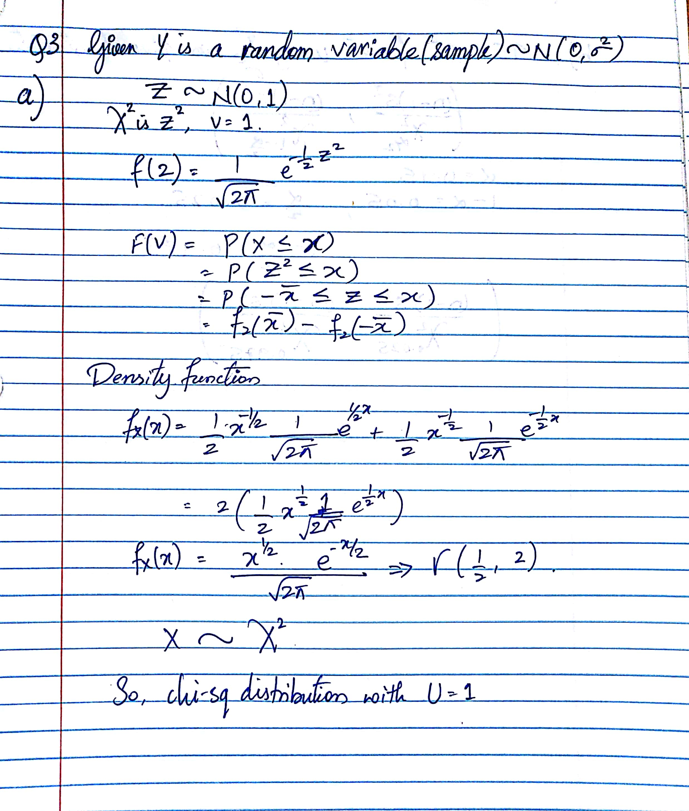
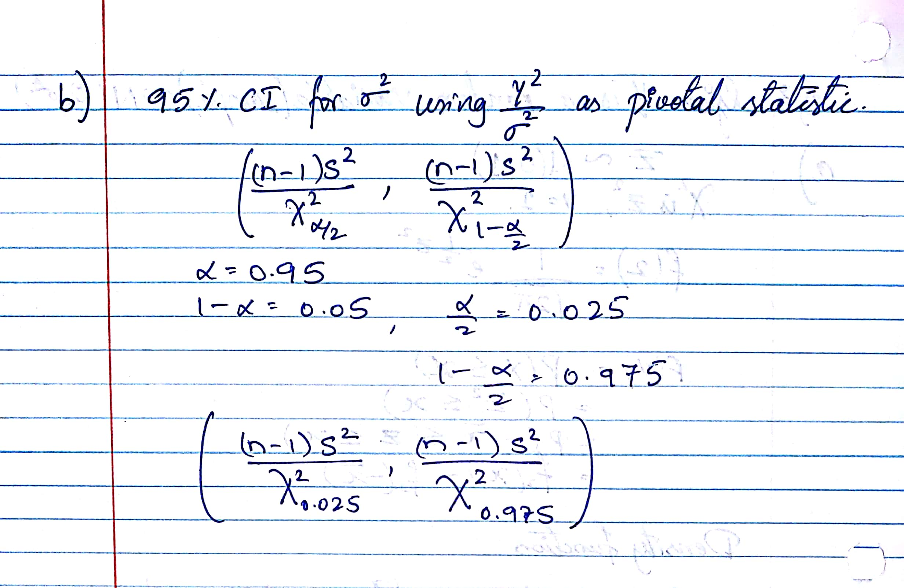
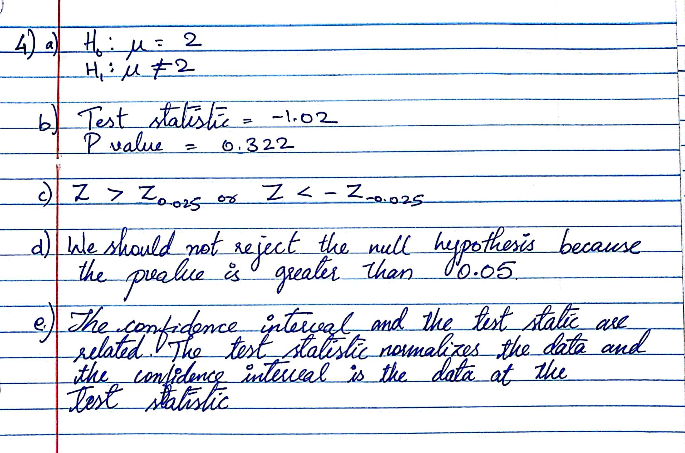

```{r setup, include=FALSE}
knitr::opts_chunk$set(echo = TRUE)
```

Questions (10/10)

# Question 1
## a
```{r}
NZ = read.csv("NZBIRDS.csv")
mysample <- NZ[sample(1:nrow(NZ), 35, replace=FALSE),]
head(mysample)
```

## b
```{r}
samplemean = mean(mysample$Body.Mass)
samplemean
samplesd = sd(mysample$Body.Mass)
samplesd
ci=t.test(mysample$Body.Mass,mu=samplemean)$conf.int
ci
```

## c
```
we can say that the with 95% confidence the body mass of any selected species from the actual species data set will be within the interval of (`r ci`)
```

## d
```{r}
actualmean = mean(NZ$Body.Mass)
actualmean
```

```
We can see that the actual mean of the data is within the above 95% CI. This happened because we have a 95% CI of sample mean which most likely is to include all the values of body mass
```

## e
```{r}
samplemean2 = round(mean(mysample$Egg.Length),4)
samplemean2
ci2 = t.test(mysample$Egg.Length,mu=samplemean2)$conf.int
ci2
```

```{r}
NZ = subset(NZ, Egg.Length > 0)
am2 = mean(NZ$Egg.Length)
am2
```

```
We can confirm that again the mean of actual egg length is within in 95% CI of the sample species
```

## f
The point estimates of proprtion of flighless birds for extinct species is
$$
\begin{align}
P_1 &=\frac{y1}{n1}=\frac{21}{38}=0.5526
\end{align}
$$

The point estimate of proportion of flightless birds for non-extinct species is
$$
\begin{align}
P_2 &=\frac{y2}{n2}=\frac{7}{78}=0.0897
\end{align}
$$

For 95% CI , $\alpha = 1-0.95 = 0.05$, $\frac{\alpha}{2} = 0.025$. So, $Z_{\frac{\alpha}{2}} = 1.96$

So, the 95% Ci of difference between the proportions is

$$
\begin{align}
P_1 - P_2 \pm \sqrt{\frac{P1Q1}{n1}-\frac{P2Q2}{n2}} &= (0.5526-0.0897)\pm \sqrt{\frac{0.5526+0.4474}{38}-\frac{0.0897+0.9103}{78}}\\
&=0.462\pm0.1703\\
&=(0.2926,0.6332)
\end{align}
$$

## g
```
Since the entire CI is above 0, we can say that we are 95% confident that the proportion of flightless birds is greater for extinct species than for non-extinct species. The CI supports the ecologists theory
```

# Question 2
```{r}
set.seed(120);x=rnorm(100,mean=1312,sd=422) # fake data to understand t-tests
set.seed(100); y=rnorm(47,mean=1352,sd=271)
boxplot(list(x=x,y=y)) # boxplot of a list
```

##a Difference ebtween the means
```{r}
t.test(x,y,mu =1352 - 1312,var.equal=FALSE,conf.level = 0.90)
```

## b Ratio of Variances
```{r}
var.test(x,y,mu =1352 - 1312,conf.level = 0.90)
```

# Question 3
<center>

</center>

<center>

</center>

# Question 4
<center>

</center>

# Question 5
## a
```{r}
WL = read.csv("WISCLAKES.csv")
head(WL)
ci=t.test(WL$DOC,mu=15,conf.level = 0.9)$conf.int 
ci
pvalue=t.test(WL$DOC,mu=15,conf.level = 0.9)$p.value 
pvalue
```

```
As p-value is `r pvalue` which is greater than 0.05 we do not have enough evidence against the null hypothesis
```

## b
```
From seeing the 90% CI we can see that a mean of 14grams/m3 is within the interval. So, it is likely to detect a mean of 14grams/m3.
```

# Question 6
```{r}
OR = read.csv("ORCHARD.csv",sep=",")
fog = subset(OR , CONDITION == "FOG" & RATIO > 0) 
cl = subset(OR, CONDITION != "FOG") 
t.test(fog$RATIO,cl$RATIO,mu = 0, var.equal=FALSE,conf.level = 0.95)
pvalue=t.test(fog$RATIO,cl$RATIO,mu = 0, var.equal=FALSE,conf.level = 0.95)$p.value 
pvalue
```

```
We can see that p-value is greater than 0.05 so, Null hypothesis is accepted.That is there is no sufficient evidence that mean of foggy and clear or cloudy ratios are differ at 5% level of significance.
```

# Question 7
```{r}
GT = read.csv("GASTURBINE.csv",sep=",")
head(GT)
```

```{r}
Traditional = subset(GT , ENGINE == "Traditional")
Advanced = subset(GT , ENGINE == "Advanced")
Aeroderiv = subset(GT , ENGINE == "Aeroderiv")
```

## a
```{r}
t.test(Traditional$HEATRATE,Aeroderiv$HEATRATE,mu = 0,var.equal = TRUE,conf.level = 0.95)
pvalue = t.test(Traditional$HEATRATE,Aeroderiv$HEATRATE,mu = 0,var.equal = TRUE,conf.level = 0.95)$p.value 
pvalue
```

## b
```{r}
t.test(Advanced$HEATRATE,Aeroderiv$HEATRATE,mu = 0,var.equal = TRUE,conf.level = 0.95)
pvalue = t.test(Advanced$HEATRATE,Aeroderiv$HEATRATE,mu = 0,var.equal = TRUE,conf.level = 0.95)$p.value 
pvalue
```

# Question 8
```{r}
GA = read.csv("GOBIANTS.csv",sep=",")
head(GA)
DS = subset(GA, Region == "Dry_Steppe ")
head(DS)
GD = subset(GA, Region == "Gobi Desert") 
head(GD)
t.test(DS$AntSpecies, GD$AntSpecies,mu=0,var.equal = TRUE, conf.level = 0.05)
pvalue = t.test(DS$AntSpecies, GD$AntSpecies,mu=0,var.equal = TRUE, conf.level = 0.05)$p.value 
pvalue
```

## a
$$
\begin{align}
H_0&= \frac{variance\;of\;Dry\;Steppe\;region}{variance\;of\;Gobi\;Desert\;region}=1\\
H_1&=\frac{variance\;of\;Dry\;Steppe\;region}{variance\;of\;Gobi\;Desert\;region}\neq1
\end{align}
$$

## b
```
t=0.1821
```
## c
```
rejection region = alpha/2 = 0.05/2 = 0.025
```

## d
```
pvalue = `r pvalue`
```

## e
```
We can say that the null hypothesis is accepted that is there is no suffiient evidence that variances of above two regions is different.
```

## f
```
The data is normal, variances of both regions is equal, samples are independent, standard devviations of both samples are known, the size of both the samples are less than 30.
```

# Question 9
```{r}
TP = read.csv("THRUPUT.csv",sep=",")
head(TP)
```

```{r}
t.test(TP$HUMAN,TP$AUTO,mu=0,var.equal = FALSE)
```

```{r}
pvalue = t.test(TP$HUMAN,TP$AUTO,mu=0,var.equal = FALSE)$p.value 
pvalue 
pvalue2 = t.test(TP$HUMAN,TP$AUTO,mu=0,var.equal = TRUE)$p.value 
pvalue2
```

```
From the above, pvalue is greater than 0.05, so null hypothesis is accepted.There is no significant difference between human and automated thru put.
```

# Question 10
```{r}
set.seed(35); sam<-round(rnorm(30,mean=20,sd=3),3)

#Modified myboot
myboot<-function(iter=10000,x,fun="mean",alpha=0.05,...){  #Notice where the ... is repeated in the code
  n=length(x)   #sample size
  
  y=sample(x,n*iter,replace=TRUE)
  rs.mat=matrix(y,nr=n,nc=iter,byrow=TRUE)
  xstat=apply(rs.mat,2,fun) # xstat is a vector and will have iter values in it 
  ci=quantile(xstat,c(alpha/2,1-alpha/2))# Nice way to form a confidence interval
  
  cit = t.test(x)$conf.int
  t = t.test(x)$statistic
  # A histogram follows
  # The object para will contain the parameters used to make the histogram
  para=hist(xstat,freq=FALSE,las=1,
            main=paste("Histogram of Bootstrap sample statistics","\n","alpha=",alpha," iter=",iter,sep=""),
            ...)
  
  #mat will be a matrix that contains the data, this is done so that I can use apply()
  mat=matrix(x,nr=length(x),nc=1,byrow=TRUE)
  
  #pte is the point estimate
  #This uses whatever fun is
  pte=apply(mat,2,fun)
  abline(v=pte,lwd=3,col="Black")# Vertical line
  segments(ci[1],0,ci[2],0,lwd=4)      #Make the segment for the ci
  text(ci[1],0.1,paste("(",round(ci[1],2),sep=""),col="Red",cex=3)
  text(ci[2],0.1,paste(round(ci[2],2),")",sep=""),col="Red",cex=3)
  
  text(ci[1],0.2,paste("(",round(cit[1],2),sep=""),col="Blue",cex=3)
  text(ci[2],0.2,paste(round(cit[2],2),")",sep=""),col="Blue",cex=3)
  # plot the point estimate 1/2 way up the density
  text(pte,max(para$density)/2,round(pte,2),cex=3)
  
  return(list(fun=fun, x=x, t=t, ci=ci, cit=cit[1:2]))# Some output to use if necessary
}

#Modified myboot function call
myboot(10000,x=sam,fun=function(x) mean(x),alpha=0.05,xlab="xstat", col=3:8)
```