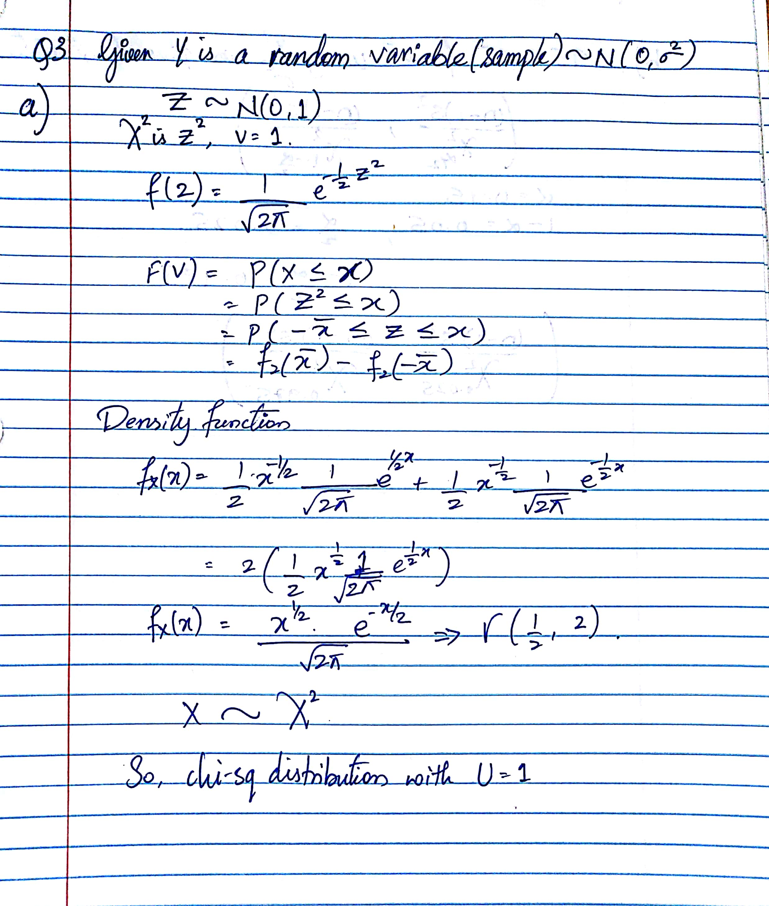
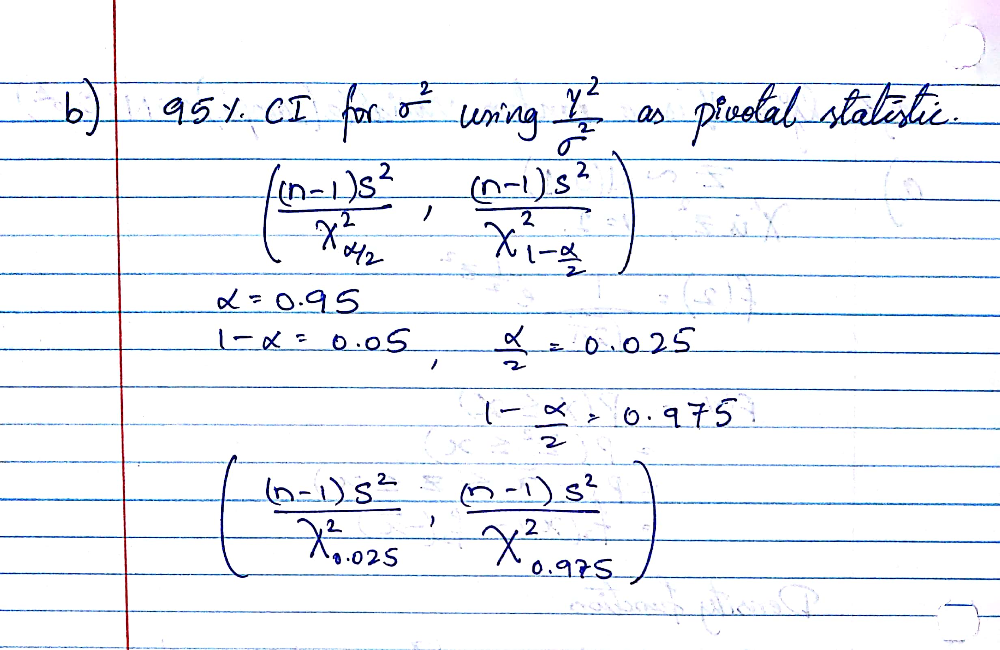

Questions (10/10)

# Question 1
## a

```r
NZ = read.csv("NZBIRDS.csv")
mysample <- NZ[sample(1:nrow(NZ), 35, replace=FALSE),]
head(mysample)
```

```
##        Species            Name Extinct Habitat Nest.Site Nest.Density Diet
## 44       Rails G. philippensis      No       A         G            L    I
## 45       Rails    G. australis      No      TG         G            L    I
## 70     Parrots N. meridionalis      No      TA         C            L    H
## 77 Kingfishers       H. sancta      No      TA         C            L    F
## 30   Waterfowl     A. gracilis      No       A        GC            L    H
## 98   Songbirds    P. rufusater      No      TA         C            L    I
##    Flight Body.Mass Egg.Length
## 44    Yes       170         40
## 45     No       700         58
## 70    Yes       425         42
## 77    Yes        65         29
## 30    Yes       425         50
## 98    Yes        70         29
```

## b

```r
samplemean = mean(mysample$Body.Mass)
samplemean
```

```
## [1] 11067.06
```

```r
samplesd = sd(mysample$Body.Mass)
samplesd
```

```
## [1] 29736.39
```

```r
ci=t.test(mysample$Body.Mass,mu=samplemean)$conf.int
ci
```

```
## [1]   852.2485 21281.8657
## attr(,"conf.level")
## [1] 0.95
```

## c
```
we can say that the with 95% confidence the body mass of any selected species from the actual species data set will be within the interval of (852.2485445, 2.1281866\times 10^{4})
```

## d

```r
actualmean = mean(NZ$Body.Mass)
actualmean
```

```
## [1] 9113.043
```

```
We can see that the actual mean of the data is within the above 95% CI. This happened because we have a 95% CI of sample mean which most likely is to include all the values of body mass
```

## e

```r
samplemean2 = round(mean(mysample$Egg.Length),4)
samplemean2
```

```
## [1] 69.1857
```

```r
ci2 = t.test(mysample$Egg.Length,mu=samplemean2)$conf.int
ci2
```

```
## [1] 52.31902 86.05241
## attr(,"conf.level")
## [1] 0.95
```


```r
NZ = subset(NZ, Egg.Length > 0)
am2 = mean(NZ$Egg.Length)
am2
```

```
## [1] 61.05652
```

```
We can confirm that again the mean of actual egg length is within in 95% CI of the sample species
```

## f
The point estimates of proprtion of flighless birds for extinct species is
$$
\begin{align}
P_1 &=\frac{y1}{n1}=\frac{21}{38}=0.5526
\end{align}
$$

The point estimate of proportion of flightless birds for non-extinct species is
$$
\begin{align}
P_2 &=\frac{y2}{n2}=\frac{7}{78}=0.0897
\end{align}
$$

For 95% CI , $\alpha = 1-0.95 = 0.05$, $\frac{\alpha}{2} = 0.025$. So, $Z_{\frac{\alpha}{2}} = 1.96$

So, the 95% Ci of difference between the proportions is

$$
\begin{align}
P_1 - P_2 \pm \sqrt{\frac{P1Q1}{n1}-\frac{P2Q2}{n2}} &= (0.5526-0.0897)\pm \sqrt{\frac{0.5526+0.4474}{38}-\frac{0.0897+0.9103}{78}}\\
&=0.462\pm0.1703\\
&=(0.2926,0.6332)
\end{align}
$$

## g
```
Since the entire CI is above 0, we can say that we are 95% confident that the proportion of flightless birds is greater for extinct species than for non-extinct species. The CI supports the ecologists theory
```

# Question 2

```r
set.seed(120);x=rnorm(100,mean=1312,sd=422) # fake data to understand t-tests
set.seed(100); y=rnorm(47,mean=1352,sd=271)
boxplot(list(x=x,y=y)) # boxplot of a list
```

<!-- -->

##a Difference ebtween the means

```r
t.test(x,y,mu =1352 - 1312,var.equal=FALSE,conf.level = 0.90)
```

```
## 
## 	Welch Two Sample t-test
## 
## data:  x and y
## t = -1.7409, df = 144.99, p-value = 0.08381
## alternative hypothesis: true difference in means is not equal to 40
## 90 percent confidence interval:
##  -143.42290   35.38182
## sample estimates:
## mean of x mean of y 
##  1324.452  1378.473
```

## b Ratio of Variances

```r
var.test(x,y,mu =1352 - 1312,conf.level = 0.90)
```

```
## 
## 	F test to compare two variances
## 
## data:  x and y
## F = 4.52, num df = 99, denom df = 46, p-value = 1.396e-07
## alternative hypothesis: true ratio of variances is not equal to 1
## 90 percent confidence interval:
##  2.919555 6.743560
## sample estimates:
## ratio of variances 
##           4.519985
```

# Question 3
<center>

</center>

<center>

</center>

# Question 4
<center>

</center>

# Question 5
## a

```r
WL = read.csv("WISCLAKES.csv")
head(WL)
```

```
##              LAKE  DOC
## 1       Allequash  9.6
## 2 Big Muskellunge  4.5
## 3           Brown 13.2
## 4        Crampton  4.1
## 5   Cranberry Bog 22.6
## 6         Crystal  2.7
```

```r
ci=t.test(WL$DOC,mu=15,conf.level = 0.9)$conf.int 
ci
```

```
## [1] 10.08013 18.95187
## attr(,"conf.level")
## [1] 0.9
```

```r
pvalue=t.test(WL$DOC,mu=15,conf.level = 0.9)$p.value 
pvalue
```

```
## [1] 0.8534843
```

```
As p-value is 0.8534843 which is greater than 0.05 we do not have enough evidence against the null hypothesis
```

## b
```
From seeing the 90% CI we can see that a mean of 14grams/m3 is within the interval. So, it is likely to detect a mean of 14grams/m3.
```

# Question 6

```r
OR = read.csv("ORCHARD.csv",sep=",")
fog = subset(OR , CONDITION == "FOG" & RATIO > 0) 
cl = subset(OR, CONDITION != "FOG") 
t.test(fog$RATIO,cl$RATIO,mu = 0, var.equal=FALSE,conf.level = 0.95)
```

```
## 
## 	Welch Two Sample t-test
## 
## data:  fog$RATIO and cl$RATIO
## t = -1.7459, df = 4.2617, p-value = 0.1514
## alternative hypothesis: true difference in means is not equal to 0
## 95 percent confidence interval:
##  -0.45562346  0.09862346
## sample estimates:
## mean of x mean of y 
##   0.27375   0.45225
```

```r
pvalue=t.test(fog$RATIO,cl$RATIO,mu = 0, var.equal=FALSE,conf.level = 0.95)$p.value 
pvalue
```

```
## [1] 0.1513503
```

```
We can see that p-value is greater than 0.05 so, Null hypothesis is accepted.That is there is no sufficient evidence that mean of foggy and clear or cloudy ratios are differ at 5% level of significance.
```

# Question 7

```r
GT = read.csv("GASTURBINE.csv",sep=",")
head(GT)
```

```
##        ENGINE SHAFTS   RPM CPRATIO INLET.TEMP EXH.TEMP AIRFLOW POWER
## 1 Traditional      1 27245     9.2       1134      602       7  1630
## 2 Traditional      1 14000    12.2        950      446      15  2726
## 3 Traditional      1 17384    14.8       1149      537      20  5247
## 4 Traditional      1 11085    11.8       1024      478      27  6726
## 5 Traditional      1 14045    13.2       1149      553      29  7726
## 6 Traditional      1  6211    15.7       1172      517     176 52600
##   HEATRATE LHV. ISOWORK
## 1    14622 24.6  232.86
## 2    13196 27.3  181.73
## 3    11948 30.1  262.35
## 4    11289 31.9  249.11
## 5    11964 30.1  266.41
## 6    10526 34.2  298.86
```


```r
Traditional = subset(GT , ENGINE == "Traditional")
Advanced = subset(GT , ENGINE == "Advanced")
Aeroderiv = subset(GT , ENGINE == "Aeroderiv")
```

## a

```r
t.test(Traditional$HEATRATE,Aeroderiv$HEATRATE,mu = 0,var.equal = TRUE,conf.level = 0.95)
```

```
## 
## 	Two Sample t-test
## 
## data:  Traditional$HEATRATE and Aeroderiv$HEATRATE
## t = -1.2141, df = 44, p-value = 0.2312
## alternative hypothesis: true difference in means is not equal to 0
## 95 percent confidence interval:
##  -2041.8478   506.5731
## sample estimates:
## mean of x mean of y 
##  11544.08  12311.71
```

```r
pvalue = t.test(Traditional$HEATRATE,Aeroderiv$HEATRATE,mu = 0,var.equal = TRUE,conf.level = 0.95)$p.value 
pvalue
```

```
## [1] 0.2311704
```

## b

```r
t.test(Advanced$HEATRATE,Aeroderiv$HEATRATE,mu = 0,var.equal = TRUE,conf.level = 0.95)
```

```
## 
## 	Two Sample t-test
## 
## data:  Advanced$HEATRATE and Aeroderiv$HEATRATE
## t = -4.1945, df = 26, p-value = 0.0002811
## alternative hypothesis: true difference in means is not equal to 0
## 95 percent confidence interval:
##  -3795.810 -1299.047
## sample estimates:
## mean of x mean of y 
##  9764.286 12311.714
```

```r
pvalue = t.test(Advanced$HEATRATE,Aeroderiv$HEATRATE,mu = 0,var.equal = TRUE,conf.level = 0.95)$p.value 
pvalue
```

```
## [1] 0.0002810834
```

# Question 8

```r
GA = read.csv("GOBIANTS.csv",sep=",")
head(GA)
```

```
##   Site      Region Rain Temp PlantCov AntSpecies Diversity
## 1    1 Dry_Steppe   196  5.7       40          3      0.89
## 2    2 Dry_Steppe   196  5.7       52          3      0.83
## 3    3 Dry_Steppe   179  7.0       40         52      1.31
## 4    4 Dry_Steppe   197  8.0       43          7      1.48
## 5    5 Dry_Steppe   149  8.5       27          5      0.97
## 6    6 Gobi Desert  112 10.7       30         49      0.46
```

```r
DS = subset(GA, Region == "Dry_Steppe ")
head(DS)
```

```
##   Site      Region Rain Temp PlantCov AntSpecies Diversity
## 1    1 Dry_Steppe   196  5.7       40          3      0.89
## 2    2 Dry_Steppe   196  5.7       52          3      0.83
## 3    3 Dry_Steppe   179  7.0       40         52      1.31
## 4    4 Dry_Steppe   197  8.0       43          7      1.48
## 5    5 Dry_Steppe   149  8.5       27          5      0.97
```

```r
GD = subset(GA, Region == "Gobi Desert") 
head(GD)
```

```
##    Site      Region Rain Temp PlantCov AntSpecies Diversity
## 6     6 Gobi Desert  112 10.7       30         49      0.46
## 7     7 Gobi Desert  125 11.4       16          5      1.23
## 8     8 Gobi Desert   99 10.9       30          4        NA
## 9     9 Gobi Desert  125 11.4       56          4      0.76
## 10   10 Gobi Desert   84 11.4       22          5      1.26
## 11   11 Gobi Desert  115 11.4       14          4      0.69
```

```r
t.test(DS$AntSpecies, GD$AntSpecies,mu=0,var.equal = TRUE, conf.level = 0.05)
```

```
## 
## 	Two Sample t-test
## 
## data:  DS$AntSpecies and GD$AntSpecies
## t = 0.1821, df = 9, p-value = 0.8595
## alternative hypothesis: true difference in means is not equal to 0
## 5 percent confidence interval:
##  1.399509 2.933825
## sample estimates:
## mean of x mean of y 
##  14.00000  11.83333
```

```r
pvalue = t.test(DS$AntSpecies, GD$AntSpecies,mu=0,var.equal = TRUE, conf.level = 0.05)$p.value 
pvalue
```

```
## [1] 0.8595396
```

## a
$$
\begin{align}
H_0&= \frac{variance\;of\;Dry\;Steppe\;region}{variance\;of\;Gobi\;Desert\;region}=1\\
H_1&=\frac{variance\;of\;Dry\;Steppe\;region}{variance\;of\;Gobi\;Desert\;region}\neq1
\end{align}
$$

## b
```
t=0.1821
```
## c
```
rejection region = alpha/2 = 0.05/2 = 0.025
```

## d
```
pvalue = 0.8595396
```

## e
```
We can say that the null hypothesis is accepted that is there is no suffiient evidence that variances of above two regions is different.
```

## f
```
The data is normal, variances of both regions is equal, samples are independent, standard devviations of both samples are known, the size of both the samples are less than 30.
```

# Question 9

```r
TP = read.csv("THRUPUT.csv",sep=",")
head(TP)
```

```
##   TASK HUMAN  AUTO
## 1    1 185.4 180.4
## 2    2 146.3 248.5
## 3    3 174.4 185.5
## 4    4 184.9 216.4
## 5    5 240.0 269.3
## 6    6 253.8 249.6
```


```r
t.test(TP$HUMAN,TP$AUTO,mu=0,var.equal = FALSE)
```

```
## 
## 	Welch Two Sample t-test
## 
## data:  TP$HUMAN and TP$AUTO
## t = -1.441, df = 13.897, p-value = 0.1717
## alternative hypothesis: true difference in means is not equal to 0
## 95 percent confidence interval:
##  -81.06293  15.93793
## sample estimates:
## mean of x mean of y 
##  210.8875  243.4500
```


```r
pvalue = t.test(TP$HUMAN,TP$AUTO,mu=0,var.equal = FALSE)$p.value 
pvalue 
```

```
## [1] 0.1717404
```

```r
pvalue2 = t.test(TP$HUMAN,TP$AUTO,mu=0,var.equal = TRUE)$p.value 
pvalue2
```

```
## [1] 0.1715795
```

```
From the above, pvalue is greater than 0.05, so null hypothesis is accepted.There is no significant difference between human and automated thru put.
```

# Question 10

```r
set.seed(35); sam<-round(rnorm(30,mean=20,sd=3),3)

#Modified myboot
myboot<-function(iter=10000,x,fun="mean",alpha=0.05,...){  #Notice where the ... is repeated in the code
  n=length(x)   #sample size
  
  y=sample(x,n*iter,replace=TRUE)
  rs.mat=matrix(y,nr=n,nc=iter,byrow=TRUE)
  xstat=apply(rs.mat,2,fun) # xstat is a vector and will have iter values in it 
  ci=quantile(xstat,c(alpha/2,1-alpha/2))# Nice way to form a confidence interval
  
  cit = t.test(x)$conf.int
  t = t.test(x)$statistic
  # A histogram follows
  # The object para will contain the parameters used to make the histogram
  para=hist(xstat,freq=FALSE,las=1,
            main=paste("Histogram of Bootstrap sample statistics","\n","alpha=",alpha," iter=",iter,sep=""),
            ...)
  
  #mat will be a matrix that contains the data, this is done so that I can use apply()
  mat=matrix(x,nr=length(x),nc=1,byrow=TRUE)
  
  #pte is the point estimate
  #This uses whatever fun is
  pte=apply(mat,2,fun)
  abline(v=pte,lwd=3,col="Black")# Vertical line
  segments(ci[1],0,ci[2],0,lwd=4)      #Make the segment for the ci
  text(ci[1],0.1,paste("(",round(ci[1],2),sep=""),col="Red",cex=3)
  text(ci[2],0.1,paste(round(ci[2],2),")",sep=""),col="Red",cex=3)
  
  text(ci[1],0.2,paste("(",round(cit[1],2),sep=""),col="Blue",cex=3)
  text(ci[2],0.2,paste(round(cit[2],2),")",sep=""),col="Blue",cex=3)
  # plot the point estimate 1/2 way up the density
  text(pte,max(para$density)/2,round(pte,2),cex=3)
  
  return(list(fun=fun, x=x, t=t, ci=ci, cit=cit[1:2]))# Some output to use if necessary
}

#Modified myboot function call
myboot(10000,x=sam,fun=function(x) mean(x),alpha=0.05,xlab="xstat", col=3:8)
```

<!-- -->

```
## $fun
## function (x) 
## mean(x)
## <bytecode: 0x000000001833fda8>
## 
## $x
##  [1] 23.195 20.399 19.898 19.865 30.014 18.821 21.232 18.313 23.574 21.047
## [11] 21.535 21.336 17.695 18.497 14.274 14.664 22.593 18.963 25.515 25.019
## [21] 22.053 22.871 23.006 23.829 19.038 21.735 21.461 21.659 21.703 21.049
## 
## $t
##       t 
## 37.6284 
## 
## $ci
##     2.5%    97.5% 
## 20.06700 22.26845 
## 
## $cit
## [1] 20.01155 22.31198
```
