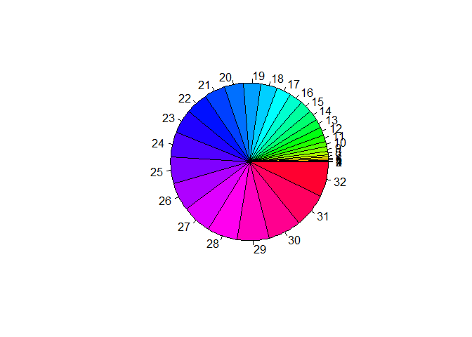

#Function Completed

```r
mybirthday = function(n)
{
  #Denominator is 365^n
  logpAc = lfactorial(365)-lfactorial(365-(1:n))-(1:n)*log(365)
  pAc=exp(logpAc)
  #p=1-q
  pA = 1- pAc
  
  names(pA)=1:n
  names(pA)
  
  #number of colors=Number of elements in pA
  pie(pA, col=rainbow(length(pA)))
  
  #rounding the decimals to 2 places
  mat = matrix(c(round(pA,2)), nr=n, nc=1, byrow=FALSE,dimnames=list("Number in room"=1:n, c("pA")))
  as.table(mat)
}

table = mybirthday(32)
```

<!-- -->

#Table

```r
table
```

```
##               
## Number in room   pA
##             1  0.00
##             2  0.00
##             3  0.01
##             4  0.02
##             5  0.03
##             6  0.04
##             7  0.06
##             8  0.07
##             9  0.09
##             10 0.12
##             11 0.14
##             12 0.17
##             13 0.19
##             14 0.22
##             15 0.25
##             16 0.28
##             17 0.32
##             18 0.35
##             19 0.38
##             20 0.41
##             21 0.44
##             22 0.48
##             23 0.51
##             24 0.54
##             25 0.57
##             26 0.60
##             27 0.63
##             28 0.65
##             29 0.68
##             30 0.71
##             31 0.73
##             32 0.75
```
