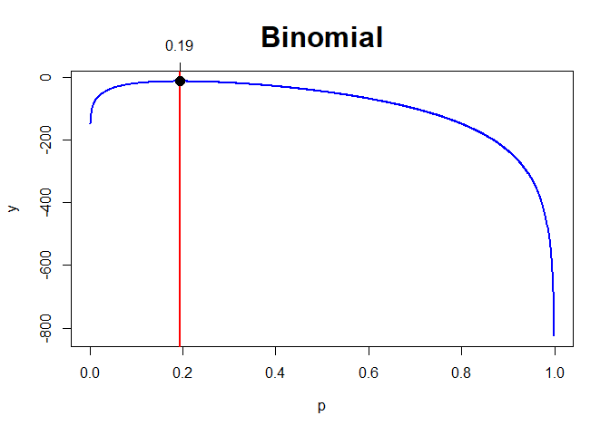
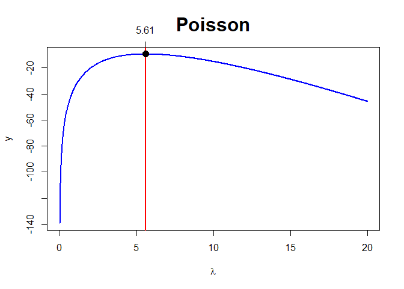
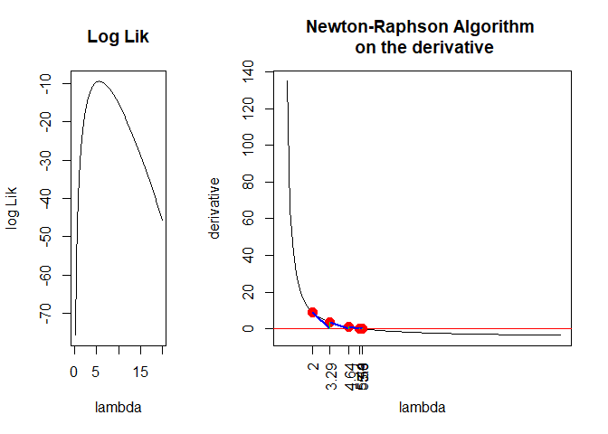
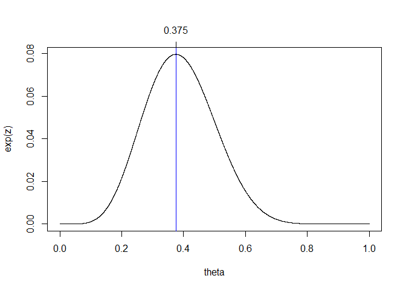
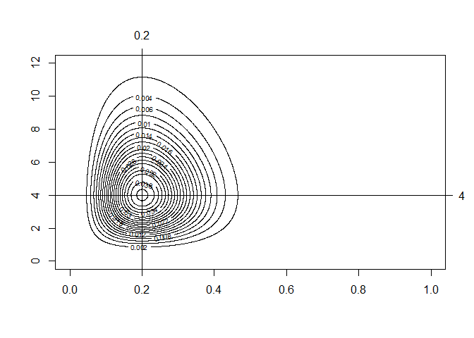
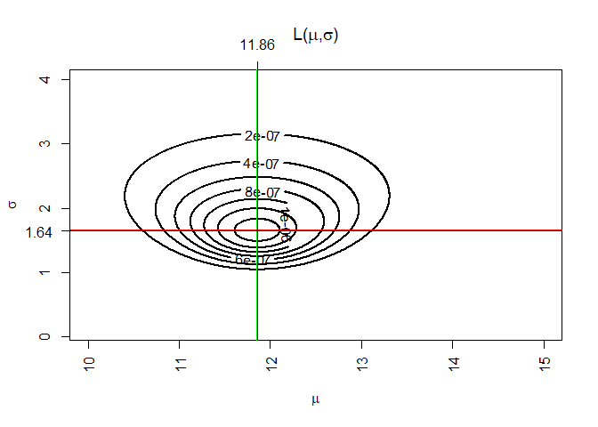
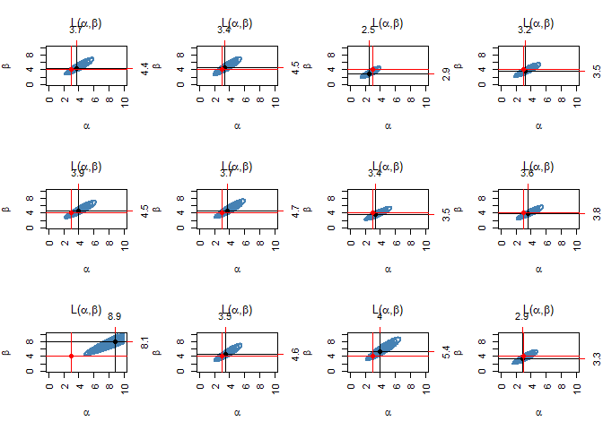
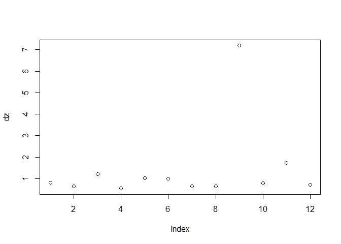

#Task 1

```r
getwd()
```

```
## [1] "C:/Users/prith/OneDrive/Documents/MATH4753_FA18/Lab10"
```

#Task 2
##Lines
###A
```
This creates an outer product of the arrays x and param and lfun is a function to use on the outer products.
```

###B
```
This gives you the index of the largest y.
```

##Formula
$$
l(\lambda) = \frac{e^{-n\lambda}.\lambda^{\sum x_i}}{x_1!.x_2!...x_n!}
$$

##R code for likelihood
```
mymaxlik=function(lfun,x,param,...){
np=length(param) z=outer(x,param,lfun) y=apply(z,2,sum)
plot(param,y,col="Blue",type="l",lwd=2,...)
i=max(which(y==max(y))) abline(v=param[i],lwd=2,col="Red")
points(param[i],y[i],pch=19,cex=1.5,col="Black")
axis(3,param[i],round(param[i],2))
ifelse(i-3>=1 & i+2<=np, slope<-(y[(i-2):(i+2)]-y[(i-
3):(i+1)])/(param[(i-2):(i+2)]-param[(i- 3):(i+1)]),slope<-"NA")
return(list(i=i,parami=param[i],yi=y[i],slope=slope)) 
}
```

##Max Likelihood Estimation

```r
mymaxlik=function(lfun,x,param,...){
  # how many param values are there?
  np=length(param)
  # outer -- notice the order, x then param
  # this produces a matrix -- try outer(1:4,5:10,function(x,y) paste(x,y,sep=" "))   to understand
  # The outer product of the arrays X and Y is the array A with dimension c(dim(X),dim(Y)) where element A[c(arrayindex.x, arrayindex.y)] = FUN(X[arrayindex.x], Y[arrayindex.y]). So, it is evaluate the function in the grid for each xi and yi
  z=outer(x,param,lfun)
  # z is a matrix where each x,param is replaced with the function evaluated at those values
  y=apply(z,2,sum)
  
  # y is a vector made up of the column sums
  # Each y is the log lik for a new parameter value
  plot(param,y,col="Blue",type="l",lwd=2,...)
  # which gives the index for the value of y >= max.
  # there could be a max between two values of the parameter, therefore 2 indices
  # the first max will take the larger indice
  # First, the maximum value of array Y is found then ?which(y==max(y))? gives the indexes of all y which is equal to max(y). At the end ?i=max()? will take the maximum index from ?which()? and assign it to ?i?.
  i=max(which(y>=max(y)))
  abline(v=param[i],lwd=2,col="Red")
  
  # plots a nice point where the max lik is
  points(param[i],y[i],pch=19,cex=1.5,col="Black")
  axis(3,param[i],round(param[i],2))
  #check slopes. If it is a max the slope shoud change sign from + to
  # We should get three + and two -vs
  ifelse(i-3>=1 & i+2<=np, slope<-(y[(i-2):(i+2)]-y[(i-3):(i+1)])/(param[(i-2):(i+2)]-param[(i-3):(i+1)]),slope<-"NA")
  return(list(i=i,parami=param[i],yi=y[i],slope=slope))
}

# log likelihoods for binom defined
logbin=function(x,param) log(dbinom(x,prob=param,size=20))

mymaxlik(x=c(3,3,4,3,4,5,5,4),param=seq(0,1,length=1000),lfun=logbin,xlab=expression("p"),main="Binomial",cex.main=2)
```

<!-- -->

```
## $i
## [1] 195
## 
## $parami
## [1] 0.1941942
## 
## $yi
## [1] -12.78734
## 
## $slope
## [1]  2.12579310  1.08781082  0.05802047 -0.96371372 -1.97752478
```

#Task 3
##Max likelihood

```r
logpoiss=function(x,param) log(dpois(x,lambda=param))
```

##Graphical Solution

```r
mymaxlik(x=c(4,6,7,6,5),param=seq(0,20,length=1000),lfun=logpoiss,xlab=expression(lambda),main="Poisson",cex.main=2)
```

<!-- -->

```
## $i
## [1] 281
## 
## $parami
## [1] 5.605606
## 
## $yi
## [1] -9.411759
## 
## $slope
## [1]  0.040005454  0.021908448  0.003940937 -0.013898462 -0.031611116
```

##Algebraic expression
$$
log(l(\lambda)) = log(\frac{e^{-n\lambda}.\lambda^{\sum x_i}}{x_1!.x_2!...x_n!})
$$

##NRML

```r
myNRML=function(x0,delta=0.001,llik,xrange,parameter="param"){
  f=function(x) (llik(x+delta)-llik(x))/delta
  fdash=function(x) (f(x+delta)-f(x))/delta
  d=1000
  i=0
  x=c()
  y=c()
  x[1]=x0
  y[1]=f(x[1])
  while(d > delta & i<100){
    i=i+1
    x[i+1]=x[i]-f(x[i])/fdash(x[i])
    y[i+1]=f(x[i+1])
    d=abs(y[i+1])
  }
  layout(matrix(1:2,nr=1,nc=2,byrow=TRUE),width=c(1,2))
  curve(llik(x), xlim=xrange,xlab=parameter,ylab="log Lik",main="Log Lik")
  curve(f(x),xlim=xrange,xaxt="n", xlab=parameter,ylab="derivative",main=  "Newton-Raphson Algorithm \n on the derivative")
  points(x,y,col="Red",pch=19,cex=1.5)
  axis(1,x,round(x,2),las=2)
  abline(h=0,col="Red")
  
  segments(x[1:(i-1)],y[1:(i-1)],x[2:i],rep(0,i-1),col="Blue",lwd=2)
  segments(x[2:i],rep(0,i-1),x[2:i],y[2:i],lwd=0.5,col="Green")
  
  list(x=x,y=y)
}

myNRML(x0=2,delta=0.000001,llik=function(x) log(dpois(4,x)*dpois(6,x)*dpois(7,x)*dpois(6,x)*dpois(5,x)),xrange=c(0,20),parameter="lambda" )
```

<!-- -->

```
## $x
## [1] 2.000000 3.287233 4.644564 5.436662 5.594728 5.600001 5.600000
## 
## $y
## [1]  8.999996e+00  3.517802e+00  1.028552e+00  1.502188e-01  4.710779e-03
## [6] -1.003642e-06  0.000000e+00
```

##Value of $\lambda$
```
Value of Lambda = 5.6
```

#Task 4

```r
mymaxlikg=function(lfun="logbin2",theta) { # default log lik is a combination bin
  nth=length(theta)  # nu. of valuse used in theta
  thmat=matrix(theta,nr=nth,nc=1,byrow=TRUE) # Matrix of theta
  z=apply(thmat,1,lfun) # z holds the log lik values
  zmax=max(which(z>=max(z)))  # finding the INDEX of the max lik
  plot(theta,exp(z),type="l") # plot of lik
  abline(v=theta[zmax],col="Blue")   #  verical line through max
  axis(3,theta[zmax],round(theta[zmax],4))  # one tick on the third axis 
  theta[zmax]   # theta corresponding to max lik
}

logbin2=function(theta){log(dbinom(2,prob=theta,size=6)) + log(dbinom(4,prob=theta,size=10))}

mymaxlikg(theta=seq(0,1,length=10000))
```

<!-- -->

```
## [1] 0.3750375
```

#Task 5
##Algebraic Expression
$$
\begin{align}
l(\theta_1, \theta_2) &= log(bin(y_1|\theta_1)poiss(y_2|\theta_2))\\
&=log(bin(y_1|\theta_1))+log(poiss(y_2|\theta_2))\\
&=log(dbinom(4,size=20,\theta1)+log(dpois(4,lambda=\theta2)))\\
&=log((ny)p_yq_{n-y}+log(e^{-\lambda}\lambda^yy!))
\end{align}
$$

##maxlikg2

```r
logbinpois=function(theta1,theta2) log(dbinom(4,size=20,prob=theta1)) +
  log(dpois(4,lambda=theta2))

maxlikg2=function(theta1,theta2,lfun="logbinpois",...){
  n1=length(theta1)
  n2=length(theta2)
  z=outer(theta1,theta2,lfun)
  contour(theta1,theta2,exp(z),...) # exp(z) gives the lik
  maxl=max(exp(z))    # max lik
  coord=which(exp(z)==maxl,arr.ind=TRUE)  # find the co-ords of the max
  th1est=theta1[coord[1]] # mxlik estimate of theta1
  th2est=theta2[coord[2]]
  abline(v=th1est,h=th2est)
  axis(3,th1est,round(th1est,2))
  axis(4,th2est,round(th2est,2),las=1)
  list(th1est=th1est,th2est=th2est)
}

maxlikg2(theta1=seq(0,1,length=1000),theta2=seq(0,12,length=1000),nlevels=20)
```

<!-- -->

```
## $th1est
## [1] 0.2002002
## 
## $th2est
## [1] 4
```

#Task 6
##


```r
mymlnorm=function(x,mu,sig,...){  #x sample vector
  nmu=length(mu) # number of values in mu
  nsig=length(sig)
  n=length(x) # sample size
  zz=c()    ## initialize a new vector
  lfun=function(x,m,p) log(dnorm(x,mean=m,sd=p))   # log lik for normal
  for(j in 1:nsig){
    z=outer(x,mu,lfun,p=sig[j]) # z a matrix 
    # col 1 of z contains lfun evaluated at each x with first value of mu, 
    # col2 each x with 2nd value of m 
    # all with sig=sig[j]
    y=apply(z,2,sum)
    # y is a vector filled with log lik values, 
    # each with a difft mu and all with the same sig[j]
    zz=cbind(zz,y)
    ## zz is the matrix with each column containing log L values, rows difft mu, cols difft sigmas 
  }
  maxl=max(exp(zz))
  coord=which(exp(zz)==maxl,arr.ind=TRUE)
  maxlsig=apply(zz,1,max)
  contour(mu,sig,exp(zz),las=3,xlab=expression(mu),ylab=expression(sigma),axes=TRUE,
          main=expression(paste("L(",mu,",",sigma,")",sep="")),...)
  mlx=round(mean(x),2)  # theoretical
  mly=round(sqrt((n-1)/n)*sd(x),2)
  #axis(1,at=c(0:20,mlx),labels=sort(c(0:20,mlx)))
  #axis(2,at=c(0:20,mly),labels=TRUE)
  abline(v=mean(x),lwd=2,col="Green")
  abline(h=sqrt((n-1)/n)*sd(x),lwd=2,col="Red")
  
  # Now find the estimates from the co-ords
  muest=mu[coord[1]]
  sigest=sig[coord[2]]
  
  abline(v=muest, h=sigest)
  axis(3,muest,round(muest,2))
  axis(2,sigest,round(sigest,2),las=1)    
  
  return(list(x=x,coord=coord,maxl=maxl,muest=muest,sigest=sigest))
}

mymlnorm(x=c(10,12,13,15,12,11,10),mu=seq(10,15,length=1000),sig=seq(0.1,4,length=1000),lwd=2,labcex=1)
```

<!-- -->

```
## $x
## [1] 10 12 13 15 12 11 10
## 
## $coord
##      row col
## [1,] 372 396
## 
## $maxl
## [1] 1.513619e-06
## 
## $muest
## [1] 11.85686
## 
## $sigest
## [1] 1.642042
```

#Task 7
##Beta Distribution

```r
mymlbeta=function(x,alpha,beta,...){  #x sample vector
  na=length(alpha) # number of values in alpha
  nb=length(beta)
  n=length(x) # sample size
  zz=c()    ## initialize a new vector
  lfun=function(x,a,b) log(dbeta(x,shape1=a,shape2=b))   # log lik for beta
  for(j in 1:nb){
    z=outer(x,alpha,lfun,b=beta[j]) # z a matrix 
    # col 1 of z contains lfun evaluated at each x with first value of alpha, 
    # col2 each x with 2nd value of a 
    # all with b=beta[j]
    y=apply(z,2,sum)
    # y is a vector filled with log lik values, 
    # each with a difft alpha and all with the same sig[j]
    zz=cbind(zz,y)
    ## zz is the matrix with each column containing log L values, rows difft alpha, cols difft betas 
  }
  maxl=max(exp(zz))    # max lik
  coord=which(exp(zz)==maxl,arr.ind=TRUE)  # find the co-ords of the max
  aest=alpha[coord[1]] # mxlik estimate of alpha
  best=beta[coord[2]]
  contour(alpha,beta,exp(zz),las=3,xlab=expression(alpha),ylab=expression(beta),axes=TRUE,
          main=expression(paste("L(",alpha,",",beta,")",sep="")),...)
  
  abline(v=aest, h=best)
  points(aest,best,pch=19)
  axis(4,best,round(best,2),col="Red")
  axis(3,aest,round(aest,2),col="Red")
  return(list(x=x,coord=coord,maxl=maxl,maxalpha=aest,maxbeta=best))
}
```


```r
layout(matrix(1:12,nr=3,nc=4,byrow=TRUE))
z=c()  # creat an empty matrix
a=3
b=4
sam= rbeta(30,shape1=a,shape2=b)
nsam=length(sam)
for(i in 1:12){
  w=mymlbeta(x=sample(sam,nsam,replace=TRUE),alpha=seq(0.1,10,length=100),
             beta=seq(0.1,10,length=100),lwd=2,labcex=1,col="steelblue")
  points(a,b,col="Red",pch=19)
  abline(v=a,h=b,col="Red")
  z<-rbind(z,c(w$maxalpha,w$maxbeta))
}
```

<!-- -->

```r
colnames(z)=c("alpha","beta")
z
```

```
##       alpha beta
##  [1,]   3.7  4.4
##  [2,]   3.4  4.5
##  [3,]   2.5  2.9
##  [4,]   3.2  3.5
##  [5,]   3.9  4.5
##  [6,]   3.7  4.7
##  [7,]   3.4  3.5
##  [8,]   3.6  3.8
##  [9,]   8.9  8.1
## [10,]   3.5  4.6
## [11,]   4.0  5.4
## [12,]   2.9  3.3
```

```r
dz=apply(z,1,function(x) sqrt(sum((x-c(a,b))^2)) )
dz
```

```
##  [1] 0.8062258 0.6403124 1.2083046 0.5385165 1.0295630 0.9899495 0.6403124
##  [8] 0.6324555 7.1847060 0.7810250 1.7204651 0.7071068
```


```r
plot(dz)
```

<!-- -->

```r
which(dz>4)
```

```
## [1] 9
```


