#Task 1

```r
getwd()
```

```
## [1] "C:/Users/prith/OneDrive/Documents/MATH4753_FA18/Lab12"
```

#Task 2
## Task 2.1

```r
# one sample t-test
set.seed(55);x1=rnorm(30,mean=25,sd=5)
boxplot(x1, main="Sample x1")

t.test(x1,mu=22)
```

```
## 
## 	One Sample t-test
## 
## data:  x1
## t = 3.3863, df = 29, p-value = 0.002052
## alternative hypothesis: true mean is not equal to 22
## 95 percent confidence interval:
##  23.30198 27.27320
## sample estimates:
## mean of x 
##  25.28759
```

```r
ci=t.test(x1,mu=22)$conf.int
ci
```

```
## [1] 23.30198 27.27320
## attr(,"conf.level")
## [1] 0.95
```

```r
abline(h=c(ci,mean(x1)),col=c("Red","Red","Green"))
```

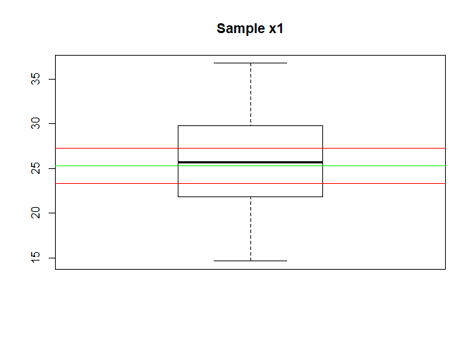<!-- -->

```r
#tcalc
tcalc=(mean(x1)-22)/(sd(x1)/sqrt(30))
tcalc
```

```
## [1] 3.386302
```
Null hypothesis is rejected.

## Task 2.2

```r
# one sample t-test
set.seed(55);x1=rnorm(30,mean=25,sd=5)
boxplot(x1, main="Sample x1")

t.test(x1,mu=23)
```

```
## 
## 	One Sample t-test
## 
## data:  x1
## t = 2.3563, df = 29, p-value = 0.02543
## alternative hypothesis: true mean is not equal to 23
## 95 percent confidence interval:
##  23.30198 27.27320
## sample estimates:
## mean of x 
##  25.28759
```

```r
ci=t.test(x1,mu=23)$conf.int
ci
```

```
## [1] 23.30198 27.27320
## attr(,"conf.level")
## [1] 0.95
```

```r
abline(h=c(ci,mean(x1)),col=c("Red","Red","Green"))
```

<!-- -->

```r
#tcalc
tcalc=(mean(x1)-23)/(sd(x1)/sqrt(30))
tcalc
```

```
## [1] 2.356277
```
Null hypothesis is rejected.


## Task 2.3

```r
# one sample t-test
set.seed(55);x1=rnorm(30,mean=25,sd=5)
boxplot(x1, main="Sample x1")

t.test(x1,mu=24)
```

```
## 
## 	One Sample t-test
## 
## data:  x1
## t = 1.3263, df = 29, p-value = 0.1951
## alternative hypothesis: true mean is not equal to 24
## 95 percent confidence interval:
##  23.30198 27.27320
## sample estimates:
## mean of x 
##  25.28759
```

```r
ci=t.test(x1,mu=24)$conf.int
ci
```

```
## [1] 23.30198 27.27320
## attr(,"conf.level")
## [1] 0.95
```

```r
abline(h=c(ci,mean(x1)),col=c("Red","Red","Green"))
```

<!-- -->

```r
#tcalc
tcalc=(mean(x1)-24)/(sd(x1)/sqrt(30))
tcalc
```

```
## [1] 1.326252
```
NULL hypothesis is not rejected.

## Task 2.4

```r
# one sample t-test
set.seed(55);x1=rnorm(30,mean=25,sd=5)
boxplot(x1, main="Sample x1")

t.test(x1,mu=25)
```

```
## 
## 	One Sample t-test
## 
## data:  x1
## t = 0.29623, df = 29, p-value = 0.7692
## alternative hypothesis: true mean is not equal to 25
## 95 percent confidence interval:
##  23.30198 27.27320
## sample estimates:
## mean of x 
##  25.28759
```

```r
ci=t.test(x1,mu=25)$conf.int
ci
```

```
## [1] 23.30198 27.27320
## attr(,"conf.level")
## [1] 0.95
```

```r
abline(h=c(ci,mean(x1)),col=c("Red","Red","Green"))
```

<!-- -->

```r
#tcalc
tcalc=(mean(x1)-25)/(sd(x1)/sqrt(30))
tcalc
```

```
## [1] 0.2962266
```

NULL hypothesis is not rejected.

## Task 2.5

```r
# one sample t-test
set.seed(55);x1=rnorm(30,mean=25,sd=5)
boxplot(x1, main="Sample x1")

t.test(x1,mu=26)
```

```
## 
## 	One Sample t-test
## 
## data:  x1
## t = -0.7338, df = 29, p-value = 0.469
## alternative hypothesis: true mean is not equal to 26
## 95 percent confidence interval:
##  23.30198 27.27320
## sample estimates:
## mean of x 
##  25.28759
```

```r
ci=t.test(x1,mu=26)$conf.int
ci
```

```
## [1] 23.30198 27.27320
## attr(,"conf.level")
## [1] 0.95
```

```r
abline(h=c(ci,mean(x1)),col=c("Red","Red","Green"))
```

<!-- -->

```r
#tcalc
tcalc=(mean(x1)-26)/(sd(x1)/sqrt(30))
tcalc
```

```
## [1] -0.7337985
```

NULL hypothesis is not rejected.


## Task 2.6

```r
mypvalue=function(t0,xmax=4,n=20, alpha=0.05){
  #calculate alpha/2
  va=round(pt(-t0,df=n-1),4)
  pv=2*va
  
  # plot the t dist
  curve(dt(x,df=n-1),xlim=c(-xmax,xmax),ylab="T Density",xlab=expression(t),
        main=substitute(paste("P-value=", pv, " alpha=", alpha)))
  
  
  # set up points on the polygon to the right
  xcurve=seq(t0,xmax,length=1000)
  ycurve=dt(xcurve,df=n-1)
  
  # set up points to the left
  xlcurve=seq(-t0,-xmax,length=1000)
  ylcurve=dt(xcurve,df=n-1)
  
  # Shade in the polygon defined by the line segments
  polygon(c(t0,xcurve,xmax),c(0,ycurve,0),col="green")
  polygon(c(-t0,xlcurve,-xmax),c(0,ylcurve,0),col="green")
  
  # make quantiles
  q=qt(1-alpha/2,n-1)
  abline( v=c(q,-q),lwd=2) # plot the cut off t value 
  axis(3,c(q,-q),c(expression(abs(t[alpha/2])),expression(-abs(t[alpha/2]))))
  
  
  # Annotation
  text(0.5*(t0+xmax),max(ycurve),substitute(paste(area, "=",va)))
  text(-0.5*(t0+xmax),max(ycurve),expression(area))
  
  return(list(q=q,pvalue=pv))
}

set.seed(55);x1=rnorm(30,mean=25,sd=5)
tcalc=(mean(x1)-24)/(sd(x1)/sqrt(30))

mypvalue(tcalc,n=30,alpha=0.05)
```

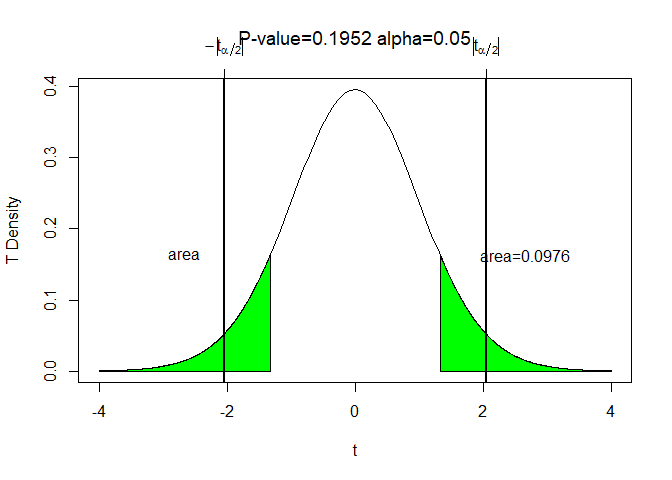<!-- -->

```
## $q
## [1] 2.04523
## 
## $pvalue
## [1] 0.1952
```


## Task 2.7

```r
bootpval<-function(x,conf.level=0.95,iter=3000,mu0=0, test="two"){
  n=length(x)
  y=x-mean(x)+mu0  # transform the data so that it is centered at the NULL
  rs.mat<-c()    #rs.mat will become a resample matrix -- now it is an empty vector
  xrs.mat<-c()
  for(i in 1:iter){ # for loop - the loop will go around iter times
    rs.mat<-cbind(rs.mat,sample(y,n,replace=TRUE)) #sampling from y cbind -- column bind -- binds the vectors together by columns
    xrs.mat<-cbind(xrs.mat,sample(x,n,replace=TRUE)) #sampling from x cbind -- column bind -- binds the vectors together by columns
    
  }
  
  tstat<-function(z){ # The value of t when the NULL is assumed true (xbar-muo)/z/sqrt(n)
    sqrt(n)*(mean(z)-mu0)/sd(z)
  }
  
  tcalc=tstat(x) # t for the data collected
  ytstat=apply(rs.mat,2,tstat) # tstat of resampled y's, ytstat is a vector and will have iter values in it
  xstat=apply(xrs.mat,2,mean)  # mean of resampled x's
  alpha=1-conf.level # calculating alpha
  ci=quantile(xstat,c(alpha/2,1-alpha/2))# Nice way to form a confidence interval
  pvalue=ifelse(test=="two",length(ytstat[ytstat>abs(tcalc) | ytstat < -abs(tcalc)])/iter,
                ifelse(test=="upper",length(ytstat[ytstat>tcalc])/iter,
                       length(ytstat[ytstat<xstat])/iter))
  
  h=hist(ytstat,plot=FALSE)
  mid=h$mid
  if(test=="two"){
    ncoll=length(mid[mid<= -abs(tcalc)])
    ncolr=length(mid[mid>=  abs(tcalc)])
    col=c(rep("Green",ncoll),rep("Gray",length(mid)-ncoll-ncolr),rep("Green",ncolr))
  }
  if(test=="upper"){
    ncolr=length(mid[mid>=  abs(tcalc)])
    col=c(rep("Gray",length(mid)-ncolr),rep("Green",ncolr))
  }
  
  if(test=="lower"){
    ncoll=length(mid[mid<=  -abs(tcalc)])
    col=c(rep("Green",ncoll),rep("Gray",length(mid)-ncoll))
  }
  hist(ytstat,col=col,freq=FALSE,las=1,main="",xlab=expression(T[stat]))
  #segments(ci[1],0,ci[2],0,lwd=2)
  pround=round(pvalue,4)
  title(substitute(paste(P[value],"=",pround)))
  return(list(pvalue=pvalue,tcalc=tcalc,n=n,x=x,test=test,ci=ci))
}

boot=bootpval(x=x1,mu0=22,test="two")
```

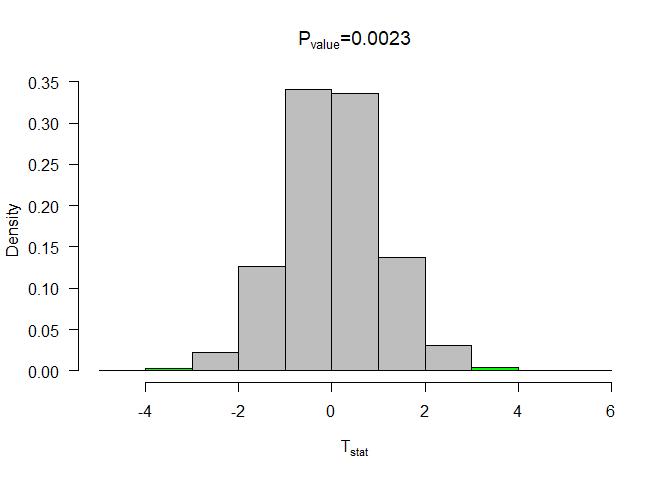<!-- -->

```r
boot
```

```
## $pvalue
## [1] 0.002333333
## 
## $tcalc
## [1] 3.386302
## 
## $n
## [1] 30
## 
## $x
##  [1] 25.60070 15.93812 25.75791 19.40389 25.00954 30.94259 22.47328
##  [8] 24.50383 26.52677 25.99205 24.75545 20.78383 14.62365 23.19618
## [15] 21.81155 23.16861 36.77682 30.46689 26.42921 29.96829 17.40364
## [22] 32.48559 29.09808 30.33025 28.66878 29.80172 21.53910 32.02999
## [29] 16.83231 26.30915
## 
## $test
## [1] "two"
## 
## $ci
##     2.5%    97.5% 
## 23.36578 27.13615
```

```r
boot=bootpval(x=x1,mu0=23,test="two")
```

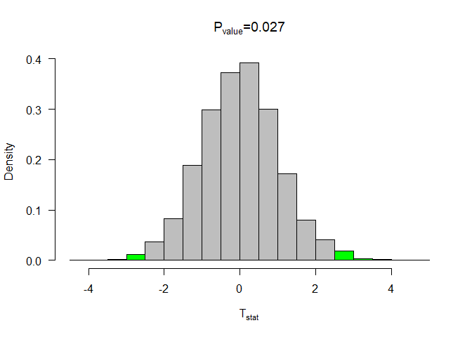<!-- -->

```r
boot
```

```
## $pvalue
## [1] 0.027
## 
## $tcalc
## [1] 2.356277
## 
## $n
## [1] 30
## 
## $x
##  [1] 25.60070 15.93812 25.75791 19.40389 25.00954 30.94259 22.47328
##  [8] 24.50383 26.52677 25.99205 24.75545 20.78383 14.62365 23.19618
## [15] 21.81155 23.16861 36.77682 30.46689 26.42921 29.96829 17.40364
## [22] 32.48559 29.09808 30.33025 28.66878 29.80172 21.53910 32.02999
## [29] 16.83231 26.30915
## 
## $test
## [1] "two"
## 
## $ci
##     2.5%    97.5% 
## 23.35295 27.15016
```

```r
boot=bootpval(x=x1,mu0=24,test="two")
```

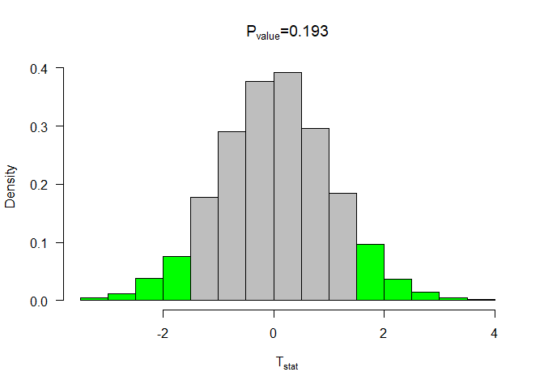<!-- -->

```r
boot
```

```
## $pvalue
## [1] 0.193
## 
## $tcalc
## [1] 1.326252
## 
## $n
## [1] 30
## 
## $x
##  [1] 25.60070 15.93812 25.75791 19.40389 25.00954 30.94259 22.47328
##  [8] 24.50383 26.52677 25.99205 24.75545 20.78383 14.62365 23.19618
## [15] 21.81155 23.16861 36.77682 30.46689 26.42921 29.96829 17.40364
## [22] 32.48559 29.09808 30.33025 28.66878 29.80172 21.53910 32.02999
## [29] 16.83231 26.30915
## 
## $test
## [1] "two"
## 
## $ci
##     2.5%    97.5% 
## 23.42505 27.10562
```

```r
boot=bootpval(x=x1,mu0=25,test="two")
```

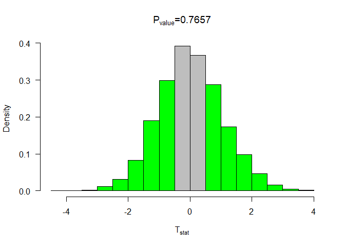<!-- -->

```r
boot
```

```
## $pvalue
## [1] 0.7656667
## 
## $tcalc
## [1] 0.2962266
## 
## $n
## [1] 30
## 
## $x
##  [1] 25.60070 15.93812 25.75791 19.40389 25.00954 30.94259 22.47328
##  [8] 24.50383 26.52677 25.99205 24.75545 20.78383 14.62365 23.19618
## [15] 21.81155 23.16861 36.77682 30.46689 26.42921 29.96829 17.40364
## [22] 32.48559 29.09808 30.33025 28.66878 29.80172 21.53910 32.02999
## [29] 16.83231 26.30915
## 
## $test
## [1] "two"
## 
## $ci
##     2.5%    97.5% 
## 23.41679 27.24529
```

```r
boot=bootpval(x=x1,mu0=26,test="two")
```

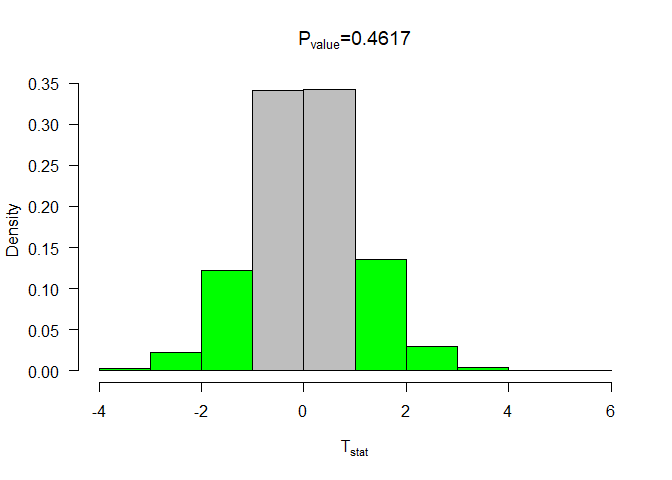<!-- -->

```r
boot
```

```
## $pvalue
## [1] 0.4616667
## 
## $tcalc
## [1] -0.7337985
## 
## $n
## [1] 30
## 
## $x
##  [1] 25.60070 15.93812 25.75791 19.40389 25.00954 30.94259 22.47328
##  [8] 24.50383 26.52677 25.99205 24.75545 20.78383 14.62365 23.19618
## [15] 21.81155 23.16861 36.77682 30.46689 26.42921 29.96829 17.40364
## [22] 32.48559 29.09808 30.33025 28.66878 29.80172 21.53910 32.02999
## [29] 16.83231 26.30915
## 
## $test
## [1] "two"
## 
## $ci
##     2.5%    97.5% 
## 23.44446 27.21564
```


# Task 3
## Task 3.1

```r
set.seed(30);x=rnorm(15,mean=10,sd=7)   # fake data to understand t-tests
set.seed(40); y=rnorm(20,mean=12,sd=4)
#boxplot(list(x=x,y=y)) # boxplot of a list

## Equal variances?
var.test(x,y)
```

```
## 
## 	F test to compare two variances
## 
## data:  x and y
## F = 3.3363, num df = 14, denom df = 19, p-value = 0.01596
## alternative hypothesis: true ratio of variances is not equal to 1
## 95 percent confidence interval:
##  1.260446 9.544255
## sample estimates:
## ratio of variances 
##            3.33631
```
The ratio of variances is unlikely to be one. Hence, var.equal=FALSE

## Task 3.2

```r
## t.test for NULL=muy-mux=0
t.test(x,y, mu=0,var.equal=FALSE)
```

```
## 
## 	Welch Two Sample t-test
## 
## data:  x and y
## t = -1.7945, df = 20.248, p-value = 0.08768
## alternative hypothesis: true difference in means is not equal to 0
## 95 percent confidence interval:
##  -7.9632156  0.5950525
## sample estimates:
## mean of x mean of y 
##  7.990343 11.674425
```

```r
## t.test for NULL=muy-mux=2
t.test(x,y,mu=2,var.equal=FALSE)
```

```
## 
## 	Welch Two Sample t-test
## 
## data:  x and y
## t = -2.7687, df = 20.248, p-value = 0.01176
## alternative hypothesis: true difference in means is not equal to 2
## 95 percent confidence interval:
##  -7.9632156  0.5950525
## sample estimates:
## mean of x mean of y 
##  7.990343 11.674425
```

We observe that the difference in the two means is plausible that it is 0 but not plausible that it is 2.

When doing two sample t-tests, we need see do the variance test first. The variance test will give us an information on the parameter var.equal to be passed into the t-test. From the t-test results, we can conclude if the NULL HYPOTHESIS is palusible or not.

# Task 4
## Task 4.1

```r
set.seed(30);x=rnorm(15,mean=10,sd=4)   # fake data to understand t-tests
set.seed(40);y=rnorm(20,mean=12,sd=4)

var.test(x,y)
```

```
## 
## 	F test to compare two variances
## 
## data:  x and y
## F = 1.0894, num df = 14, denom df = 19, p-value = 0.8454
## alternative hypothesis: true ratio of variances is not equal to 1
## 95 percent confidence interval:
##  0.4115743 3.1164915
## sample estimates:
## ratio of variances 
##           1.089407
```

The ratio of variances is likely to be one. Hence, var.equal=TRUE

## Task 4.2

```r
## t.test for NULL=muy-mux=0
t.test(x,y, mu=0,var.equal=TRUE)
```

```
## 
## 	Two Sample t-test
## 
## data:  x and y
## t = -2.0623, df = 33, p-value = 0.04712
## alternative hypothesis: true difference in means is not equal to 0
## 95 percent confidence interval:
##  -5.60756393 -0.03803598
## sample estimates:
## mean of x mean of y 
##  8.851625 11.674425
```

```r
## t.test for NULL=muy-mux=5
t.test(x,y,mu=2,var.equal=TRUE)
```

```
## 
## 	Two Sample t-test
## 
## data:  x and y
## t = -3.5235, df = 33, p-value = 0.001271
## alternative hypothesis: true difference in means is not equal to 2
## 95 percent confidence interval:
##  -5.60756393 -0.03803598
## sample estimates:
## mean of x mean of y 
##  8.851625 11.674425
```

We observe that the difference in the two means is unlikely to be both 0 and 2.

# Task 5

```r
## Bootstrap interval for a two sample test
boot2pval<-function(x1,x2,conf.level=0.95,iter=3000,mudiff=0, test="two"){
n1=length(x1)
n2=length(x2)
y1=x1-mean(x1)+mean(c(x1,x2))  # transform the data so that it is centered at the NULL
y2=x2-mean(x2)+mean(c(x1,x2))
y1rs.mat<-c()    #rs.mat will be come a resample matrix -- now it is an empty vector
x1rs.mat<-c()
y2rs.mat<-c()
x2rs.mat<-c()
for(i in 1:iter){ # for loop - the loop will go around iter times
y1rs.mat<-cbind(y1rs.mat,sample(y1,n1,replace=TRUE)) #sampling from y cbind -- column bind -- binds the vectors together by columns
y2rs.mat<-cbind(y2rs.mat,sample(y2,n2,replace=TRUE))

}
x1rs.mat<-y1rs.mat+mean(x1)-mean(c(x1,x2))
x2rs.mat<-y2rs.mat+mean(x2)-mean(c(x1,x2))

xbar1=mean(x1)
xbar2=mean(x2)
sx1sq=var(x1)
sx2sq=var(x2)

tcalc=(xbar1-xbar2-mudiff)/sqrt(sx1sq/n1+sx2sq/n2)

sy1sq=apply(y1rs.mat,2,var)
sy2sq=apply(y2rs.mat,2,var) 
y1bar=apply(y1rs.mat,2,mean)
y2bar=apply(y2rs.mat,2,mean)

tstat=(y1bar-y2bar-mudiff)/sqrt(sy1sq/n1+sy2sq/n2)


alpha=1-conf.level # calculating alpha
#ci=quantile(xstat,c(alpha/2,1-alpha/2))# Nice way to form a confidence interval
pvalue=ifelse(test=="two",length(tstat[tstat>abs(tcalc) | tstat < -abs(tcalc)])/iter,
ifelse(test=="upper",length(tstat[tstat>tcalc])/iter,
length(ytstat[tstat<tcalc])/iter))

h=hist(tstat,plot=FALSE)
mid=h$mid
if(test=="two"){
ncoll=length(mid[mid<= -abs(tcalc)])
ncolr=length(mid[mid>=  abs(tcalc)])
col=c(rep("Green",ncoll),rep("Gray",length(mid)-ncoll-ncolr),rep("Green",ncolr))
}
hist(tstat,col=col,freq=FALSE)
#segments(ci[1],0,ci[2],0,lwd=2)

return(list(pvalue=pvalue))
#return(list(pvalue=pvalue,tcalc=tcalc,n=n,x=x,test=test,ci=ci))
}

set.seed(30);x=rnorm(15,mean=10,sd=7)   
set.seed(40);y=rnorm(20,mean=12,sd=4)

### mudiff=0
boot2pval(x1=x,x2=y)
```

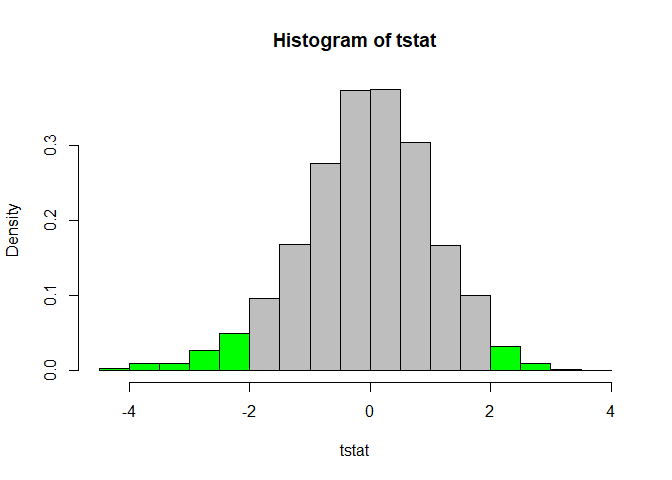<!-- -->

```
## $pvalue
## [1] 0.104
```

```r
### mudiff=2
boot2pval(x1=x,x2=y,mudiff=2)
```

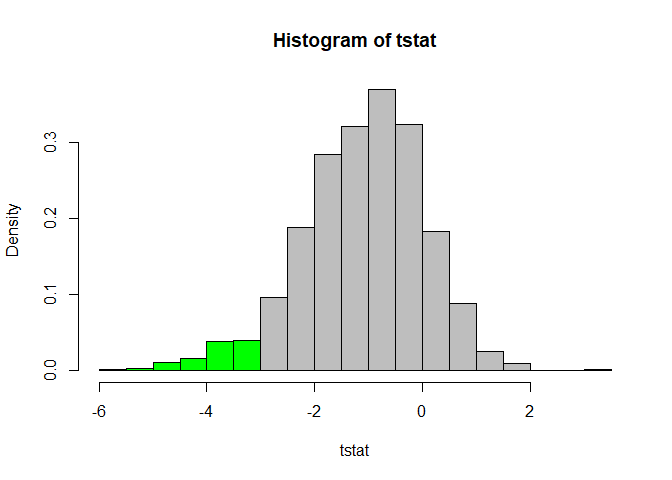<!-- -->

```
## $pvalue
## [1] 0.07566667
```

# Task 6

```r
set.seed(30);x=rnorm(15,mean=10,sd=4)   
set.seed(40);y=rnorm(20,mean=12,sd=4)

### mudiff=0
boot2pval(x1=x,x2=y)
```

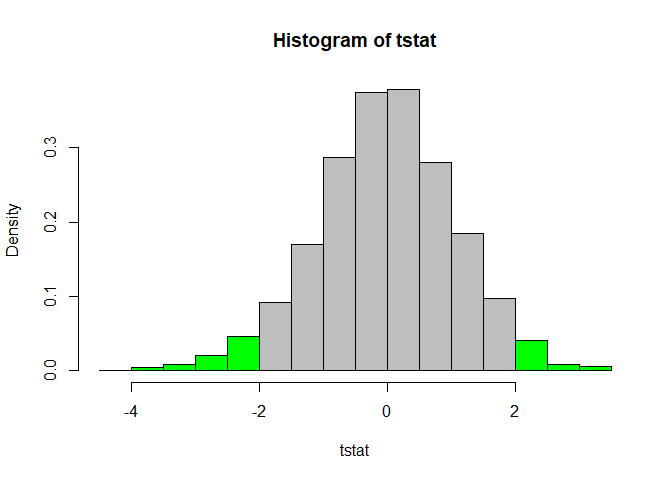<!-- -->

```
## $pvalue
## [1] 0.06033333
```

```r
### mudiff=5
boot2pval(x1=x,x2=y,mudiff=2)
```

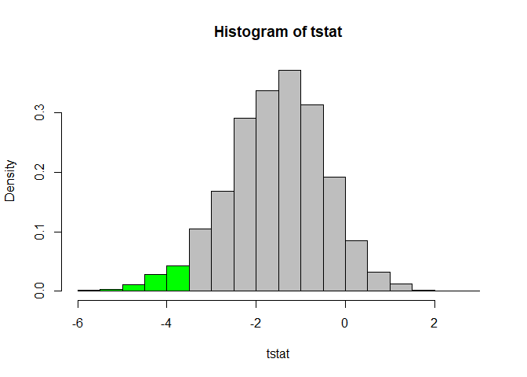<!-- -->

```
## $pvalue
## [1] 0.04333333
```

# Task 7

Line A - With sample x1, hypothesis testing is done with NULL HYPOTHESIS stating mu=23.

Line B- It indicates the results for the One Sample t-test is shown below.

Line C- It displays the value of t_calc, df(degrees of freedom) and p-value.

Line D- It tells us that the alternative hypothesis is that true mean is not equal to 23.

Line E- It indicates the the interval with 95% confidence level is shown below.

Line F- It tells us that, with 95% confidence, the true mean lies within (23.30198,27.27320).

Line G- It tells that the actual sample mean from x1 is 25.28759


