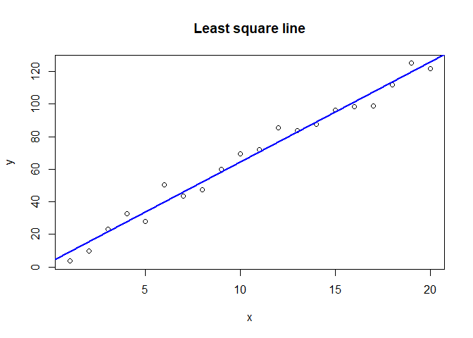
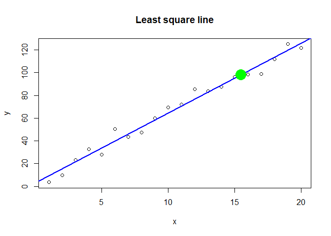
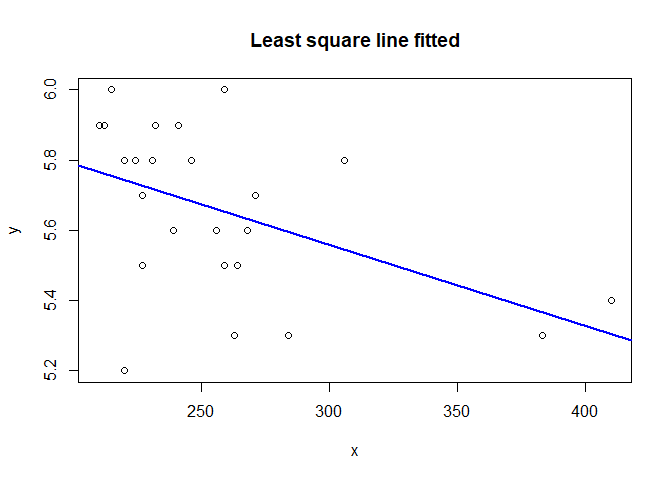
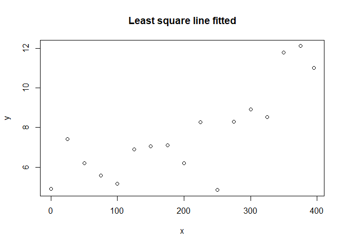
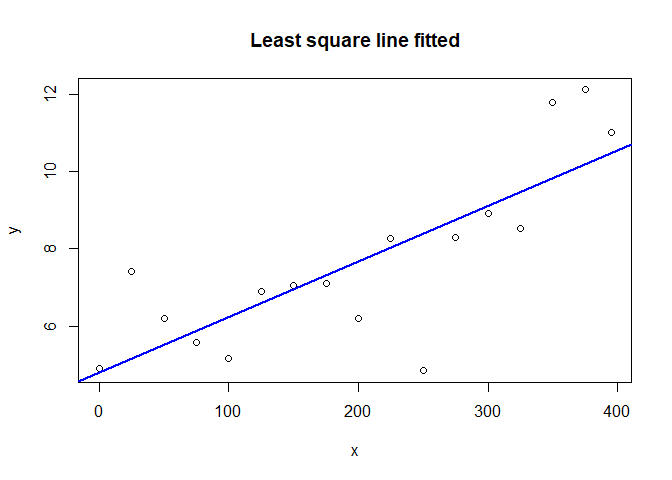
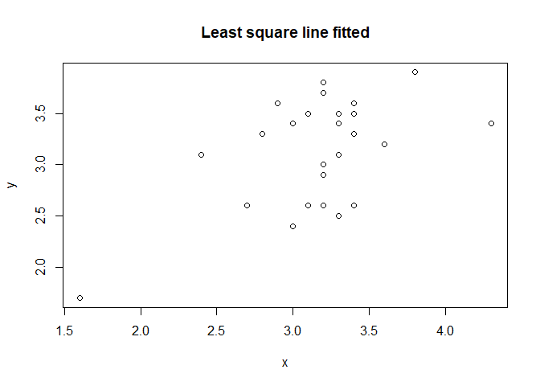
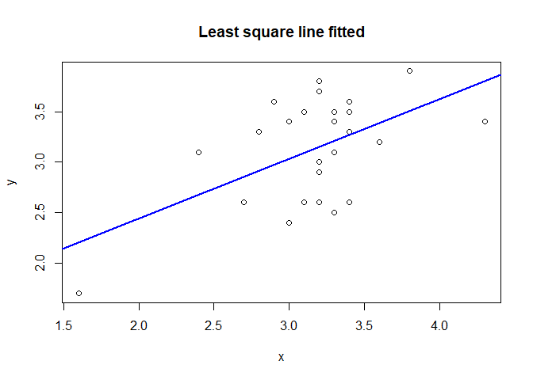

#Task 1

```r
getwd()
```

```
## [1] "C:/Users/prith/OneDrive/Documents/MATH4753_FA18/Lab14"
```

#Task 2
##Function

```r
mylsq=function(x,y){
  ssxx=sum((x-mean(x))^2 )
  ssxy=sum((x-mean(x))*(y-mean(y))) 
  b1hat=ssxy/ssxx
  b0hat=mean(y)-b1hat*mean(x)  
  return(list(b0hat=b0hat,b1hat= b1hat)) 
}
```

##abline

```r
x=1:20 
set.seed(29);y=4+6*x + rnorm(20,0,5) 
plot(x,y,main="Least square line",xlab="x",ylab="y")
mylsq(x,y)  #computeleast square estimates
```

```
## $b0hat
## [1] 3.102214
## 
## $b1hat
## [1] 6.130737
```

```r
b1hat=mylsq(x,y)$b1hat
b0hat=mylsq(x,y)$b0hat
abline(b0hat,b1hat,lwd=2,col="blue") # draw the abline of estimates
```

<!-- -->

##check

```r
slr=lm(y~x); summary(slr)
```

```
## 
## Call:
## lm(formula = y ~ x)
## 
## Residuals:
##     Min      1Q  Median      3Q     Max 
## -8.5348 -4.1612 -0.1713  2.6409 10.6656 
## 
## Coefficients:
##             Estimate Std. Error t value Pr(>|t|)    
## (Intercept)   3.1022     2.4814    1.25    0.227    
## x             6.1307     0.2071   29.60   <2e-16 ***
## ---
## Signif. codes:  0 '***' 0.001 '**' 0.01 '*' 0.05 '.' 0.1 ' ' 1
## 
## Residual standard error: 5.342 on 18 degrees of freedom
## Multiple R-squared:  0.9799,	Adjusted R-squared:  0.9787 
## F-statistic: 875.9 on 1 and 18 DF,  p-value: < 2.2e-16
```

#Task 3
##Function

```r
mypred=function(x,b0,b1){
ym=b0+ b1*x
ym
}
```

## b

```r
ym=mypred(x=15.5,b0hat,b1hat)
ym
```

```
## [1] 98.12864
```

```r
set.seed(29);y=4+6*x + rnorm(20,0,5) 
plot(x,y,main="Least square line",xlab="x",ylab="y")
mylsq(x,y)  #computeleast square estimates
```

```
## $b0hat
## [1] 3.102214
## 
## $b1hat
## [1] 6.130737
```

```r
b1hat=mylsq(x,y)$b1hat
b0hat=mylsq(x,y)$b0hat
abline(b0hat,b1hat,lwd=2,col="blue") # draw the abline of estimates
points(x=15.5,y=ym,cex=3,col="Green",pch=19)
```

<!-- -->

## c
### a

```r
OJ = read.csv("OJUICE.csv",sep=",")
x=OJ$Pectin
y=OJ$SweetIndex
mylsq(x,y)
```

```
## $b0hat
## [1] 6.252068
## 
## $b1hat
## [1] -0.002310626
```

```r
b1hat=mylsq(x,y)$b1hat
b0hat=mylsq(x,y)$b0hat
plot(x,y,main="Least square line fitted",xlab="x",ylab="y")
abline(b0hat,b1hat,lwd=2,col="blue")
```

<!-- -->

```r
ym=mypred(x=300,b0hat,b1hat)
ym
```

```
## [1] 5.55888
```

### b
```
B1hat is slope of fitted line when we increase pectin by one, the sweetness of OJUICE will decrease by 0.00231062. B0hat is the cuttoff of the fitted line and when the pectin is zero the sweetness will be 6.252068
```

### c

```r
ym=mypred(x=300,b0hat,b1hat)
ym
```

```
## [1] 5.55888
```


## d

### a

```r
DR = read.csv("DRILLROCK.csv",sep=",")
x=DR$DEPTH
y=DR$TIME
mylsq(x,y)
```

```
## $b0hat
## [1] 4.789603
## 
## $b1hat
## [1] 0.01438785
```

```r
b1hat=mylsq(x,y)$b1hat
b0hat=mylsq(x,y)$b0hat
plot(x,y,main="Least square line fitted",xlab="x",ylab="y")
```

<!-- -->

### b
```
The least square prediction equation is:
y = b0hat+b1hat+x
y=4.789603+0.0143878*x
```

### c

```r
DR = read.csv("DRILLROCK.csv",sep=",")
x=DR$DEPTH
y=DR$TIME
mylsq(x,y)
```

```
## $b0hat
## [1] 4.789603
## 
## $b1hat
## [1] 0.01438785
```

```r
b1hat=mylsq(x,y)$b1hat
b0hat=mylsq(x,y)$b0hat
plot(x,y,main="Least square line fitted",xlab="x",ylab="y")
abline(b0hat,b1hat,lwd=2,col="blue")
```

<!-- -->


#Task 4
##Function

```r
mysq=function(x,y){
  n=length(x)
  ssxx=sum((x-mean(x))^2 )
  ssxy=sum((x-mean(x))*(y-mean(y))) 
  b1hat=ssxy/ssxx
  b0hat=mean(y)-b1hat*mean(x)   
  yhat=b0hat+ b1hat*x  
  ssr=sum((y-yhat)^2) 
  sq=ssr/(n-2)  
  return(list(ssr=ssr,sq=sq))
}
```

##From task 2

```r
x=1:20 
set.seed(29);y=4+6*x + rnorm(20,0,5) 
obj = mysq(x,y)
obj$ssr
```

```
## [1] 513.6199
```

```r
obj$sq
```

```
## [1] 28.53444
```

```r
sqrt(obj$sq) 
```

```
## [1] 5.341763
```

##Carbon Data
### a

```r
C = read.csv("CARBON.csv",sep=",")
x=C$LabFurnace
y=C$PilotPlant
mylsq(x,y)
```

```
## $b0hat
## [1] 1.264785
## 
## $b1hat
## [1] 0.5888795
```

```r
b1hat=mylsq(x,y)$b1hat
b0hat=mylsq(x,y)$b0hat
plot(x,y,main="Least square line fitted",xlab="x",ylab="y")
```

<!-- -->

### b

```r
x=C$LabFurnace
y=C$PilotPlant
mylsq(x,y)
```

```
## $b0hat
## [1] 1.264785
## 
## $b1hat
## [1] 0.5888795
```

```r
b1hat=mylsq(x,y)$b1hat
b0hat=mylsq(x,y)$b0hat
plot(x,y,main="Least square line fitted",xlab="x",ylab="y")
abline(b0hat,b1hat,lwd=2,col="blue")
```

<!-- -->

### c

```r
obj = mysq(x,y)
obj$ssr
```

```
## [1] 4.694591
```

```r
obj$sq
```

```
## [1] 0.2041127
```

### d

```r
sqrt(obj$sq)
```

```
## [1] 0.4517883
```


