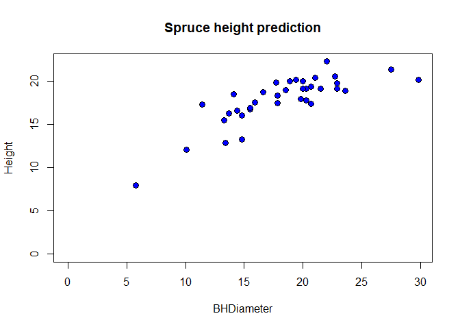
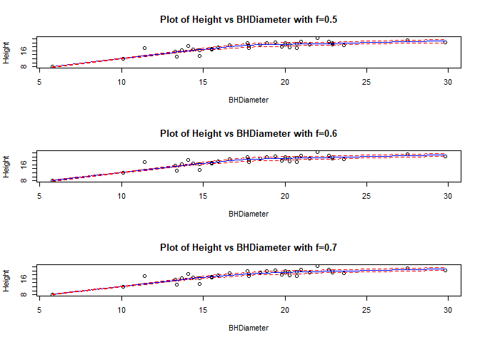
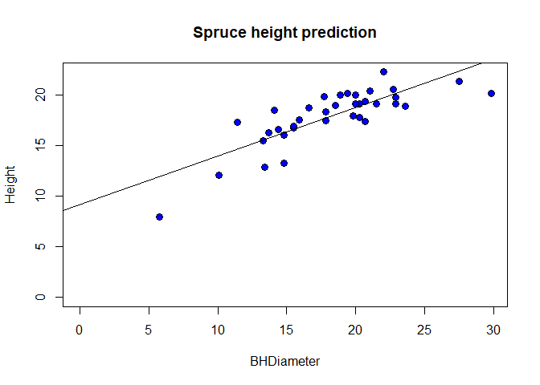
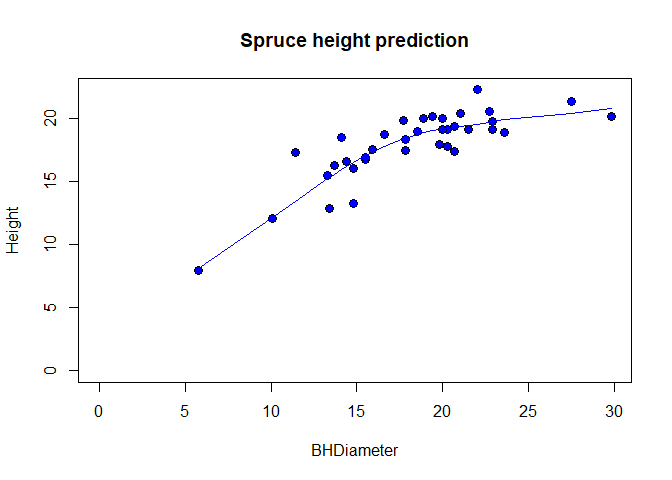
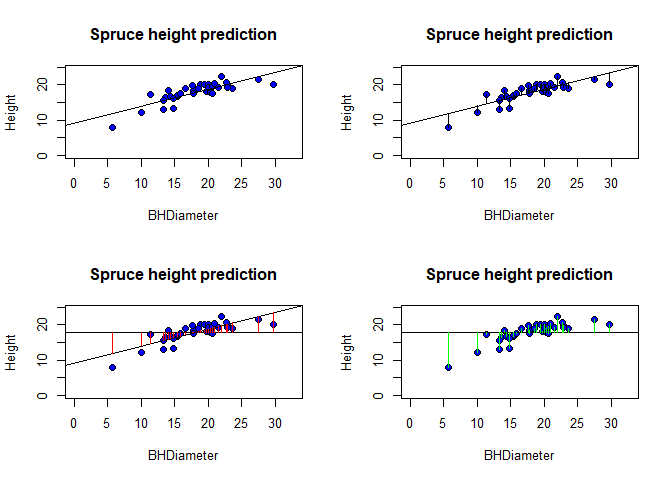
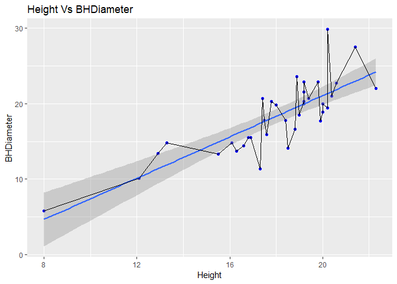

#Task 1

```r
getwd()
```

```
## [1] "C:/Users/prith/OneDrive/Documents/MATH4753_FA18/Lab3"
```

#Task 2

```r
spruce.df=read.csv("SPRUCE.csv")
head(spruce.df)
```

```
##   BHDiameter Height
## 1       18.9   20.0
## 2       16.6   18.8
## 3       15.5   16.8
## 4       15.5   16.9
## 5       19.4   20.2
## 6       13.7   16.3
```

#Task 3
##Prediction

```r
plot(Height~BHDiameter,bg="Blue",pch=21,cex=1.2,
     ylim=c(0,max(Height)),xlim=c(0,max(BHDiameter)), 
     main="Spruce height prediction",data=spruce.df)
```

<!-- -->

##Trendscatter

```r
library(s20x)
```

```
## Warning: package 's20x' was built under R version 3.4.4
```

```r
layout(matrix(1:3,nr=3,nc=1))
trendscatter(Height~BHDiameter,f=0.5,data=spruce.df, main="Plot of Height vs BHDiameter with f=0.5")
trendscatter(Height~BHDiameter,f=0.6,data=spruce.df, main="Plot of Height vs BHDiameter with f=0.6")
trendscatter(Height~BHDiameter,f=0.7,data=spruce.df, main="Plot of Height vs BHDiameter with f=0.7")
```

<!-- -->

##Creating Linear model

```r
# Now make the linear model
spruce.lm=lm(Height~BHDiameter,data=spruce.df)
plot(Height~BHDiameter,bg="Blue",pch=21,cex=1.2,
     ylim=c(0,max(Height)),xlim=c(0,max(BHDiameter)), 
     main="Spruce height prediction",data=spruce.df)
abline(spruce.lm)
```

<!-- -->

```
The graph seems to be acccurate at the first glance but it misses out on a few points towards the ends of each side.
```

##Curve trend for the same data for Comparison

```r
plot(Height~BHDiameter,bg="Blue",pch=21,cex=1.2,
     ylim=c(0,max(Height)),xlim=c(0,max(BHDiameter)), 
     main="Spruce height prediction",data=spruce.df)
lines(lowess(spruce.df), col="blue")
```

<!-- -->

```
In this graph we can see that the curved graph seems to include almost all of the points near the line.
This graph seems more accurate than the previous graph.
```

#Task 4
##Layout graph

```r
layout(matrix(1:4,nr=2,nc=2,byrow=TRUE))

#plot1
plot(Height~BHDiameter,bg="Blue",pch=21,cex=1.2,
ylim=c(0,1.1*max(Height)),xlim=c(0,1.1*max(BHDiameter)), 
main="Spruce height prediction",data=spruce.df)

abline(spruce.lm)

#plot2
plot(Height~BHDiameter,bg="Blue",pch=21,cex=1.2,
ylim=c(0,1.1*max(Height)),xlim=c(0,1.1*max(BHDiameter)), 
main="Spruce height prediction",data=spruce.df)

abline(spruce.lm)
yhat=with(spruce.df,predict(spruce.lm,data.frame(BHDiameter)))
yhat=fitted(spruce.lm) 
with(spruce.df,{
segments(BHDiameter,Height,BHDiameter,yhat)
})

#plot3
plot(Height~BHDiameter,bg="Blue",pch=21,cex=1.2,
ylim=c(0,1.1*max(Height)),xlim=c(0,1.1*max(BHDiameter)), 
main="Spruce height prediction",data=spruce.df)

with(spruce.df, abline(h=mean(Height)))
abline(spruce.lm)
with(spruce.df, segments(BHDiameter,mean(Height),BHDiameter,yhat,col="Red"))

#plot4
plot(Height~BHDiameter,bg="Blue",pch=21,cex=1.2,
ylim=c(0,1.1*max(Height)),xlim=c(0,1.1*max(BHDiameter)), 
main="Spruce height prediction",data=spruce.df)

with(spruce.df,abline(h=mean(Height)))
with(spruce.df, segments(BHDiameter,Height,BHDiameter,mean(Height),col="Green"))
```

<!-- -->

##Calculate MSS,RSS and TSS

```r
RSS=with(spruce.df,sum((Height-yhat)^2))
RSS
```

```
## [1] 95.70281
```


```r
MSS=with(spruce.df,sum((yhat-mean(Height))^2))
MSS
```

```
## [1] 183.2447
```


```r
TSS=with(spruce.df,sum((Height-mean(Height))^2))
TSS
```

```
## [1] 278.9475
```

##Calculate MSS/TSS

```r
MSS/TSS
```

```
## [1] 0.6569146
```

```
It is equal to the Multiple R-squared
```

##Tss=Mss+RSS?

```r
TSS
```

```
## [1] 278.9475
```

```r
MSS+RSS
```

```
## [1] 278.9475
```

```
They are equal
```

#Task 5
##Summarize

```r
summary(spruce.lm)
```

```
## 
## Call:
## lm(formula = Height ~ BHDiameter, data = spruce.df)
## 
## Residuals:
##     Min      1Q  Median      3Q     Max 
## -3.9394 -0.9763  0.2829  0.9950  2.6644 
## 
## Coefficients:
##             Estimate Std. Error t value Pr(>|t|)    
## (Intercept)  9.14684    1.12131   8.157 1.63e-09 ***
## BHDiameter   0.48147    0.05967   8.069 2.09e-09 ***
## ---
## Signif. codes:  0 '***' 0.001 '**' 0.01 '*' 0.05 '.' 0.1 ' ' 1
## 
## Residual standard error: 1.678 on 34 degrees of freedom
## Multiple R-squared:  0.6569,	Adjusted R-squared:  0.6468 
## F-statistic:  65.1 on 1 and 34 DF,  p-value: 2.089e-09
```

##Value of slope and intercept

```r
coef(spruce.lm)
```

```
## (Intercept)  BHDiameter 
##   9.1468390   0.4814743
```

```
Value of slope = 0.48147

Value of intercept = 9.14684
```
##Fitted line Equation
```
Height = 9.146839 + BHDiameter * 0.4814743
```
##Predictions

```r
predict(spruce.lm, data.frame(BHDiameter=c(15,18,20)))
```

```
##        1        2        3 
## 16.36895 17.81338 18.77632
```

#Task 6

```r
library(ggplot2)
```

```
## Warning: package 'ggplot2' was built under R version 3.4.4
```

```r
ggplot(data = spruce.lm, aes(x = Height, y = BHDiameter)) + 
  geom_point(color='blue') +
  geom_smooth(method = "lm", se = TRUE) +
  geom_line(aes(Height, BHDiameter)) +
  labs(title="Height Vs BHDiameter")
```

<!-- -->

