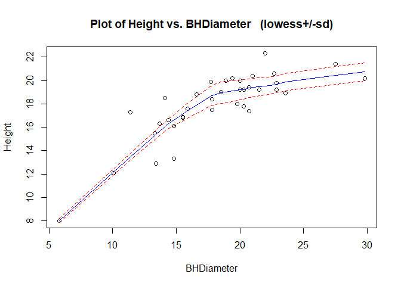
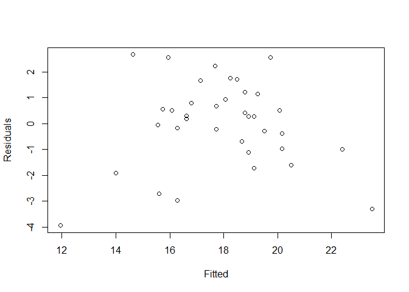
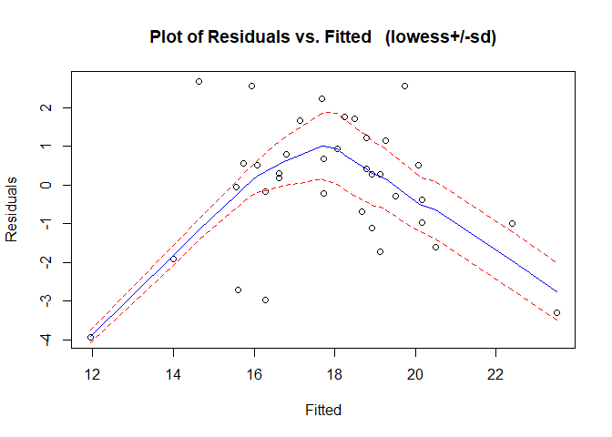
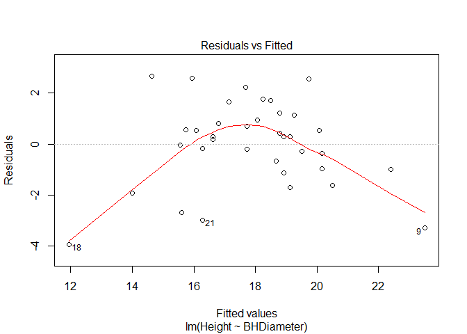
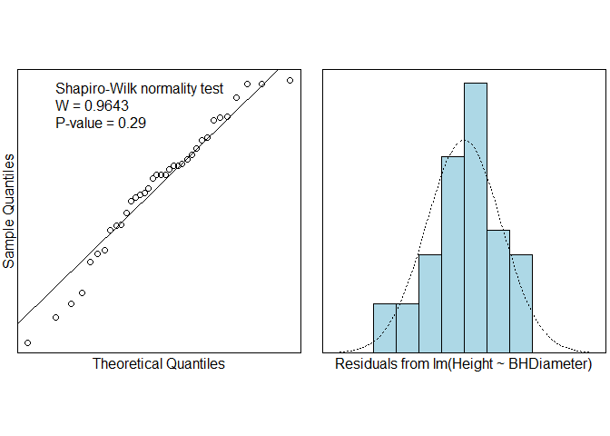
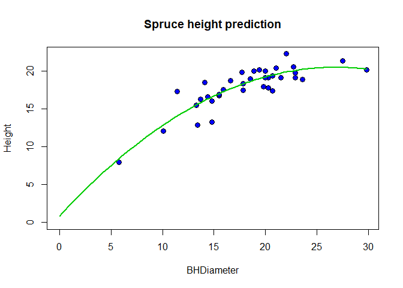

#Task 1

```r
getwd()
```

```
## [1] "C:/Users/prith/OneDrive/Documents/MATH4753_FA18/Lab4"
```

#Task 2

```r
dird="C:\\Users\\prith\\OneDrive\\Documents\\MATH4753_FA18\\DATAxls\\"

myread=function(csv){
  fl=paste(dird,csv,sep="")
  read.table(fl,header=TRUE,sep=",")
}

spruce.df=myread("SPRUCE.csv")#MS pg478
with(spruce.df, dput(list(D=BHDiameter,H=Height), 
                     file="spruce.dat"))

#Last six lines
tail(spruce.df)
```

```
##    BHDiameter Height
## 31       17.7   19.9
## 32       20.7   19.4
## 33       21.0   20.4
## 34       13.3   15.5
## 35       15.9   17.6
## 36       22.9   19.2
```

#Task 3
##Task 3.1 Trendscatter

```r
library(s20x)
```

```
## Warning: package 's20x' was built under R version 3.4.4
```

```r
trendscatter(Height~BHDiameter,f=0.5,data=spruce.df)
```

<!-- -->

##Task 3.2 Linear Model Spruce.lm

```r
spruce.lm=lm(Height~BHDiameter,data=spruce.df)
summary(spruce.lm)
```

```
## 
## Call:
## lm(formula = Height ~ BHDiameter, data = spruce.df)
## 
## Residuals:
##     Min      1Q  Median      3Q     Max 
## -3.9394 -0.9763  0.2829  0.9950  2.6644 
## 
## Coefficients:
##             Estimate Std. Error t value Pr(>|t|)    
## (Intercept)  9.14684    1.12131   8.157 1.63e-09 ***
## BHDiameter   0.48147    0.05967   8.069 2.09e-09 ***
## ---
## Signif. codes:  0 '***' 0.001 '**' 0.01 '*' 0.05 '.' 0.1 ' ' 1
## 
## Residual standard error: 1.678 on 34 degrees of freedom
## Multiple R-squared:  0.6569,	Adjusted R-squared:  0.6468 
## F-statistic:  65.1 on 1 and 34 DF,  p-value: 2.089e-09
```

##Task 3.3 height.res and height.fit

```r
#residuals  created from the linear model object
height.res=residuals(spruce.lm)

#fitted values made from the linear model object
height.fit=fitted(spruce.lm)
```

##Task 3.4 Plot and Trendscatter plot

```r
#Make the plot using the plot function 
plot(height.fit,height.res, xlab="Fitted", ylab="Residuals")
```

<!-- -->

```r
# Put a lowess smoother through res vs fitted
trendscatter( height.fit,height.res, xlab="Fitted", ylab="Residuals")
```

<!-- -->

```
The plot with Residuals and Fitted shows us a Quadractic graph while the plot earlier shows a gradually rising graph and flat towards the end.

```

##Task 3.5 plot Residuals

```r
# Quick way to make a residual plot
plot(spruce.lm, which =1)
```

<!-- -->

##Task 3.6 Check Normality

```r
# Two plots testing normality
normcheck(spruce.lm,shapiro.wilk = TRUE)
```

<!-- -->

```
P-Value = 0.29

Since the value is smaller, there is  higher evidence towards the Null hypothesis.
```

##Task 3.7 Conclusion
```
Applying the straight line to this data set is valid because the mode of the residual bar graph is 0 which means that there is no residual because the theoretical and actual were the same.
```

#Task 4
##Task 4.1 create quad.lm

```r
# Creating Quad.lm Linear model for quadratic equation
quad.lm=lm(Height~BHDiameter + I(BHDiameter^2),data=spruce.df)
summary(quad.lm)
```

```
## 
## Call:
## lm(formula = Height ~ BHDiameter + I(BHDiameter^2), data = spruce.df)
## 
## Residuals:
##     Min      1Q  Median      3Q     Max 
## -3.2966 -0.6245 -0.0707  0.7442  3.2541 
## 
## Coefficients:
##                  Estimate Std. Error t value Pr(>|t|)    
## (Intercept)      0.860896   2.205022   0.390 0.698731    
## BHDiameter       1.469592   0.243786   6.028 8.88e-07 ***
## I(BHDiameter^2) -0.027457   0.006635  -4.138 0.000227 ***
## ---
## Signif. codes:  0 '***' 0.001 '**' 0.01 '*' 0.05 '.' 0.1 ' ' 1
## 
## Residual standard error: 1.382 on 33 degrees of freedom
## Multiple R-squared:  0.7741,	Adjusted R-squared:  0.7604 
## F-statistic: 56.55 on 2 and 33 DF,  p-value: 2.182e-11
```

##Task 4.2 Plot with Quadratic curve

```r
#add to the scatter plot
plot(Height~BHDiameter,bg="Blue",pch=21,cex=1.2,
ylim=c(0,max(Height)),xlim=c(0,max(BHDiameter)), 
main="Spruce height prediction",data=spruce.df)

myplot=function(x){
 0.86089580 +1.46959217*x  -0.02745726*x^2
 }
 
 #Or more general method
myplot=function(x){
 quad.lm$coef[1] +quad.lm$coef[2]*x  + quad.lm$coef[3]*x^2
 } 
 
curve(myplot, lwd=2, col="green3",add=TRUE)
```

<!-- -->

