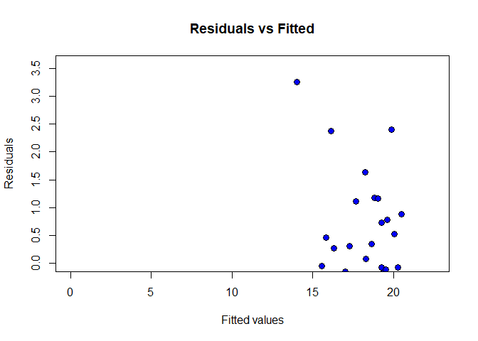
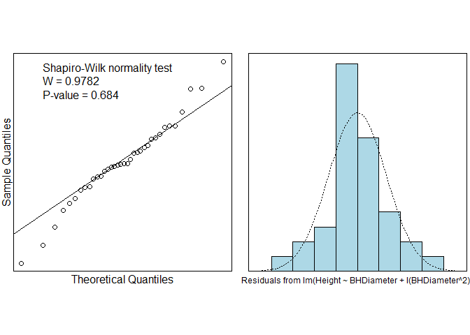
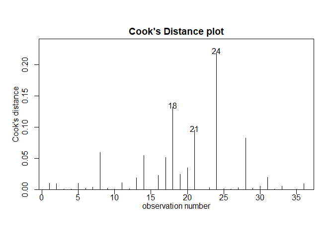
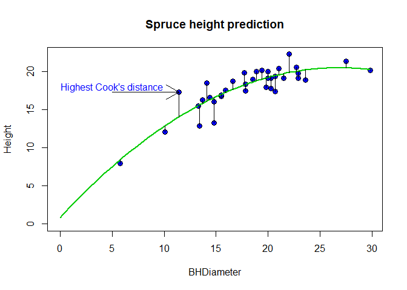

#Task 1

```r
getwd()
```

```
## [1] "C:/Users/prith/OneDrive/Documents/MATH4753_FA18/Lab4"
```

#Task 2

```r
dird="C:\\Users\\prith\\OneDrive\\Documents\\MATH4753_FA18\\DATAxls\\"

myread=function(csv){
  fl=paste(dird,csv,sep="")
  read.table(fl,header=TRUE,sep=",")
}

spruce.df=myread("SPRUCE.csv")#MS pg478
with(spruce.df, dput(list(D=BHDiameter,H=Height), 
                     file="spruce.dat"))

#Last six lines
tail(spruce.df)
```

```
##    BHDiameter Height
## 31       17.7   19.9
## 32       20.7   19.4
## 33       21.0   20.4
## 34       13.3   15.5
## 35       15.9   17.6
## 36       22.9   19.2
```

#Task 3
##Task 3.1 Trendscatter

```r
library(s20x)
```

```
## Warning: package 's20x' was built under R version 3.4.4
```

```r
trendscatter(Height~BHDiameter,f=0.5,data=spruce.df)
```

<!-- -->

##Task 3.2 Linear Model Spruce.lm

```r
spruce.lm=lm(Height~BHDiameter,data=spruce.df)
summary(spruce.lm)
```

```
## 
## Call:
## lm(formula = Height ~ BHDiameter, data = spruce.df)
## 
## Residuals:
##     Min      1Q  Median      3Q     Max 
## -3.9394 -0.9763  0.2829  0.9950  2.6644 
## 
## Coefficients:
##             Estimate Std. Error t value Pr(>|t|)    
## (Intercept)  9.14684    1.12131   8.157 1.63e-09 ***
## BHDiameter   0.48147    0.05967   8.069 2.09e-09 ***
## ---
## Signif. codes:  0 '***' 0.001 '**' 0.01 '*' 0.05 '.' 0.1 ' ' 1
## 
## Residual standard error: 1.678 on 34 degrees of freedom
## Multiple R-squared:  0.6569,	Adjusted R-squared:  0.6468 
## F-statistic:  65.1 on 1 and 34 DF,  p-value: 2.089e-09
```

##Task 3.3 height.res and height.fit

```r
#residuals  created from the linear model object
height.res=residuals(spruce.lm)

#fitted values made from the linear model object
height.fit=fitted(spruce.lm)
```

##Task 3.4 Plot and Trendscatter plot

```r
#Make the plot using the plot function 
plot(height.fit,height.res, xlab="Fitted", ylab="Residuals")
```

<!-- -->

```r
# Put a lowess smoother through res vs fitted
trendscatter( height.fit,height.res, xlab="Fitted", ylab="Residuals")
```

<!-- -->

```
The plot with Residuals and Fitted shows us a Quadractic graph while the plot earlier shows a gradually rising graph and flat towards the end.

```

##Task 3.5 plot Residuals

```r
# Quick way to make a residual plot
plot(spruce.lm, which =1)
```

<!-- -->

##Task 3.6 Check Normality

```r
# Two plots testing normality
normcheck(spruce.lm,shapiro.wilk = TRUE)
```

<!-- -->

```
P-Value = 0.29

Since the value is smaller, there is  higher evidence towards the Null hypothesis. But not high enough to disregard the hypothesis.
```

##Task 3.7 Conclusion
```
Applying the straight line to this data set is valid because the mode of the residual bar graph is 0 which means that there is no residual because the theoretical and actual were the same.
```

#Task 4
##Task 4.1 create quad.lm

```r
# Creating Quad.lm Linear model for quadratic equation
quad.lm=lm(Height~BHDiameter + I(BHDiameter^2),data=spruce.df)
summary(quad.lm)
```

```
## 
## Call:
## lm(formula = Height ~ BHDiameter + I(BHDiameter^2), data = spruce.df)
## 
## Residuals:
##     Min      1Q  Median      3Q     Max 
## -3.2966 -0.6245 -0.0707  0.7442  3.2541 
## 
## Coefficients:
##                  Estimate Std. Error t value Pr(>|t|)    
## (Intercept)      0.860896   2.205022   0.390 0.698731    
## BHDiameter       1.469592   0.243786   6.028 8.88e-07 ***
## I(BHDiameter^2) -0.027457   0.006635  -4.138 0.000227 ***
## ---
## Signif. codes:  0 '***' 0.001 '**' 0.01 '*' 0.05 '.' 0.1 ' ' 1
## 
## Residual standard error: 1.382 on 33 degrees of freedom
## Multiple R-squared:  0.7741,	Adjusted R-squared:  0.7604 
## F-statistic: 56.55 on 2 and 33 DF,  p-value: 2.182e-11
```

##Task 4.2 Plot with Quadratic curve

```r
#add to the scatter plot
plot(Height~BHDiameter,bg="Blue",pch=21,cex=1.2,
ylim=c(0,max(Height)),xlim=c(0,max(BHDiameter)), 
main="Spruce height prediction",data=spruce.df)

myplot=function(x){
 0.86089580 +1.46959217*x  -0.02745726*x^2
 }
 
 #Or more general method
myplot=function(x){
 quad.lm$coef[1] +quad.lm$coef[2]*x  + quad.lm$coef[3]*x^2
 } 
 
curve(myplot, lwd=2, col="green3",add=TRUE)
```

<!-- -->

##Task 4.3 Fitted Quadratic

```r
# Make quad.fit, a vector of fitted values
quad.fit = fitted(quad.lm) 

# Find the residuals for quadratic fit 
height.res_2 = residuals(quad.lm)

# Plot the residuals vs fitted values.
plot(height.res_2~quad.fit,bg="Blue",pch=21, cex=1.2,
     ylim=c(0,1.1*max(height.res_2)),xlim=c(0,1.1*max(quad.fit)),
     main="Residuals vs Fitted", ylab="Residuals", xlab="Fitted values")
```

<!-- -->

##Task 4.4 Normcheck

```r
# construct QQ plot 
normcheck(quad.lm,shapiro.wilk = TRUE)
```

<!-- -->

P-Value is 0.684.

This value is very much greater than the linear model making its case against Null hypothesis.

#Task 5
##Summarize Quad.lm

```r
#summarize quad.lm
summary(quad.lm)
```

```
## 
## Call:
## lm(formula = Height ~ BHDiameter + I(BHDiameter^2), data = spruce.df)
## 
## Residuals:
##     Min      1Q  Median      3Q     Max 
## -3.2966 -0.6245 -0.0707  0.7442  3.2541 
## 
## Coefficients:
##                  Estimate Std. Error t value Pr(>|t|)    
## (Intercept)      0.860896   2.205022   0.390 0.698731    
## BHDiameter       1.469592   0.243786   6.028 8.88e-07 ***
## I(BHDiameter^2) -0.027457   0.006635  -4.138 0.000227 ***
## ---
## Signif. codes:  0 '***' 0.001 '**' 0.01 '*' 0.05 '.' 0.1 ' ' 1
## 
## Residual standard error: 1.382 on 33 degrees of freedom
## Multiple R-squared:  0.7741,	Adjusted R-squared:  0.7604 
## F-statistic: 56.55 on 2 and 33 DF,  p-value: 2.182e-11
```

The value of $\hat\beta_0$ = 0.8609

The value of $\hat\beta_1$ = 1.4696

The value of $\hat\beta_2$ = -0.0274


##Interval Estimates

```r
#Make interval estimates
ciReg(quad.lm)
```

```
##                 95 % C.I.lower    95 % C.I.upper
## (Intercept)           -3.62525           5.34705
## BHDiameter             0.97361           1.96558
## I(BHDiameter^2)       -0.04096          -0.01396
```

##Height Prediction

```r
#predict height of spruce tree with quad.lm when diamater is 15,18 and 20cm
predict(quad.lm, data.frame(BHDiameter=c(15,18,20)))
```

```
##        1        2        3 
## 16.72690 18.41740 19.26984
```

```r
# prediction using linear model spruce.lm when diameter is 15,18 and 20cm
predict(spruce.lm, data.frame(BHDiameter = c(15,18,20)))
```

```
##        1        2        3 
## 16.36895 17.81338 18.77632
```


##Multiple R-squared comparison

Multiple R-squared value for Quadratic model is 0.7741

Multiple R-squared value for Linear model is 0.6569

Multiple R-squared gives us the measure of variability.

**The Quadratic model is better here because it has more variability.**

**Quadratic model has more variability compared to linear model. We can say this by looking at multiple r-squared values above**


##Anova Comparison

```r
anova(spruce.lm,quad.lm)
```

```
## Analysis of Variance Table
## 
## Model 1: Height ~ BHDiameter
## Model 2: Height ~ BHDiameter + I(BHDiameter^2)
##   Res.Df    RSS Df Sum of Sq      F    Pr(>F)    
## 1     34 95.703                                  
## 2     33 63.007  1    32.696 17.125 0.0002269 ***
## ---
## Signif. codes:  0 '***' 0.001 '**' 0.01 '*' 0.05 '.' 0.1 ' ' 1
```

##Calculate TSS, MSS and RSS

```r
height.qfit=fitted(quad.lm)
height.qfit
```

```
##         1         2         3         4         5         6         7 
## 18.828182 17.690005 17.042969 17.042969 19.037171 15.840856 19.269837 
##         8         9        10        11        12        13        14 
## 20.510131 20.271601 19.378756 19.194478 20.115697 19.378756 16.123368 
##        15        16        17        18        19        20        21 
## 19.269837 12.902862 19.902612  8.460868 20.250678 19.516294 16.596623 
##        22        23        24        25        26        27        28 
## 18.320080 20.072189 14.045902 18.651105 16.329487 19.765011 15.623206 
##        29        30        31        32        33        34        35 
## 16.596623 18.320080 18.270594 19.516294 19.613682 15.549558 17.285943 
##        36 
## 20.115697
```

```r
#  RSS=residual sum of squares
RSS=with(spruce.df,sum((Height-height.qfit)^2))
RSS
```

```
## [1] 63.00683
```

```r
# MSS=model sum of squares
MSS=with(spruce.df,sum((height.qfit-mean(Height))^2))
MSS
```

```
## [1] 215.9407
```

```r
# TSS=total sum of squares
TSS=with(spruce.df,sum((Height-mean(Height))^2))
TSS 
```

```
## [1] 278.9475
```

```r
# Calculate MSS/TSS, and interpret it!
MSS/TSS
```

```
## [1] 0.7741266
```

#Task 6
##Cooks plot

```r
cooks20x(quad.lm)
```

<!-- -->

We can say that cooks distance is used to find the outliers in observations for predictor variables. It also gives the influence of all the observations on a fitted response values. If the observation using cooks distance is greater than thrice of the mean cooks distance might be an outlier.

##Highest cooks value removed

```r
quad2.lm=lm(Height~BHDiameter + I(BHDiameter^2) , data=spruce.df[-24,])
summary(quad2.lm)
```

```
## 
## Call:
## lm(formula = Height ~ BHDiameter + I(BHDiameter^2), data = spruce.df[-24, 
##     ])
## 
## Residuals:
##      Min       1Q   Median       3Q      Max 
## -3.11233 -0.48227  0.01253  0.71727  2.59146 
## 
## Coefficients:
##                  Estimate Std. Error t value Pr(>|t|)    
## (Intercept)     -0.341500   2.068479  -0.165     0.87    
## BHDiameter       1.564793   0.226102   6.921 7.78e-08 ***
## I(BHDiameter^2) -0.029242   0.006114  -4.782 3.74e-05 ***
## ---
## Signif. codes:  0 '***' 0.001 '**' 0.01 '*' 0.05 '.' 0.1 ' ' 1
## 
## Residual standard error: 1.266 on 32 degrees of freedom
## Multiple R-squared:  0.8159,	Adjusted R-squared:  0.8044 
## F-statistic: 70.91 on 2 and 32 DF,  p-value: 1.74e-12
```

```r
summary(quad.lm)
```

```
## 
## Call:
## lm(formula = Height ~ BHDiameter + I(BHDiameter^2), data = spruce.df)
## 
## Residuals:
##     Min      1Q  Median      3Q     Max 
## -3.2966 -0.6245 -0.0707  0.7442  3.2541 
## 
## Coefficients:
##                  Estimate Std. Error t value Pr(>|t|)    
## (Intercept)      0.860896   2.205022   0.390 0.698731    
## BHDiameter       1.469592   0.243786   6.028 8.88e-07 ***
## I(BHDiameter^2) -0.027457   0.006635  -4.138 0.000227 ***
## ---
## Signif. codes:  0 '***' 0.001 '**' 0.01 '*' 0.05 '.' 0.1 ' ' 1
## 
## Residual standard error: 1.382 on 33 degrees of freedom
## Multiple R-squared:  0.7741,	Adjusted R-squared:  0.7604 
## F-statistic: 56.55 on 2 and 33 DF,  p-value: 2.182e-11
```


We can conclude that quad2.lm which has highest cooks datum removed gives a better estimate when compared to quad.lm

When the cooks distance highest datum is removed from the data frame, the estimates will be improved.

#Bonus Question

```r
#add to the scatter plot
plot(Height~BHDiameter,bg="Blue",pch=21,cex=1.2,
ylim=c(0,max(Height)),xlim=c(0,max(BHDiameter)), 
main="Spruce height prediction",data=spruce.df)

myplot=function(x){
 result = 0.86089580 +1.46959217*x  -0.02745726*x^2
 result
 return (result)
 }
 
#For segments
myplot2=function(){
  n = 36
  mat <- matrix(ncol=1, nrow=n)
  for (x in 1:n){
    mat[x] = quad.lm$coef[1] +quad.lm$coef[2]*(spruce.df$BHDiameter[x])  + quad.lm$coef[3]*(spruce.df$BHDiameter[x])^2
  }
  return(mat)
} 
curveplot = myplot2()
curve(myplot, lwd=2, col="green3",add=TRUE)
with(spruce.df,{segments(BHDiameter,Height,BHDiameter,curveplot)})
with(spruce.df,arrows(5, 17.3, 11.4, 17.3))
with(spruce.df,text(5,18,"Highest Cook's distance",col="blue"))
```

<!-- -->


