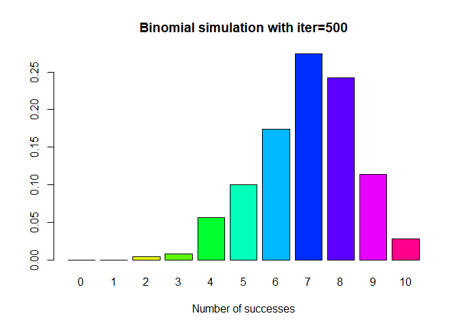
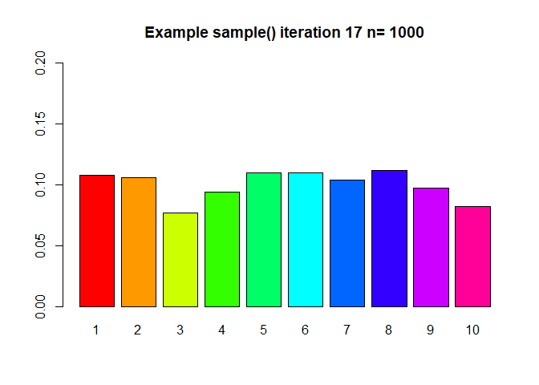

#Task 1

```r
getwd()
```

```
## [1] "C:/Users/prith/OneDrive/Documents/MATH4753_FA18/Lab5"
```

#Task 2
##mybin function

```r
mybin=function(iter=100,n=10, p=0.5, main="Binomial simulation"){ 
# make a matrix to hold the samples
#initially filled with NA's
sam.mat=matrix(NA,nr=n,nc=iter, byrow=TRUE)
#Make a vector to hold the number of successes in each trial
succ=c()
for( i in 1:iter){
#Fill each column with a new sample
sam.mat[,i]=sample(c(1,0),n,replace=TRUE, prob=c(p,1-p))
#Calculate a statistic from the sample (this case it is the sum)
succ[i]=sum(sam.mat[,i])
}
#Make a table of successes
succ.tab=table(factor(succ,levels=0:n))
#Make a barplot of the proportions
barplot(succ.tab/(iter), col=rainbow(n+1), main=main, xlab="Number of successes")
succ.tab/iter
}
```

##Different Iterations

```r
mybin(iter=100,n=10, p=0.7, main="Binomial simulation with iter=100")
```

<!-- -->

```
## 
##    0    1    2    3    4    5    6    7    8    9   10 
## 0.00 0.00 0.01 0.00 0.03 0.07 0.15 0.35 0.27 0.09 0.03
```

```r
mybin(iter=200,n=10, p=0.7, main="Binomial simulation with iter=200")
```

<!-- -->

```
## 
##     0     1     2     3     4     5     6     7     8     9    10 
## 0.000 0.000 0.000 0.005 0.075 0.110 0.195 0.265 0.190 0.125 0.035
```

```r
mybin(iter=500,n=10, p=0.7, main="Binomial simulation with iter=500")
```

<!-- -->

```
## 
##     0     1     2     3     4     5     6     7     8     9    10 
## 0.000 0.000 0.004 0.008 0.056 0.100 0.174 0.274 0.242 0.114 0.028
```

```r
mybin(iter=1000,n=10, p=0.7, main="Binomial simulation with iter=1000")
```

<!-- -->

```
## 
##     0     1     2     3     4     5     6     7     8     9    10 
## 0.000 0.000 0.000 0.008 0.040 0.108 0.215 0.266 0.227 0.107 0.029
```

```r
obj=mybin(iter=10000,n=10, p=0.7, main="Binomial simulation with iter=10000")
```

<!-- -->

##table for 10,000 iterations

```r
obj
```

```
## 
##      0      1      2      3      4      5      6      7      8      9 
## 0.0000 0.0002 0.0012 0.0105 0.0393 0.1008 0.1972 0.2701 0.2309 0.1216 
##     10 
## 0.0282
```

##verify with dbinom

```r
tr=dbinom(0:10,10,0.7)
error=abs(obj-tr)
error
```

```
## 
##            0            1            2            3            4 
## 0.0000059049 0.0000622190 0.0002467005 0.0014983080 0.0025430910 
##            5            6            7            8            9 
## 0.0021193452 0.0029209490 0.0032720680 0.0025744405 0.0005391790 
##           10 
## 0.0000475249
```

#Task 3
##sample

```r
blackwhite = rep(c(1,0),c(12,8))
blackwhite
```

```
##  [1] 1 1 1 1 1 1 1 1 1 1 1 1 0 0 0 0 0 0 0 0
```

```r
sample(blackwhite,5,replace=FALSE)
```

```
## [1] 1 1 0 0 1
```

```r
sample(blackwhite,5,replace=TRUE)
```

```
## [1] 0 1 1 1 1
```


##myhyper function

```r
myhyper=function(iter=100,N=20,r=12,n=5, main="Hypergeometric Simulation"){
# make a matrix to hold the samples
#initially filled with NA's
sam.mat=matrix(NA,nr=n,nc=iter, byrow=TRUE)
#Make a vector to hold the number of successes over the trials
succ=c()
for( i in 1:iter){
#Fill each column with a new sample
sam.mat[,i]=sample(rep(c(1,0),c(r,N-r)),n,replace=FALSE)
#Calculate a statistic from the sample (this case it is the sum)
succ[i]=sum(sam.mat[,i])
}
#Make a table of successes
succ.tab=table(factor(succ,levels=0:n))
#Make a barplot of the proportions
barplot(succ.tab/(iter), col=rainbow(n+1), main=main, xlab="Number of successes")
succ.tab/iter
}
```

##Iterations data

```r
myhyper(iter=100, n=5, N=20, r=12, main="Hypergeometric Simulation with iter=100")
```

<!-- -->

```
## 
##    0    1    2    3    4    5 
## 0.00 0.10 0.23 0.39 0.22 0.06
```

```r
myhyper(iter=200, n=5, N=20, r=12, main="Hypergeometric Simulation with iter=200")
```

<!-- -->

```
## 
##     0     1     2     3     4     5 
## 0.015 0.075 0.240 0.380 0.225 0.065
```

```r
myhyper(iter=500, n=5, N=20, r=12, main="Hypergeometric Simulation with iter=500")
```

<!-- -->

```
## 
##     0     1     2     3     4     5 
## 0.004 0.064 0.250 0.368 0.262 0.052
```

```r
myhyper(iter=1000, n=5, N=20, r=12, main="Hypergeometric Simulation with iter=1000")
```

<!-- -->

```
## 
##     0     1     2     3     4     5 
## 0.000 0.068 0.232 0.376 0.264 0.060
```

```r
obj=myhyper(iter=10000, n=5, N=20, r=12, main="Hypergeometric Simulation with iter=10000")
```

<!-- -->


```r
obj
```

```
## 
##      0      1      2      3      4      5 
## 0.0036 0.0571 0.2376 0.3882 0.2620 0.0515
```

##Error

```r
tr=dhyper(0:5,12,8,5)
error=abs(obj-tr)
error
```

```
## 
##            0            1            2            3            4 
## 0.0000119711 0.0029204334 0.0007900929 0.0091168215 0.0065820433 
##            5 
## 0.0004164087
```

#Task 4
##What the code describes
The user defined function, mysample() is a function which has a for loop which interates from 1 to iter times. Inside the for loop, we have the sample which chooses n numbers from 1:10 with replacement. We also have the factor function which gets the factors. After randomly choosing these, we plot those using the bar plot function. Since this function is inside the for loop, it plots iter times.


##mysample

```r
mysample=function(n, iter=10,time=0.5){
for( i in 1:iter){
#make a sample
s=sample(1:10,n,replace=TRUE)
# turn the sample into a factor
sf=factor(s,levels=1:10)
#make a barplot
barplot(table(sf)/n,beside=TRUE,col=rainbow(10), 
main=paste("Example sample()", " iteration ", i, " n= ", n,sep="") ,
ylim=c(0,0.2)
)

#release the table
Sys.sleep(time)
}
}
mysample(n=1000, iter=30,time=1)
```

<!-- --><!-- --><!-- --><!-- --><!-- --><!-- --><!-- --><!-- --><!-- --><!-- --><!-- --><!-- --><!-- --><!-- --><!-- --><!-- --><!-- --><!-- --><!-- --><!-- --><!-- --><!-- --><!-- --><!-- --><!-- --><!-- --><!-- --><!-- --><!-- --><!-- -->

##Result of mysample()

Since we have bar plot function inside the for loop, there are barplots ploted in the plot window for iter times. Since iter = 30, there were 30 bar plots plotted.

#Task 5
##choose

```r
choose(8,4)
```

```
## [1] 70
```

##P(Y>4), Y~Pois($\lambda$=2)

```r
prob=1 - sum(dpois(0:4,2))
prob
```

```
## [1] 0.05265302
```

##P(Y=10),Y~NegBin(p=0.4,r=3)

```r
dnbinom(7,3,0.4)
```

```
## [1] 0.06449725
```

##P($Y\leq8$),Y~Bin(n=15,p=0.4)

```r
pbinom(8,15,0.4)
```

```
## [1] 0.9049526
```

