#Task 1

```r
getwd()
```

```
## [1] "C:/Users/prith/OneDrive/Documents/MATH4753_FA18/Lab6"
```

#Task 2
##layout(4)

```r
layout(matrix(1:4, nr=2,nc=2))

layout.show(4)
```

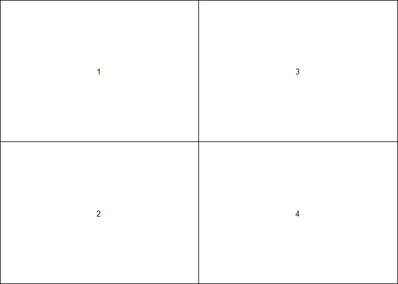<!-- -->

```r
curve(dnorm(x, mean=10,sd=4),xlim=c(-10,30))

curve(dnorm(x, mean=10,sd=2),xlim=c(-10,30))

curve(dnorm(x, mean=5,sd=10),xlim=c(-20,30))

curve(dnorm(x, mean=5,sd=0.5),xlim=c(-10,30))
```

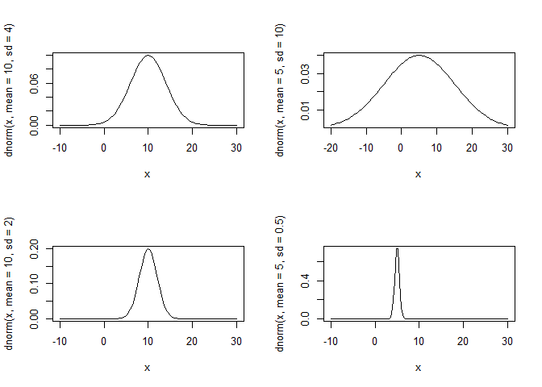<!-- -->

##Area and Probabilities

```r
layout(1)
layout.show(1)
```

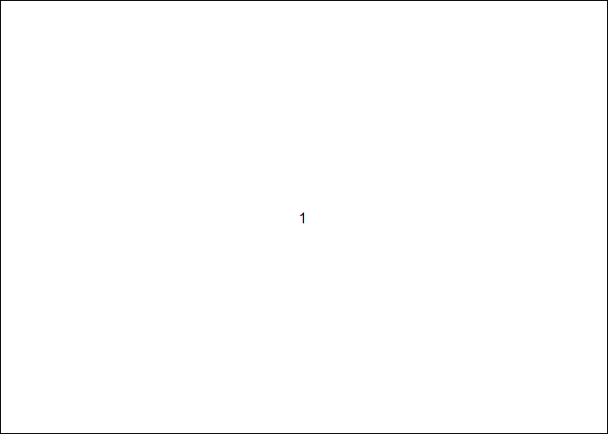<!-- -->

```r
curve(dnorm(x, mean=0,sd=1),xlim=c(-4,4))
xcurve=seq(2,5,length=1000)
ycurve=dnorm(xcurve,mean=0,sd=1)
polygon(c(2,xcurve,5),c(0,ycurve,0),col="Red")
xc=(2+4)/2
yc=0.5*dnorm(xc,0,1)
text(x=xc,y=yc,paste("P(Y>=2)","=",round((1-pnorm(2,mean=0,sd=1)),4)))
```

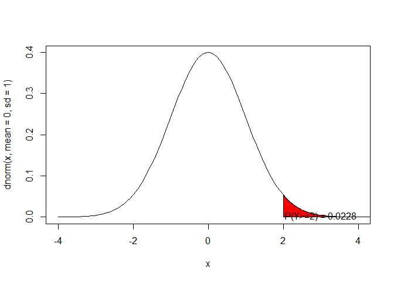<!-- -->

```r
curve(dnorm(x, mean=4,sd=2),xlim=c(-2,10),xlab="Y",ylab="Normal Density")
xcurve=seq(1,5,length=1000)
ycurve=dnorm(xcurve,mean=4,sd=2)
polygon(c(1,xcurve,5),c(0,ycurve,0),col="Red")
xc=(1+5)/2
yc=0.5*dnorm(xc,4,2)
text(x=xc,y=yc,paste("P(1 <= Y < 5)","=",round(pnorm(5,mean=4,sd=2)-pnorm(1,mean=4,sd=2),4)))
```

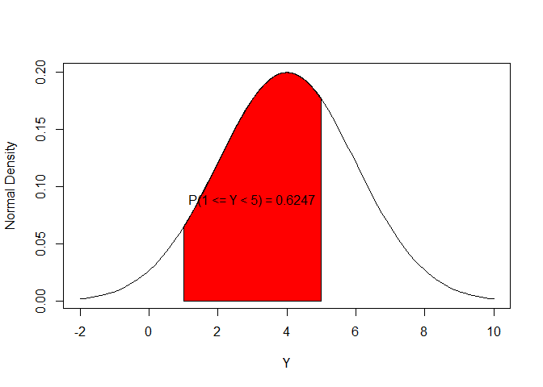<!-- -->

```r
curve(dnorm(x, mean=10,sd=4),xlim=c(-2,22))
xcurve=seq(-2,10,length=1000)
ycurve=dnorm(xcurve,mean=10,sd=4)
polygon(c(-2,xcurve,10),c(0,ycurve,0),col="Red")
xc=(-1+10)/2
yc=0.5*dnorm(xc,10,4)
text(x=xc,y=yc,paste("P(Y<10)","=",round(pnorm(10,mean=10,sd=4),4)))
```

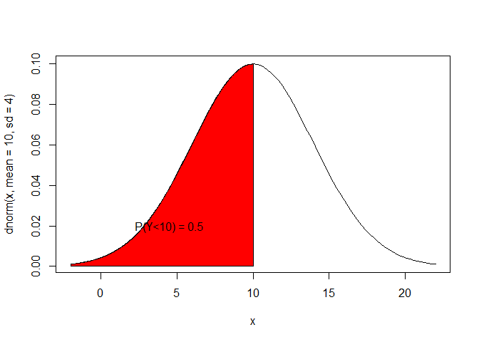<!-- -->

```r
curve(dnorm(x, mean=-2,sd=0.5),xlim=c(-4,0))
xcurve=seq(-3,-2,length=1000)
ycurve=dnorm(xcurve,mean=-2,sd=1/2)
polygon(c(-3,xcurve,-2),c(0,ycurve,0),col="Red")
xc=(-3-2)/2
yc=0.5*dnorm(xc,-2,0.5)
text(x=xc,y=yc,paste("P(-3<Y<-2)","=",round(pnorm(-2,mean=-2,sd=0.5)-pnorm(-3,mean=-2,sd=0.5),4)))
```

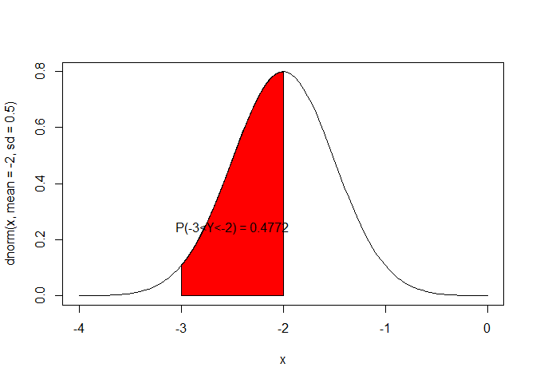<!-- -->

#Task 3
##Gamma distribution

```r
curve(dgamma(x,shape=1,scale=1),xlim=c(0,10),ylim=c(0,1),col="Red",lwd=2,ylab="Gamma density", main="Beta=1")
xc=5
yc=0.6
text(x=xc,y=yc,paste("alpha=",1),col = "Red")

curve(dgamma(x,shape=3,scale=1),xlim=c(0,10),ylim=c(0,1),add=TRUE,lwd=2)
xc=5
yc=0.5
text(x=xc,y=yc,paste("alpha=",3))

curve(dgamma(x,shape=5,scale=1),xlim=c(0,10),ylim=c(0,1),add=TRUE, col="Blue",lwd=2)
xc=5
yc=0.4
text(x=xc,y=yc,paste("alpha=",5),col = "Blue")
```

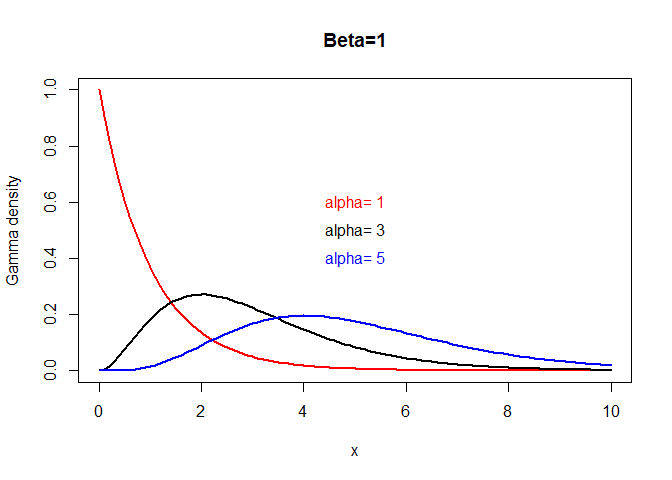<!-- -->


```r
curve(dgamma(x, shape=3,scale=2),xlim=c(0,20),ylim=c(0,0.2),ylab="Gamma density")
xcurve=seq(2,5,length=1000)
ycurve=dgamma(xcurve,shape=3,scale=2)
polygon(c(2,xcurve,5),c(0,ycurve,0),col="Red")
xc=3.5
yc=0.07
text(x=xc,y=yc,paste("P(2<Y<5)","=",round(pgamma(5,shape=3,scale=2)-pgamma(2,shape=3,scale=2),4)))
```

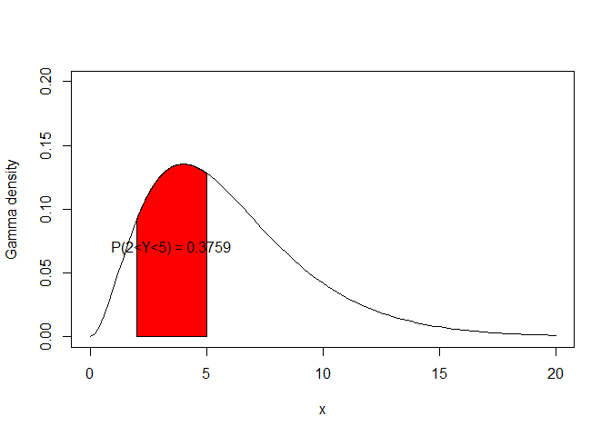<!-- -->

```r
curve(dgamma(x, shape=6,scale=3),xlim=c(0,40),ylim=c(0,0.2),ylab="Gamma density")
xcurve=seq(1,4,length=1000)
ycurve=dgamma(xcurve,shape=6,scale=3)
polygon(c(1,xcurve,4),c(0,ycurve,0),col="Red")
xc=3
yc=0.10
text(x=xc,y=yc,paste("P(1=<Y<=4)","=",round(pgamma(4,shape=6,scale=3)-pgamma(1,shape=6,scale=3),4)))
```

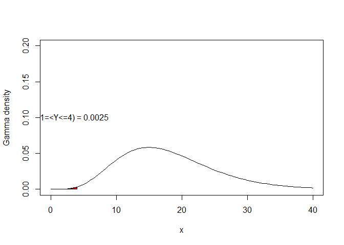<!-- -->

```r
curve(dgamma(x, shape=2,scale=4),xlim=c(0,30),ylim=c(0,0.2),ylab="Gamma density")
xcurve=seq(3,6,length=1000)
ycurve=dgamma(xcurve,shape=2,scale=4)
polygon(c(3,xcurve,6),c(0,ycurve,0),col="Red")
xc=5
yc=0.05
text(x=xc,y=yc,paste("P(3=<Y<6)","=",round(pgamma(6,shape=2,scale=4)-pgamma(3,shape=2,scale=4),4)))
```

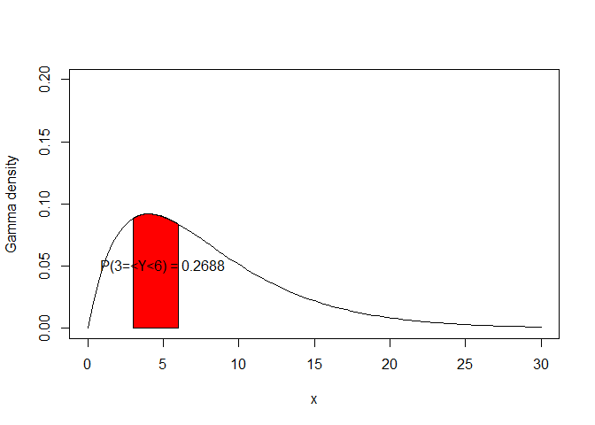<!-- -->

#Task 4
##Layout graphs

```r
layout(matrix(1:4, nr=2,nc=2, byrow=TRUE))
curve(dchisq(x,df=1),xlim=c(0,10),ylim=c(0,1),col="Red",lwd=2,
      ylab="Chisq density", main="df=1")
curve(dchisq(x,df=2),xlim=c(0,10),ylim=c(0,1),col="Red",lwd=2,
      ylab="Chisq density", main="df=2")
curve(dchisq(x,df=4),xlim=c(0,15),ylim=c(0,0.4),col="Red",lwd=2,
      ylab="Chisq density", main="df=4")
curve(dchisq(x,df=20),xlim=c(0,60),ylim=c(0,0.2),col="Red",lwd=2,
      ylab="Chisq density", main="df=20")
```

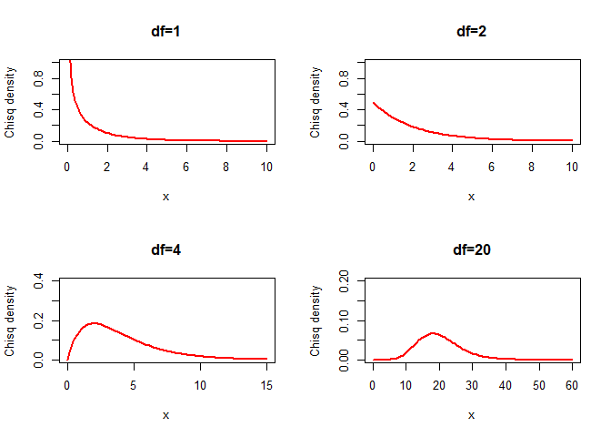<!-- -->

##$P(2 \leq Y \leq 4)$

```r
curve(dchisq(x, df=2),xlim=c(0,10),ylim=c(0,1),ylab="Gamma density")
xcurve=seq(2,4,length=1000)
ycurve=dchisq(xcurve,df=2)
polygon(c(2,xcurve,4),c(0,ycurve,0),col="Red")
xc=3
yc=0.2
text(x=xc,y=yc,paste("P(2=<Y<=4)","=",round(pchisq(4,df=2)-pchisq(2,df=2),4)))
```

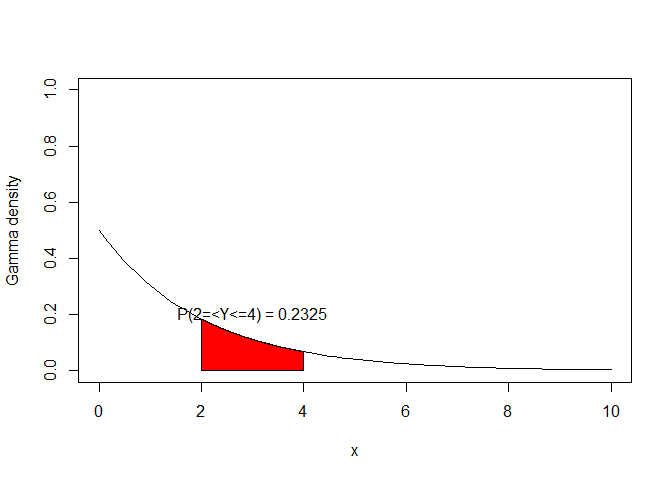<!-- -->

##$P(3 \leq Y \leq 5)$

```r
curve(dchisq(x, df=3),xlim=c(0,10),ylim=c(0,0.5),ylab="Gamma density")
xcurve=seq(3,5,length=1000)
ycurve=dchisq(xcurve,df=3)
polygon(c(3,xcurve,5),c(0,ycurve,0),col="Red")
xc=4
yc=0.1
text(x=xc,y=yc,paste("P(3=<Y<=5)","=",round(pchisq(5,df=3)-pchisq(3,df=3),4)))
```

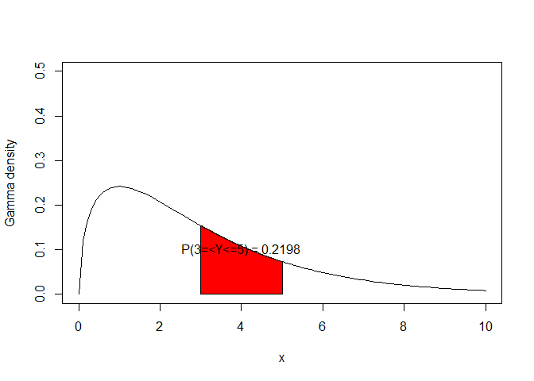<!-- -->

##$P(10 < Y \leq 21)$

```r
curve(dchisq(x, df=20),xlim=c(0,60),ylim=c(0,0.1),ylab="Gamma density")
xcurve=seq(10,21,length=1000)
ycurve=dchisq(xcurve,df=20)
polygon(c(10,xcurve,21),c(0,ycurve,0),col="Red")
xc=15
yc=0.03
text(x=xc,y=yc,paste("P(20=<Y<=21)","=",round(pchisq(21,df=20)-pchisq(10,df=20),4)))
```

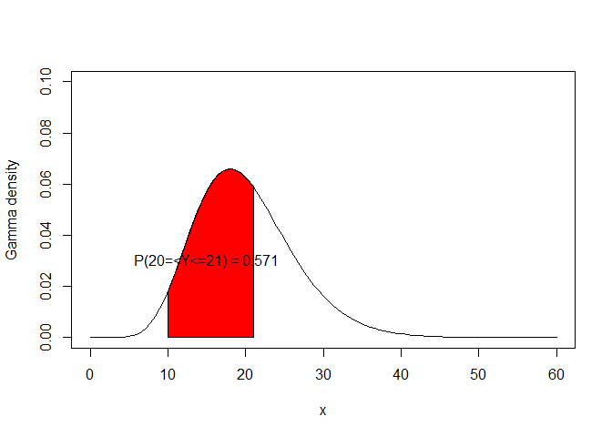<!-- -->

#Task 5
##Layout Graphs

```r
layout(matrix(1:4, nr=2,nc=2))
curve(dweibull(x,shape=1,scale=1),xlim=c(0,10),ylim=c(0,1),col="Red",lwd=2, main="shape=1,scale=1")
curve(dweibull(x,shape=3,scale=1),xlim=c(0,5),ylim=c(0,2),col="Red",lwd=2, main="shape=3,scale=1")
curve(dweibull(x,shape=1,scale=3),xlim=c(0,10),ylim=c(0,1),col="Red",lwd=2, main="shape=1,scale=3")
curve(dweibull(x,shape=2,scale=2),xlim=c(0,10),ylim=c(0,1),col="Red",lwd=2, main="shape=2,scale=2")
```

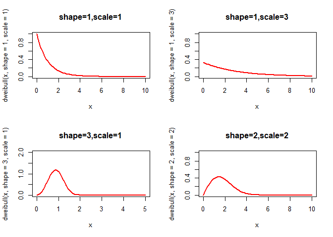<!-- -->

##$P(1 \leq Y \leq 5)$

```r
curve(dweibull(x, shape=1,scale=1),xlim=c(0,10),ylim=c(0,1),main="shape=1,scale=1")
xcurve=seq(1,5,length=1000)
ycurve=dweibull(xcurve,shape=1,scale=1)
polygon(c(1,xcurve,5),c(0,ycurve,0),col="Red")
xc=3
yc=0.1
text(x=xc,y=yc,paste("P(1=<Y<=5)","=",round(pweibull(5,shape=1,scale=1)-pweibull(1,shape=1,scale=1),4)))
```

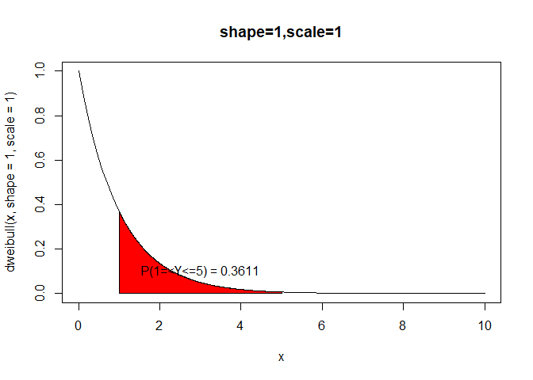<!-- -->

##$P(2 \leq Y \leq 5)$

```r
curve(dweibull(x, shape=1,scale=3),xlim=c(0,10),ylim=c(0,1),main="shape=1,scale=3")
xcurve=seq(2,5,length=1000)
ycurve=dweibull(xcurve,shape=1,scale=3)
polygon(c(2,xcurve,5),c(0,ycurve,0),col="Red")
xc=3.5
yc=0.1
text(x=xc,y=yc,paste("P(2=<Y<=5)","=",round(pweibull(5,shape=1,scale=3)-pweibull(2,shape=1,scale=3),4)))
```

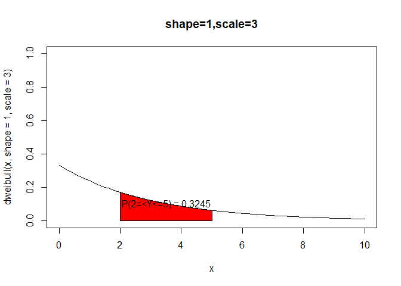<!-- -->

##$P(1 \leq Y \leq 2)$

```r
curve(dweibull(x, shape=3,scale=1),xlim=c(0,4),ylim=c(0,2),main="shape=3,scale=1")
xcurve=seq(1,2,length=1000)
ycurve=dweibull(xcurve,shape=3,scale=1)
polygon(c(1,xcurve,2),c(0,ycurve,0),col="Red")
xc=1.5
yc=0.5
text(x=xc,y=yc,paste("P(1=<Y<=2)","=",round(pweibull(2,shape=3,scale=1)-pweibull(1,shape=3,scale=1),4)))
```

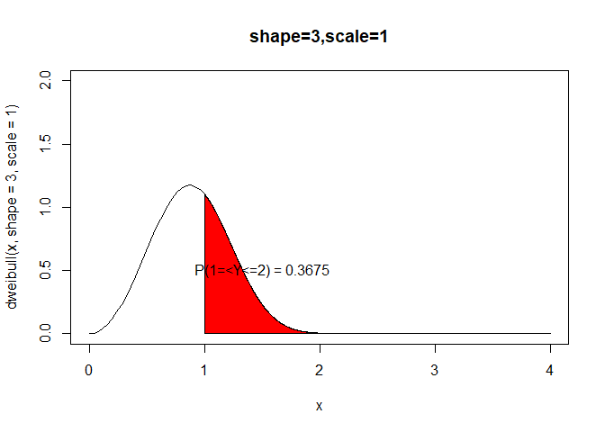<!-- -->

#Task 6
##Layout Graphs

```r
layout(matrix(1:4, nr=2,nc=2))

curve(dbeta(x,2,3),xlim=c(0,1),col="Black",ylab="beta density")
text(x=0.3,y=0.5,paste("alpha=2,Beta=3"))
curve(dbeta(x,1,4),xlim=c(0,1),col="Black",ylab="beta density")
text(x=0.6,y=2,paste("alpha=1,Beta=4"))
curve(dbeta(x,3,5),xlim=c(0,1),col="Black",ylab="beta density")
text(x=0.3,y=0.5,paste("alpha=3,Beta=5"))
curve(dbeta(x,4,2),xlim=c(0,1),col="Black",ylab="beta density")
text(x=0.6,y=0.5,paste("alpha=4,Beta=2"))
```

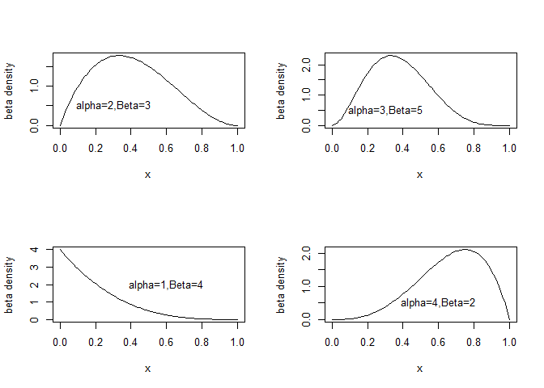<!-- -->

##P(.5 < Y < 1)

```r
curve(dbeta(x,3,4),xlim=c(0,1),ylim=c(0,3),col="Black",lwd=2,ylab="beta density", main="P(Y>0.5)")
xcurve=seq(.5,1,length=100)
ycurve=dbeta(xcurve,3,4)
polygon(c(.5,xcurve,1),c(0,ycurve,0),col="Red")
text(x=0.6,y=2.25,paste("P(Y>.5)","=",round(1 - pbeta(.5,3,4),4)))
```

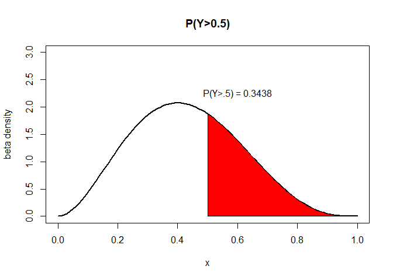<!-- -->

##P(Y < 0.3)

```r
curve(dbeta(x,6,3),xlim=c(0,1),ylim=c(0,5),col="Black",lwd=2,ylab="beta density",main="P(Y<.3)")
xcurve=seq(0,.3,length=100)
ycurve=dbeta(xcurve,6,3)
polygon(c(0,xcurve,.3),c(0,ycurve,0),col="Red")
text(x=0.2,y=1,paste("P(Y<0.3)","=",round(pbeta(.3,6,3),4)))
```

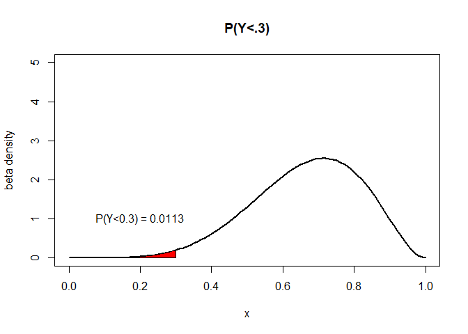<!-- -->

##P(.5 < Y < .8)

```r
curve(dbeta(x,2,3),xlim=c(0,1),ylim=c(0,5),col="Black",lwd=2,ylab="beta density", main="P(.2<Y<.6)")
xcurve=seq(.2,.6,length=100)
ycurve=dbeta(xcurve,2,3)
polygon(c(.2,xcurve,.6),c(0,ycurve,0),col="Red")
text(x=0.4,y=2.5,paste("P(.2<Y<.6)","=",round(pbeta(.6,2,3) - pbeta(.2,2,3),4)))
```

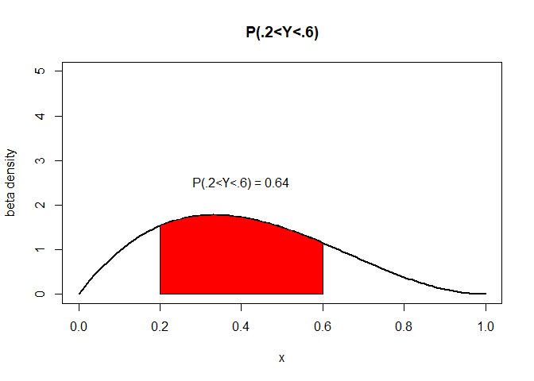<!-- -->

#Task 7

```r
vec1=seq(1,4,length=100)
vec2=dgamma(vec1,shape=6,scale=3)
dexp(vec2,rate=1)
```

```
##   [1] 0.9999918 0.9999906 0.9999892 0.9999877 0.9999861 0.9999842 0.9999822
##   [8] 0.9999800 0.9999776 0.9999750 0.9999722 0.9999691 0.9999658 0.9999622
##  [15] 0.9999583 0.9999542 0.9999497 0.9999449 0.9999398 0.9999343 0.9999285
##  [22] 0.9999223 0.9999157 0.9999086 0.9999012 0.9998933 0.9998849 0.9998761
##  [29] 0.9998668 0.9998570 0.9998466 0.9998357 0.9998242 0.9998122 0.9997996
##  [36] 0.9997863 0.9997725 0.9997580 0.9997428 0.9997269 0.9997104 0.9996931
##  [43] 0.9996751 0.9996563 0.9996368 0.9996165 0.9995954 0.9995735 0.9995507
##  [50] 0.9995271 0.9995026 0.9994772 0.9994509 0.9994237 0.9993956 0.9993665
##  [57] 0.9993364 0.9993053 0.9992733 0.9992402 0.9992061 0.9991709 0.9991346
##  [64] 0.9990973 0.9990589 0.9990193 0.9989786 0.9989368 0.9988938 0.9988497
##  [71] 0.9988043 0.9987578 0.9987101 0.9986611 0.9986108 0.9985594 0.9985066
##  [78] 0.9984526 0.9983973 0.9983407 0.9982828 0.9982235 0.9981629 0.9981010
##  [85] 0.9980377 0.9979730 0.9979070 0.9978396 0.9977707 0.9977005 0.9976289
##  [92] 0.9975558 0.9974813 0.9974054 0.9973280 0.9972492 0.9971689 0.9970871
##  [99] 0.9970039 0.9969192
```

