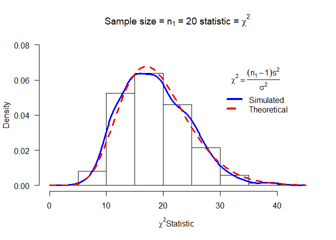
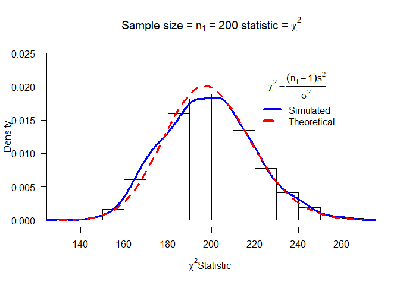

#Task 1

```r
getwd()
```

```
## [1] "C:/Users/prith/OneDrive/Documents/MATH4753_FA18/Lab7"
```

#Task 2
##Getting the mychisim() function

```r
mychisim<-function(n1=10,sigma1=3,mean1=5,iter=1000,ymax=0.1,x=20, y=0.1){    # adjust ymax to make graph fit
y1=rnorm(n1*iter,mean=mean1,sd=sigma1)# generate iter samples of size n1

data1.mat=matrix(y1,nrow=n1,ncol=iter,byrow=TRUE) # Each column is a sample size n1

ssq1=apply(data1.mat,2,var) # ssq1 is s squared

w=(n1-1)*ssq1/sigma1^2      #chi-sq stat

hist(w,freq=FALSE, ylim=c(0,ymax), # Histogram with annotation
main=substitute(paste("Sample size = ",n[1]," = ",n1," statistic = ",chi^2)),
xlab=expression(paste(chi^2, "Statistic",sep=" ")), las=1)
lines(density(w),col="Blue",lwd=3) # add a density plot
curve(dchisq(x,n1-1),add=TRUE,col="Red",lty=2,lwd=3) # add a theoretical curve
title=expression(chi^2==frac((n[1]-1)*s^2,sigma^2)) #mathematical annotation -see ?plotmath
legend(x,y,c("Simulated","Theoretical"),col=c("Blue","Red"),lwd=4,lty=1:2,bty="n",title=title) # Legend #
return(list(w=w,summary=summary(w),sd=sd(w),fun="Chi-sq")) # some output to use if needed
}
```

##n1=10

```r
chisq = mychisim(n1=10,iter=1000,mean1=10,sigma1=4, ymax=0.12)
```

<!-- -->

##n1=20

```r
mychisim(n1=20,iter=1000,mean1=10,sigma1=4,x=30,y=0.06, ymax=0.08)
```

<!-- -->

```
## $w
##    [1] 33.200108 18.630172 18.416654 27.947358 11.805647 14.369981
##    [7] 17.982191 11.499243 26.628949 10.485769 28.497810 16.561832
##   [13] 24.292810 21.753258 10.658863 20.167601 13.811773 25.368716
##   [19] 13.698070 22.263425 18.142825 20.256245 22.726704 16.362032
##   [25] 19.973101 17.526596 30.986777 11.387484 22.654053 10.882065
##   [31] 15.377962 17.828774  9.516967  8.808866 33.686798 15.917858
##   [37] 26.097751 15.415546 17.763911 27.970123 33.942346 15.069940
##   [43] 11.385854 19.873864 18.817813 18.010534 17.106124 19.982310
##   [49] 19.370630 21.697298 21.888085 23.918854  7.397883 10.242857
##   [55] 11.604096 18.486564 25.349162 14.952962 17.777154 24.575628
##   [61] 14.531420 13.885712 14.746480 28.635765 15.618444 36.021183
##   [67] 25.775053 18.550745 14.724489 24.692027 18.463443 22.183089
##   [73] 16.905958 20.914781 16.430855 17.659322 23.332673 20.037944
##   [79] 25.122752 13.851683 23.098654 19.237422 26.107226 13.219719
##   [85]  9.705127 22.767580 27.639254 15.943460 24.964655 14.973543
##   [91] 17.120414 15.602052 16.675697 23.049604 14.941407 26.806644
##   [97] 13.524665 28.217403 20.869061 27.299976 17.639804 17.631037
##  [103] 19.949335 18.901251 16.855830 16.961613 10.114372 24.269100
##  [109] 14.635544 16.360636 26.684242 18.713262  9.727043 17.851537
##  [115]  6.929816 13.593138 11.877198 26.372552 23.880802 11.786839
##  [121] 22.054539 14.913013 13.213999 13.963322 12.311245 12.384215
##  [127] 22.377897 21.906995 28.859081 14.230189 10.623268 10.637486
##  [133] 20.348320 25.129061 13.796526 14.167632 22.633571 13.877130
##  [139] 19.133540 11.782881 10.993422 27.472521 34.835119 16.165388
##  [145] 20.015092 16.502804 22.377317 11.993113 35.913970 11.592615
##  [151] 30.912170 18.974853  9.004037 24.764844 11.093893 16.648279
##  [157] 20.699134 19.394102 21.152635 30.060740 25.340444 13.284101
##  [163]  9.408393 30.882747 14.252158 17.236494  6.667522 23.834350
##  [169] 21.109009 22.861344 15.798748 10.315552 12.217524 25.475865
##  [175] 27.108892 20.753787 22.603452 14.641103 22.254289 13.528106
##  [181] 24.300956 23.443824 11.291202 16.375914 24.752930 13.716263
##  [187]  8.595115 16.338941 23.177921 13.123497 18.181623 21.314088
##  [193] 27.849887 16.762327 20.158530 15.883937 22.533064 15.591203
##  [199] 30.049283 35.493945 15.221481 16.259136 10.874545 19.253754
##  [205] 14.199171 17.544328 24.551262 25.479711 15.127290  7.573795
##  [211]  3.546242 21.091539 13.914495 14.795682 14.710235 20.651643
##  [217] 24.676662 17.296316 12.858541 17.447259 19.988509 18.264766
##  [223] 18.350639 20.605542 10.367562 21.933728 16.475200 17.332197
##  [229] 13.248214 23.340914 18.149729 18.095298 21.211133 30.444293
##  [235] 10.410709 14.246046 18.751705 27.564210 22.794313 12.200989
##  [241] 21.765890 17.191556 17.630576 22.809295 17.415090 29.668062
##  [247]  7.125567 26.753371 13.951205 22.725749 10.518454 12.969998
##  [253] 24.505451 17.593337 21.601368 20.653638 22.224823 32.963234
##  [259] 13.656873 13.452014 18.908627 24.947909 23.265859 21.726872
##  [265] 11.923773 14.996840  9.926079 20.309864 26.928942 17.125288
##  [271] 22.248500 14.910233 11.950034 14.237109 25.632891 14.583485
##  [277] 25.036948 17.846745 15.552696  8.189718 11.402909 30.132234
##  [283] 17.669100 18.191841 19.917248 17.476467 21.575387 20.487910
##  [289] 19.707533 20.327507 12.005652 17.922807 25.899231 26.538183
##  [295] 30.626215  9.097916 21.418245 22.048079 19.436026 27.988589
##  [301]  9.451194 19.964346 25.139605 22.902373 26.897340 16.607232
##  [307] 18.112878 19.774621 17.993348 13.286797 20.160533 25.058148
##  [313] 30.360989 23.884310 27.323030 22.053850 24.905887 27.477536
##  [319] 19.393172 18.432877 15.847243 13.193379 22.020367 15.942141
##  [325] 22.938709 22.776270 19.475298 18.941869 17.790632 10.532651
##  [331] 19.462924 30.362543 15.597024 13.278289 21.429565 24.655698
##  [337] 19.625830 29.790738 20.543253 17.671710 16.773071 14.786267
##  [343]  9.493676 15.848127 18.969401 14.383218 12.228051  8.728667
##  [349] 19.607318 20.319039 14.793820 24.559054 24.286037 18.498549
##  [355] 39.045819  5.143085 21.281162 13.491050 13.712754 19.751819
##  [361] 14.659453 12.383709 18.368589 18.352960 12.832746 28.839505
##  [367] 16.826942 23.717794  9.574177 22.578372 14.481778 25.484996
##  [373] 19.419016 17.379842 17.684420 10.866830 18.850986 24.309520
##  [379] 12.814102 14.475836 20.210774 29.703442 21.457288 20.683956
##  [385] 26.046054 16.519525 14.797559 21.144331 17.109179 11.718607
##  [391] 23.725704 13.949189 33.419141 30.242756 19.409541 16.979417
##  [397]  7.842790 26.898165 15.184431 22.468836 25.449385 16.567234
##  [403] 15.729417 16.376004 14.944457  8.089740 15.243201 21.638339
##  [409] 18.282311 10.652116 13.192549 25.246670 18.409339 19.654539
##  [415] 28.346389 12.080940 19.105075 21.469952 11.035926 13.287230
##  [421] 28.682615 21.845241 22.340093 14.062154 20.160749 23.884598
##  [427] 12.505372 21.451924 10.203611 15.365751  8.206225 20.731637
##  [433] 13.543706 17.263174 26.055345 13.761370 14.388770 14.345813
##  [439] 13.124168 20.114954 21.940182 23.397845 27.687776 14.435310
##  [445]  8.401181 33.712974 21.318282 27.631459 16.721453 20.048285
##  [451] 22.131349  9.026052  9.711958 14.458251 21.889227 20.715649
##  [457] 19.312329 19.442702 24.968231 15.428165 25.133340 20.867923
##  [463] 21.109451 17.032344 27.547808  8.986667 24.099273 19.921944
##  [469] 25.736139 15.861387 24.558901 12.836199 20.474562 11.695055
##  [475] 17.011540 15.329820 12.709682 12.935022 20.533853 20.602968
##  [481] 23.251546 20.094027 17.600191 18.819634 13.523832 29.026517
##  [487] 20.115816 22.022067 12.683861 16.008261 12.067128 20.218226
##  [493] 14.914850 15.281601 19.942558 20.186458 26.778337  7.550200
##  [499] 10.412858 24.281678 16.218945 24.903690 20.668027 21.261103
##  [505] 25.622850 24.605306 26.301061 12.271975 20.356691 27.089418
##  [511]  7.798562 16.558297 26.759164 10.680013 17.949434 23.291228
##  [517] 22.611139 18.502455 29.687681 13.379632 13.540876 12.903455
##  [523] 14.890284 33.499542 14.208981  4.422008 25.005914 19.674501
##  [529] 17.074478 19.036465 22.765046 19.389456 16.682683 13.866319
##  [535] 20.973513 20.551226  8.197845 22.822983 16.713399 23.169685
##  [541] 15.396580 16.485941 26.377255 13.732572 18.724231 24.083742
##  [547] 13.527355 11.862916  7.973592 21.084393 15.177124 14.739223
##  [553] 14.232244 15.332093 21.548331 13.483815 24.767358 14.602200
##  [559] 21.184942 17.590260 12.374965 16.993242 19.562054 21.650598
##  [565] 19.085331 18.748467 21.218495 12.849624 17.645057 16.260346
##  [571] 26.698284 25.399469 18.897287 15.434810 19.146337 14.802712
##  [577] 17.263594  4.541286 16.554712 22.216826 17.022672 37.390456
##  [583] 18.599737 30.259193 21.370231 12.981541 12.580520 20.876225
##  [589] 16.330089 13.999991 24.147813 17.051118 25.043873 19.259397
##  [595] 27.828980 22.547762 24.621833 24.650180 14.979288  9.774182
##  [601]  8.596354 17.933814 12.501710 17.665968 15.242479 12.321811
##  [607] 15.903444 17.476857 15.756654 38.288730  8.391364 16.642080
##  [613] 17.991900 26.016378 16.332295 28.508754 10.224005 20.145684
##  [619] 16.313587 26.532640 48.755085 14.204341 18.376222 15.366345
##  [625] 17.126716 28.460847  4.732274 16.771503 17.842167 16.527360
##  [631] 14.636116 17.187456 18.584102 15.856081 27.295712 16.998881
##  [637] 11.395856 29.032248 27.229895 28.475907 13.848060 11.969883
##  [643] 17.179900 17.947626 17.153333 21.005054 23.285035 24.352227
##  [649] 27.119106 26.843175 15.768406  9.215415 14.468169 37.024532
##  [655]  9.668639 14.124046 22.759280 10.113299 11.702285 12.615076
##  [661]  9.675509  9.681539 20.123988 13.972249 25.680783 16.327215
##  [667] 22.048713 13.921710 26.995481 19.901172 12.381581 10.802719
##  [673] 15.897927 12.584635 11.035575 16.123156 17.696490 24.810364
##  [679] 21.027289 19.964259 15.775460 22.045418 17.602437 19.431324
##  [685] 16.524335 13.793910 12.220833 22.253530 10.964537 10.875028
##  [691] 16.557835 15.733013 15.162033 16.697814 38.389119  9.579710
##  [697] 26.955380 24.642668 20.697495 26.248244 18.026666 15.253660
##  [703] 15.780259 20.521708 15.467364 25.334325 11.897485 22.895891
##  [709]  8.117748 39.255684 23.038027 14.637956 19.807380 29.430884
##  [715] 11.651576 16.888408 13.723944 18.238392 23.699636 13.760726
##  [721] 14.674160 25.016743 13.234907 17.263102 20.203222 20.869700
##  [727]  6.389285 17.585316 18.107231 27.752144 15.157330 14.445060
##  [733] 18.398856 13.182266 26.301783  9.755574 15.274983 19.759306
##  [739] 14.223311 11.183454 12.198090 19.423180 21.303029 18.291028
##  [745] 15.498920 12.876145 14.518464  8.670195 20.647148 17.895471
##  [751] 24.306196 27.490235 25.972202 15.570898 19.331226 39.702031
##  [757] 13.274035 28.765096 19.421479 14.522815  8.350014  9.910921
##  [763] 23.529604 14.205797 10.561877 10.534681 19.183193 27.016831
##  [769] 25.475219 20.412834 24.595511 10.137609 20.578337 14.990571
##  [775] 20.527135 19.777794 23.126905 11.838218 21.519629 16.490163
##  [781] 27.726480 19.394865 14.653316 13.445585 22.623824 19.083554
##  [787] 22.355613 10.955198 27.574984 18.596337 14.900757 22.831438
##  [793] 16.615161 15.763968 30.408506 27.207079 15.893392 16.687989
##  [799] 12.610328  9.843825 17.337652 19.496499 28.261266 11.165865
##  [805] 22.339218 19.819870 20.329865 16.090083  8.232992 18.278599
##  [811] 17.569892 20.321567 13.078517 22.332068 12.511590 16.368120
##  [817] 13.296323 14.631569  9.361523 14.222042 16.916450 16.627334
##  [823] 15.789246 17.809038 21.520612 18.700826 25.967339 14.405774
##  [829] 14.493038 18.277355 20.444212 22.664564 23.454322 10.187002
##  [835] 15.364581 23.034630 24.156432 24.864882 20.447609 14.371309
##  [841] 19.281722 14.016861 24.286661 15.138248 13.731531 10.985505
##  [847] 33.260952 27.785127 15.317438 23.020564 18.170240 19.817763
##  [853] 23.694371 21.390432  8.649254 34.505393 17.432863 22.949879
##  [859] 39.748562 14.925004 17.281869 24.822333 17.853512 24.578915
##  [865] 26.336138 18.641698 20.791928 11.775806 29.841178 12.096492
##  [871] 27.097273 19.684010 15.699332 12.687543  8.842501 26.261208
##  [877] 20.063396 17.240172 22.313982 20.914250 10.162181 18.337896
##  [883] 10.999742 24.961431 11.695995 28.602853 15.465234 22.891523
##  [889] 20.006117 24.248507 17.215446 20.128667 16.185809 12.010436
##  [895] 23.651749  9.159111 24.941650 19.118178 19.446460 17.756473
##  [901] 19.796903 22.378182 15.323966 13.248015 13.270454 18.974906
##  [907] 23.069616 15.689943 10.492609 33.171239 18.500711 21.262233
##  [913] 20.429321 20.663280 25.653826 27.386162 18.255159 20.377384
##  [919] 17.527879 12.500244 16.955032 19.328931 16.234017 11.064681
##  [925] 15.713062 23.151041 18.148738 14.659046 12.422389 27.213175
##  [931] 17.867768 10.927420 19.247727 11.245603 23.446451 13.031655
##  [937] 14.807453 31.133795 23.018872 20.036738 14.124579 27.312754
##  [943] 24.125324 15.927719 14.451944 11.817268 16.790954 21.353721
##  [949] 24.896711 24.916825 20.403310 17.438208 22.281316 26.499816
##  [955] 18.515330 15.994443 16.257101 14.007498 27.224419 11.836264
##  [961] 14.921702  8.908005 20.329452 29.752667 20.411299 33.733101
##  [967] 20.841208 26.879697 27.482508 17.440251 14.254479 11.929445
##  [973] 25.750889 15.288488 13.846307 15.453543 20.503000 18.790524
##  [979] 13.748324  7.947416 13.264214 23.552170 27.115905  5.968311
##  [985] 16.164499 22.191690 24.211113 14.870431 17.163862 14.503608
##  [991] 20.685321 22.681275 17.090794 16.019933 15.375433 20.170560
##  [997] 12.236435 18.485183 25.026825 13.544116
## 
## $summary
##    Min. 1st Qu.  Median    Mean 3rd Qu.    Max. 
##   3.546  14.428  18.160  18.734  22.639  48.755 
## 
## $sd
## [1] 6.089865
## 
## $fun
## [1] "Chi-sq"
```

##n1=100

```r
mychisim(n1=100,iter=1000,mean1=10,sigma1=4,x=120,y=0.03, ymax=0.04)
```

<!-- -->

```
## $w
##    [1]  96.71934 110.76675  75.36778 130.74169  94.06216  99.32635
##    [7] 117.91938  91.04696 113.93600  88.00472 105.19534  98.37922
##   [13] 107.16770  99.76409 101.50855 113.87977  99.51768 106.51255
##   [19]  97.25597  99.26722 108.37916  95.26541 134.32662 113.15871
##   [25] 115.13083  89.31553  84.23831  97.15407  92.94781 103.40263
##   [31] 100.44979  78.73589  95.41484  85.18766  76.02774 126.05296
##   [37] 105.89096 118.34878 113.72818  89.19361 103.68397 103.87761
##   [43]  83.31200 116.36905  88.26438  99.94741 121.94419  79.47428
##   [49] 115.07868  88.73876 108.19954  86.75116 100.28662  70.15150
##   [55] 114.44481 122.20844 109.46349  94.70397 106.34286  94.75589
##   [61]  90.16376  88.63433  99.80238  87.35204  85.88364  97.70902
##   [67]  78.91858  87.23551 106.45941  83.03342 110.31347 108.58696
##   [73]  72.30504  99.57325  91.06485  87.08533 110.72602  84.17355
##   [79] 101.35690 101.87927 111.53199  75.14141  99.66661  99.38412
##   [85]  88.34077  90.16279 128.53626  77.03505 105.34365  83.37408
##   [91] 126.58581  86.33656  98.75655  97.37987  91.76319  97.01938
##   [97]  91.87076 127.51070  87.61844 105.84551  83.85211  92.07723
##  [103]  96.72761  85.82020 101.86315  96.97977 107.66718  88.56656
##  [109] 122.98549  86.78270 115.94161  76.30145 101.66139  89.92489
##  [115] 111.68760  78.53045  84.94514 100.31070  82.26022  95.72503
##  [121]  77.24712  99.33827  88.55527 117.77521  94.28435  82.88919
##  [127]  74.33363  79.03568  98.93236 115.17102  90.28983 107.01079
##  [133]  92.13347  90.54132  79.70115  99.70551 109.26866 118.05475
##  [139] 111.64279 102.90833  81.83480  79.73227 100.16101  99.55607
##  [145]  98.26163 110.96279 100.54663 101.84994 101.76641 108.64844
##  [151] 118.79629 106.65571 102.07485  90.91278  94.96635 113.20868
##  [157] 103.32939  86.46697 136.12406 100.58569  98.45932  96.67870
##  [163] 132.67017  92.30223  83.86393 100.58446 118.26886 104.47686
##  [169] 100.53609  71.93206  99.28378  98.44916  97.12884  97.26599
##  [175]  93.31467 102.79282  96.20638  96.31916 104.58368 109.87742
##  [181]  92.48616  80.83978  92.39030 100.92478  93.04758  87.82409
##  [187]  99.43125  92.61265  86.76276 100.60359 120.20733  98.40125
##  [193]  84.96783  98.68187  80.79320  71.93829 102.11374  81.30308
##  [199] 103.08049 105.18087 106.41909  82.71496 122.40340 102.60647
##  [205] 101.33774 117.60912  94.55655 107.39307  90.80493  89.91612
##  [211]  79.59812  94.40529  92.76292  97.56402  79.60376  99.05676
##  [217] 104.73116 131.10059  74.82974  83.43119  96.74204  92.81919
##  [223]  97.28747 122.94578  89.94735  95.00617  86.61556  86.36380
##  [229] 108.22961  93.37766 100.64389  86.91148 100.67131  85.86539
##  [235]  87.58558  95.46620  82.20695 107.18175 101.32222  73.08481
##  [241]  91.33505 100.05220  96.24212 119.31256  93.21857  89.19420
##  [247]  90.04857  94.08163 129.66087 102.46338  93.36224  88.24267
##  [253] 115.50952  83.58422 121.25401  84.85922 116.53015  87.72584
##  [259]  77.36045  95.44408 109.55874 113.79770  86.89344 107.63510
##  [265]  98.43936  92.16766  85.63554 126.68368 101.89653 108.48050
##  [271] 103.47933  91.36106  80.61740  96.15147 115.56027 103.87398
##  [277] 101.06209 102.53027 108.98262  97.51026  87.63768 108.02988
##  [283]  89.86022 101.38712  98.25834  87.77237  93.00252  99.04727
##  [289] 124.03468 113.03190  99.29195  91.05925 108.83971 116.84189
##  [295]  94.07181 116.93955  96.64524  84.44647  98.52603 100.40329
##  [301] 100.05339 101.95693  87.38764  93.40260  98.64848  83.69755
##  [307]  91.82216 105.78946 126.12617  86.07722 102.29081 129.47628
##  [313]  82.45913 128.55478 116.67712  89.00381 107.49407 102.41579
##  [319]  82.43371 115.87182  84.28867 119.82338 130.93882  80.91416
##  [325]  92.89886  95.57108  92.64315 100.38302 112.26079 105.65905
##  [331]  94.02883  94.22677 102.41510  93.32370  84.77573  83.91180
##  [337] 107.52613 111.47665  93.58298  84.47434  85.46935  86.60771
##  [343] 101.00450  98.66926 113.19223  96.33176  92.10238  97.71162
##  [349] 111.33747  74.16634  90.26635  91.38461 106.98386 132.45938
##  [355] 117.52764 104.13394 100.26773 100.24692  92.56766 104.73324
##  [361] 113.22420  72.27435 108.54470 104.69066  90.73867  90.96634
##  [367]  91.66842 118.41366  94.06286  83.80364  93.86095  99.78254
##  [373]  68.85275 116.94845  87.23321  99.80922  90.45772  95.53462
##  [379]  83.07479  78.17076 121.58839  93.85562  84.02704  94.05815
##  [385]  97.60026  98.73176 115.95505  91.65421 114.57487  90.54526
##  [391]  90.22554  90.85363  90.54353  81.47581  63.62789 102.65136
##  [397] 122.45211 118.14482 103.69822  79.34358 112.54887 111.67056
##  [403]  84.21659 104.88094  99.91170 122.21981 103.36860 117.13672
##  [409] 122.36492  81.49008  78.52740 119.45278 103.36429 136.01367
##  [415] 111.77812  90.06771  57.72749  86.24053 115.96278 102.39060
##  [421]  90.78278 103.30676 116.61045 108.41201 107.63729 111.16388
##  [427]  97.97572  89.33590  90.26562 107.11440  92.89192  89.97071
##  [433]  96.16474 112.57838  93.91429  92.35073 100.47045 116.75540
##  [439] 102.09873  78.71847 108.05214  77.04537 118.96249  91.99227
##  [445] 114.88690  86.64721  94.31486  70.54018 103.12198 111.07746
##  [451] 109.63135  79.17675  91.13871 120.18765 102.75571 116.55842
##  [457]  86.13073  84.53143  96.30678  95.15825 111.45479  98.17867
##  [463] 123.41853  95.20979  94.78434  96.94524  83.05789  87.44380
##  [469]  88.98234  99.68600  85.05390  82.52642 113.85450 111.87733
##  [475]  90.89887  79.01562 108.25127 113.76050  89.05752 102.39379
##  [481] 126.88568  80.64871 126.26461  99.80664  89.48916  81.98408
##  [487]  94.66733  89.39314 110.11652 119.47092 118.84093 104.14921
##  [493]  91.06725  91.42144 112.84497  92.92176 100.55924  92.52880
##  [499] 108.62172 110.77131  98.47894  74.80131 113.48984  99.66096
##  [505]  94.84577  94.06311  93.99352 130.81202 101.71281 107.43959
##  [511]  61.86606 105.02950 111.32886  98.17297  90.17554 117.31719
##  [517]  98.32052  96.65670 106.89882 119.66032 131.21136  97.33683
##  [523] 109.34364 122.04509  84.82156 104.60025  95.49747  88.81953
##  [529]  82.87772 116.74114  94.08419 102.67554 110.24144 101.03177
##  [535] 109.14461 100.31521 109.58277  85.57873  95.90490 105.34914
##  [541] 118.27636 111.60377  98.44227 108.06714  94.35352 101.36313
##  [547] 104.58568  93.97184  81.92669 121.79418 108.88276 120.13447
##  [553] 111.68920  78.73070  86.59581  77.53981 101.19707 119.73192
##  [559] 113.10323 117.75505  88.59636  92.47332 115.73400  98.16340
##  [565]  99.81708 116.90896  94.38108  86.27567 110.60534  99.47813
##  [571] 120.26510 113.96213 103.95792  97.53839  77.37660  70.34704
##  [577] 101.38203 104.29942 136.50147 101.36182 101.24937 117.49313
##  [583] 107.01072 107.88079  87.45710 107.07223 103.12874  93.42448
##  [589]  94.47615  89.97853  95.84785  90.78642 108.76672  93.74302
##  [595] 130.19838  89.21040 106.42305 119.32347 105.29094 107.45318
##  [601] 122.06613 125.46377  91.06244  94.35484  80.55608 112.33416
##  [607] 109.45026 113.51696  81.20404 116.79242  95.96088  86.97072
##  [613] 108.59346  99.64370  93.91393  84.32613  90.01118  88.23221
##  [619]  97.36731  81.91553  87.31445 105.09531  83.73976 101.82194
##  [625] 103.08747 113.96373  79.50871  99.59250  87.59338  81.93823
##  [631]  92.65647 116.94731 129.93027  84.32885  93.38465  91.44323
##  [637]  84.16320 105.89169 108.21765  79.56700  81.94571 108.59134
##  [643]  74.36776  94.68135 102.75878 108.76656 126.77074 104.15940
##  [649] 103.29536  78.38350  88.85023 105.06171 102.48772 108.32811
##  [655] 105.60268 109.49592  95.41041 106.09215  88.05782  85.26845
##  [661] 111.47379 109.26259  96.68078  95.99484  85.77428 109.61538
##  [667]  79.12812 103.24643 106.07379  88.26709 109.84615 112.58781
##  [673] 111.53992  88.99948  95.66832 103.87821  85.54802  90.76387
##  [679]  97.69984 113.38189 101.73862 111.89419  93.64801  90.52852
##  [685] 117.32163 122.25742 115.43109  64.15214 108.15437 107.20116
##  [691] 102.97499 112.17392  80.05272  73.48885  89.47745  87.60388
##  [697]  96.98930 130.16819  75.97289  89.87146 106.41675  93.38346
##  [703] 104.97276  76.47117  97.96370  91.34469  96.10081 112.58828
##  [709]  89.48323  95.33439  93.90130 117.71524  84.86680  91.59280
##  [715]  93.18491 112.41380  91.16899 100.99021 108.84052 102.26305
##  [721]  78.60118 103.93777  91.42915 114.87671 102.92175 111.94706
##  [727] 131.28719  84.94213  98.48535  95.92487  91.45358  95.04978
##  [733]  92.99026 100.40957  95.88564 131.15926 102.80886 110.22794
##  [739]  87.58252 107.73222 114.70935  92.35883 131.06475 100.47037
##  [745] 131.53604  81.93169 107.18211 115.99915 144.43088  93.88174
##  [751]  91.82620 123.86695  98.19122 108.96708 117.49070 114.19209
##  [757] 121.53535 111.85979  88.98451  91.68846  73.78414  94.59909
##  [763]  90.28336  94.59018 113.43239  96.01474  88.04766 106.71486
##  [769] 106.76717  87.68493 107.46622  88.18498  91.88666 104.21808
##  [775] 115.76760  97.95100  97.29479 119.25092  87.05473 105.31764
##  [781] 108.43465  82.11888  96.65126  84.77342  88.80674  83.83478
##  [787] 116.19899 105.47802  97.08606 103.15686 122.03305  95.33421
##  [793]  81.45822 106.31459  97.05741 127.61712  96.06812  85.39736
##  [799] 126.77148 108.84097  87.06357 139.27882  94.68080  72.96734
##  [805]  99.78277 109.46809 107.31505 104.23712  94.61200 126.86944
##  [811]  99.33046  99.39158 110.15049  85.50664 100.59962 122.65383
##  [817] 100.80408  94.41011  89.62479  94.89411 113.92968 108.95514
##  [823]  99.77790 132.54791  98.77331  75.73050  74.68848  94.68114
##  [829]  87.51613 114.45070  88.91200  90.60103  63.40381 109.39233
##  [835] 103.20892  92.77615  97.49356  82.25179  86.16779 102.69827
##  [841] 106.48812  87.79163 103.07351  98.54869  75.81658  95.88548
##  [847]  88.94261  96.63564 100.40121  98.91272 101.29771  81.51963
##  [853]  72.61739 107.09502  96.22137  88.76916  80.04622 111.05279
##  [859]  79.57125 116.58345  91.91799 121.06270 103.79060 105.62576
##  [865]  87.13634 109.94833 101.66463 108.00122  98.28808  88.38616
##  [871]  95.33360 108.74430 103.39639 113.31258  99.26397 128.36578
##  [877]  92.02136 111.27544 105.48271 118.30115  97.11153  95.58190
##  [883]  76.26163 119.63068  79.57603  72.89869  87.20161  86.58888
##  [889] 101.77955  77.21168 101.52024 103.89260  98.17672  86.53667
##  [895] 101.21235  85.63701 104.06510 124.78115 115.38732  85.95568
##  [901] 123.36132 109.68917  86.34188  96.79602  80.81363  89.48141
##  [907]  93.89658 113.25570 110.50775 101.42340  89.72677  92.27845
##  [913]  70.95576 103.70152 104.61777 118.89275  87.99333 100.92152
##  [919]  94.44864  74.33440  94.33679  94.95430 105.60053 101.35380
##  [925]  96.61454  81.38268 117.43675  85.17851  96.70222  95.08860
##  [931]  93.74070  94.72364  96.32717 101.19901  83.28719 107.34197
##  [937] 111.28297  92.13397  97.87995 110.99496  89.06874  94.49060
##  [943]  93.34745 103.75114  95.87264 113.01267  76.71652  97.31858
##  [949]  81.07865  98.86372  99.22966  91.43283  98.21971  96.43406
##  [955] 102.34515 105.06827  89.92013 106.42233 111.16528  89.79678
##  [961] 101.05564 106.68770 104.99673  83.90668  87.39098 110.57647
##  [967] 125.22583  77.66144 108.94438 109.13831 100.29376  86.63376
##  [973] 107.67333 117.94330 121.10698 133.96938  82.57663  61.71032
##  [979] 128.97599  90.78271  88.47621  90.59235  92.01514  69.42745
##  [985]  85.40715  74.98489  87.11729  79.69684 104.08228  92.05015
##  [991] 119.52892  87.66673 104.53955  85.75636  87.67477 119.52008
##  [997]  80.04729 103.86783  82.89214  85.53126
## 
## $summary
##    Min. 1st Qu.  Median    Mean 3rd Qu.    Max. 
##   57.73   89.48   98.39   99.10  108.20  144.43 
## 
## $sd
## [1] 13.64886
## 
## $fun
## [1] "Chi-sq"
```

##n1=200

```r
mychisim(n1=200,iter=1000,mean1=10,sigma1=4,x=220,y=0.02, ymax=0.025)
```

<!-- -->

```
## $w
##    [1] 196.3400 169.3390 174.7857 193.0334 188.6080 179.0388 184.2489
##    [8] 217.7349 183.7917 202.7968 220.3591 207.6885 170.9310 244.1555
##   [15] 199.6200 212.8123 177.5272 179.9732 181.9561 208.1467 182.1053
##   [22] 196.8288 212.5887 159.3836 239.2492 246.0157 186.8194 225.4620
##   [29] 168.1171 192.5711 210.5318 209.4327 193.7581 201.2668 193.5250
##   [36] 183.0984 175.6422 176.4361 206.0739 183.2967 206.0284 183.9716
##   [43] 201.9692 190.3663 174.2891 156.6831 223.6047 202.8338 189.5301
##   [50] 181.5474 214.2398 157.4413 214.6010 200.2816 231.4136 198.4810
##   [57] 182.2217 187.7376 206.9476 178.5318 202.0175 204.6652 189.5751
##   [64] 174.4119 216.2836 196.8928 199.2521 204.6426 201.4191 192.4784
##   [71] 179.3604 203.8370 175.9152 234.8570 197.2365 185.9541 172.6360
##   [78] 206.5049 193.2445 180.9329 212.4080 220.5539 220.8163 190.6734
##   [85] 191.6858 177.1740 210.6375 176.4929 189.9771 211.6267 193.3369
##   [92] 185.5747 214.2766 189.6132 210.8328 195.6810 210.7456 173.2474
##   [99] 181.4669 203.5620 174.7952 198.1414 183.1966 245.1540 192.3709
##  [106] 205.5519 181.9359 235.7440 224.2165 203.3091 176.1693 191.3122
##  [113] 185.2726 203.1985 224.2639 218.5648 147.7335 199.1914 196.2535
##  [120] 215.6912 187.2545 192.3866 171.9970 211.2533 219.7988 185.1018
##  [127] 211.1849 210.0142 186.0924 232.4247 191.4341 207.9198 225.5098
##  [134] 180.0295 207.3399 172.3688 191.8372 204.3465 227.4955 239.5127
##  [141] 215.8875 215.0577 171.2994 192.6918 161.1770 164.5293 183.2108
##  [148] 188.4390 207.8661 208.3345 201.2323 181.8323 235.4391 199.2593
##  [155] 247.7613 175.9150 199.0179 217.8982 207.1022 199.5370 200.0552
##  [162] 181.9256 214.3862 171.3846 168.5182 196.6624 215.1716 196.8986
##  [169] 168.2696 199.6295 173.4765 202.4271 209.2810 175.2425 184.9197
##  [176] 185.5115 190.7793 187.0658 215.0075 169.3485 200.2683 188.1164
##  [183] 204.1829 213.2452 208.8481 224.4454 212.8556 213.4017 189.2556
##  [190] 205.7092 188.8457 228.9771 199.9853 202.0952 207.0797 225.2242
##  [197] 221.9940 244.4358 225.6657 184.0624 193.9041 173.3608 175.4508
##  [204] 181.3943 176.3612 211.3757 165.1699 184.8613 212.5258 190.4792
##  [211] 208.1761 144.9192 172.8621 204.5769 183.1198 202.3271 211.2833
##  [218] 215.6942 242.7144 214.1112 154.4195 197.5123 232.5746 192.7489
##  [225] 179.4326 156.6087 247.7279 191.4620 210.9113 227.8220 197.9885
##  [232] 188.4739 202.2873 178.1025 216.7067 200.1592 197.2214 230.0373
##  [239] 189.5106 196.1678 204.8430 194.0028 206.5665 198.5993 209.3180
##  [246] 216.5185 206.7697 212.7359 221.5323 181.4279 207.3759 201.4002
##  [253] 199.0307 154.8977 198.8559 201.0931 234.3245 218.6770 214.9613
##  [260] 188.7583 224.5047 193.0538 184.4875 236.3761 173.4388 192.4718
##  [267] 201.7438 169.9834 152.0107 182.8615 234.3235 204.8775 219.3454
##  [274] 194.8204 211.1622 180.1802 200.6469 222.9094 202.0568 204.7417
##  [281] 164.5780 225.6830 206.3081 196.0766 193.5379 173.4135 183.8220
##  [288] 178.5946 191.8623 205.0865 182.8359 221.5024 173.4241 198.3404
##  [295] 181.6842 232.3734 186.3645 172.2375 203.1773 166.1271 194.6544
##  [302] 187.7355 228.4778 200.2892 197.3641 167.7864 200.4773 172.3561
##  [309] 221.2034 162.4066 197.8056 150.5527 228.9497 188.8495 203.8001
##  [316] 193.9987 184.3437 192.6019 196.1739 184.0309 133.9267 197.1099
##  [323] 214.7118 254.7600 188.1559 208.7089 195.0741 177.2214 225.1862
##  [330] 178.6326 193.5970 144.1859 205.2435 164.6211 223.6333 172.1309
##  [337] 183.0715 209.3624 205.7857 203.9194 185.8760 197.3073 221.2959
##  [344] 218.0004 198.8286 186.5919 219.2434 184.8349 215.3451 174.9791
##  [351] 207.8916 199.8269 164.1596 184.6882 204.0578 192.7675 229.9482
##  [358] 218.4607 193.9381 187.4770 184.1752 205.4757 183.9989 183.1054
##  [365] 241.1911 223.6545 189.9183 203.5456 190.9223 243.9073 202.1137
##  [372] 208.6012 200.0681 181.4048 221.1153 213.4473 202.7757 193.5619
##  [379] 203.5171 219.4008 228.6623 198.4703 183.3182 171.5878 190.5675
##  [386] 231.8224 231.7102 175.9720 194.0836 223.2735 212.3005 202.1164
##  [393] 177.5442 208.4913 246.5644 209.6918 184.1311 219.5076 168.2130
##  [400] 174.5389 155.7818 188.4800 212.7916 212.4358 214.3705 221.7579
##  [407] 241.5726 183.4057 196.8953 188.7070 172.4013 168.7271 202.3649
##  [414] 166.9366 207.5711 175.4129 151.4133 169.7823 157.5623 245.8809
##  [421] 191.0464 208.8777 219.4057 230.2946 190.9290 189.8638 170.8312
##  [428] 201.0677 195.8836 199.6335 199.2313 192.8406 220.0208 198.0236
##  [435] 229.3637 186.9680 209.9059 173.2937 216.6137 177.3585 206.8770
##  [442] 178.2335 178.2974 176.7319 184.9763 214.4102 188.0609 175.0920
##  [449] 214.5402 205.6561 224.6622 167.5590 180.2073 174.0159 151.5324
##  [456] 198.1229 199.4394 188.2597 170.7801 163.9729 223.0003 204.9883
##  [463] 239.9043 174.2885 147.8836 182.7207 183.4918 222.4666 206.8295
##  [470] 218.0904 193.8597 182.6372 232.2638 252.8854 180.7666 210.5275
##  [477] 192.9152 183.1142 212.1653 198.8765 147.4650 208.1663 186.8338
##  [484] 193.0389 198.7811 166.1906 195.3012 178.6047 217.9871 203.8118
##  [491] 220.9292 182.9484 209.7869 186.9870 191.6168 188.8033 175.4368
##  [498] 230.3207 211.2642 181.7100 188.5161 175.8249 196.8625 183.8428
##  [505] 181.2212 170.6072 165.5847 182.5469 210.4255 208.8132 217.5901
##  [512] 187.6878 234.2070 214.5813 209.4497 240.5252 203.3585 216.2655
##  [519] 192.9911 212.4640 212.6133 207.2943 191.8985 227.6878 199.3432
##  [526] 205.6919 188.6393 200.2168 230.6159 221.1583 181.2589 187.4798
##  [533] 199.3208 200.2366 198.8002 165.4689 195.5266 240.0909 212.4129
##  [540] 182.3938 175.0219 187.1055 227.2886 183.9710 182.5000 215.3434
##  [547] 212.3411 210.6090 170.8156 179.8144 200.6362 193.7226 189.9293
##  [554] 195.4735 207.4284 206.6135 178.0083 190.0989 186.7283 189.9747
##  [561] 231.0446 201.8337 177.7159 212.8437 168.9862 212.1650 179.1150
##  [568] 200.8459 198.2524 189.5735 229.6038 185.0654 227.2943 196.8633
##  [575] 194.3174 165.0262 212.1761 185.9325 181.3859 174.6055 211.1670
##  [582] 179.3941 212.6263 199.6351 185.4585 191.7604 187.3932 202.3678
##  [589] 179.1824 192.4562 190.0508 173.2873 213.5707 207.5021 164.1111
##  [596] 195.8212 201.0314 194.2772 173.8642 216.9279 185.6584 223.0798
##  [603] 203.7772 185.2727 200.6302 192.6289 192.2698 248.8004 202.3836
##  [610] 205.8727 218.1156 175.4921 217.5258 182.0408 205.7831 192.4676
##  [617] 176.6785 186.2006 158.5911 216.5710 236.7839 180.2692 203.4465
##  [624] 219.2161 235.2041 198.3512 220.9523 198.4723 231.1867 189.4379
##  [631] 199.6359 179.9180 194.4812 216.1699 213.9193 227.4050 217.8505
##  [638] 185.3207 211.8193 204.3494 207.3991 208.1510 211.2715 192.7991
##  [645] 185.6896 169.8208 169.3012 230.5067 190.4028 200.2641 253.3556
##  [652] 161.7411 192.2199 201.3166 220.2770 217.8278 213.1266 175.6333
##  [659] 159.0433 188.1634 202.8620 213.2219 188.9931 183.9656 183.7750
##  [666] 204.0834 202.4859 197.6055 191.5803 209.8950 171.9052 238.9320
##  [673] 179.4727 192.3050 227.3539 192.3812 199.8930 204.4641 211.0415
##  [680] 196.7322 187.7762 191.2365 185.7731 201.6119 186.2421 170.0572
##  [687] 186.6115 192.0092 168.5261 189.9192 217.0041 184.5292 213.5875
##  [694] 193.2876 169.4200 203.7061 208.7110 231.9186 202.4535 215.6607
##  [701] 195.0199 223.2730 197.6957 198.8316 166.6482 205.2151 156.1353
##  [708] 172.4324 211.9451 200.1592 209.7764 243.9819 160.8386 198.0683
##  [715] 179.6501 214.3283 199.9292 211.3709 173.0140 208.9893 203.9378
##  [722] 173.3218 215.6554 185.8491 188.0396 225.1505 200.0765 196.0703
##  [729] 195.1167 187.0704 184.6071 231.9248 225.3516 186.7201 219.3401
##  [736] 196.1993 217.5790 253.7935 182.6939 180.8874 175.7533 164.8248
##  [743] 207.8355 202.2960 229.6571 194.2717 206.0004 176.1239 206.9919
##  [750] 171.4037 166.9907 192.4509 197.9595 205.8083 196.5227 208.2894
##  [757] 189.7072 195.5374 175.5764 162.9118 200.1112 222.3164 188.5140
##  [764] 184.5390 164.2344 186.7924 184.2321 225.1237 191.9932 203.1158
##  [771] 181.8001 192.6552 229.9156 211.4081 197.1436 181.9823 176.6368
##  [778] 160.9029 193.1009 178.3140 172.3598 182.1639 189.2354 170.6153
##  [785] 206.6479 166.5856 216.2438 189.9754 204.6946 189.1993 209.4697
##  [792] 197.8083 192.0447 184.8252 192.3873 181.2502 169.2409 191.8545
##  [799] 175.8811 173.0049 212.6847 144.9914 199.4392 221.7674 228.7518
##  [806] 214.9605 207.0441 186.8506 181.6295 166.6179 218.8057 218.5892
##  [813] 197.9784 181.9047 179.4362 221.1474 213.4032 189.9942 211.7179
##  [820] 176.9528 253.5404 191.0835 177.2592 286.4320 199.0334 200.3874
##  [827] 180.3035 224.2043 227.3463 213.9720 166.5842 230.9334 174.9086
##  [834] 197.8949 212.2006 192.3876 184.2291 189.4691 207.0931 214.8581
##  [841] 169.8861 205.1817 222.4647 229.8853 172.5046 191.9435 203.2644
##  [848] 231.3102 190.8973 175.8505 229.1625 221.6549 210.9492 180.5757
##  [855] 217.2183 204.1520 202.0377 233.0589 219.1119 200.1303 205.4164
##  [862] 169.9163 195.4019 182.5341 215.0096 179.5678 194.1138 201.3007
##  [869] 198.4400 211.2889 191.5556 231.6642 204.9091 212.0322 223.5513
##  [876] 188.4400 183.2871 227.9337 188.2397 198.5258 180.8004 196.4142
##  [883] 228.4967 202.3025 198.8475 196.8354 190.3306 199.1926 187.7636
##  [890] 182.9960 209.3348 205.0808 205.3578 209.6932 193.7650 211.7579
##  [897] 234.7533 155.3225 200.1265 241.8653 167.6904 163.3429 211.3337
##  [904] 209.0577 179.7162 170.6702 196.2519 179.1433 206.2444 150.4262
##  [911] 171.6344 184.1856 242.3975 200.5209 188.7222 245.6811 163.6738
##  [918] 201.2436 231.4897 189.9633 170.0028 221.2185 177.3413 182.5182
##  [925] 203.1772 168.9964 185.0519 176.8103 232.9880 188.0540 192.7013
##  [932] 205.9367 194.1091 196.6400 221.1508 213.7946 222.1062 173.6472
##  [939] 204.7927 172.3473 203.8687 151.2846 229.6134 197.5408 176.7356
##  [946] 211.3536 204.3866 215.8023 184.9870 202.0655 189.5672 205.8049
##  [953] 227.2299 185.2239 190.9627 201.3804 201.6286 187.6430 194.5588
##  [960] 183.4323 172.0026 210.8190 203.1016 166.2085 180.9331 186.1428
##  [967] 196.6849 183.4226 198.7367 227.3296 227.1691 220.8209 189.1623
##  [974] 189.7771 228.0772 214.5993 187.6503 228.1811 186.0293 195.0878
##  [981] 177.8081 192.0378 209.9296 188.6846 221.0228 169.7133 212.4934
##  [988] 231.7059 226.5981 213.1623 208.5487 213.8993 220.8196 192.8223
##  [995] 183.4357 186.5297 199.5417 194.9288 187.5683 183.5759
## 
## $summary
##    Min. 1st Qu.  Median    Mean 3rd Qu.    Max. 
##   133.9   183.7   197.3   197.8   211.3   286.4 
## 
## $sd
## [1] 20.28243
## 
## $fun
## [1] "Chi-sq"
```

