#Task 1

```r
getwd()
```

```
## [1] "C:/Users/prith/OneDrive/Documents/MATH4753_FA18/Lab8"
```

#Task 2
##create sample

```r
sample=runif(10,0,5)
sample
```

```
##  [1] 1.36276010 0.02234691 1.45866618 0.57854534 1.68421348 4.45554563
##  [7] 3.12558259 4.65502681 3.24843095 0.38775548
```

##Mean and variance

```r
mean1=(0+5)/2
mean1
```

```
## [1] 2.5
```

```r
variance1=(5-0)^2/12
variance1
```

```
## [1] 2.083333
```

##mean and variance of the sample

```r
mean(sample)
```

```
## [1] 2.097887
```

```r
var(sample)
```

```
## [1] 2.793154
```

##Theoretical mean and variance of
### T
$$
E(T)=n. \mu = n. \frac{a+b}{2}\\
V(T)=n. \sigma^2 = n.\frac{(b-a)^2}{12}
$$

###$\bar Y$
$$
E(\bar Y) =  \frac{a+b}{2}\\
V(\bar Y) = \frac{(b-a)^2}{12n}
$$

##Code Analysis

* A- random uniform n times iter values out of the population
* B- make a matrix with iter columns and n rows
* C- sum the data in columns
* D- call the function myclt() with sample size as 10 and repeat 10000

##Record plot

```r
myclt=function(n,iter,a=0,b=5){
y=runif(n*iter,a,b)
data=matrix(y,nr=n,nc=iter,byrow=TRUE)
sm=apply(data,2,sum)
h=hist(sm,plot=FALSE)
hist(sm,col=rainbow(length(h$mids)),freq=FALSE,main="Distribution of the sum of uniforms")
curve(dnorm(x,mean=n*(a+b)/2,sd=sqrt(n*(b-a)^2/12)),add=TRUE,lwd=2,col="Blue")
sm
}
w=myclt(n=50,iter=10000,a=5,b=10)
```

<!-- -->

##sample estimates

```r
mean(w)
```

```
## [1] 375.0612
```

```r
var(w)
```

```
## [1] 103.1583
```

##Change in code

```r
myclt=function(n,iter,a=0,b=5){
y=runif(n*iter,a,b)
data=matrix(y,nr=n,nc=iter,byrow=TRUE)
means=apply(data,2,mean)
h=hist(means,plot=FALSE)
hist(means,col=rainbow(length(h$mids)),freq=FALSE,main="Distribution of the sum of uniforms")
curve(dnorm(x,mean=n*(a+b)/2,sd=sqrt(n*(b-a)^2/12)),add=TRUE,lwd=2,col="Blue")
means
}
w1=myclt(n=50,iter=10000,a=5,b=10)
```

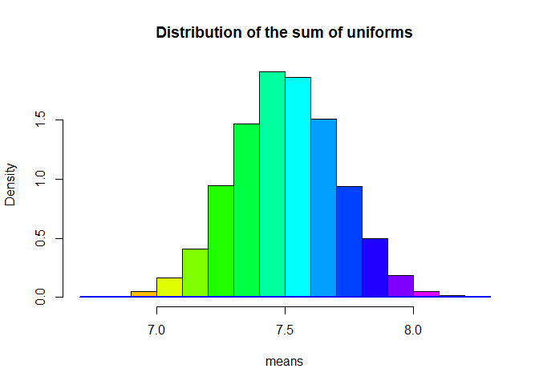<!-- -->


```r
mean(w1)
```

```
## [1] 7.503809
```

```r
var(w1)
```

```
## [1] 0.0412737
```

#Task 3

##Questions
* 2 means it applies the function to the columns
* There are 100,000 terms in w when the function is called
* sd takes the formula because we are calculating standard variance for $\bar Y$.

##mycltu function

```r
mycltu=function(n,iter,a=0,b=10){
## r-random sample from the uniform
y=runif(n*iter,a,b)
## Place these numbers into a matrix
## The columns will correspond to the iteration and the rows will equal the sample size n
data=matrix(y,nr=n,nc=iter,byrow=TRUE)
## apply the function mean to the columns (2) of the matrix
## these are placed in a vector w
w=apply(data,2,mean)
## We will make a histogram of the values in w
## How high should we make y axis?
## All the values used to make a histogram are placed in param (nothing is plotted yet)
param=hist(w,plot=FALSE)
## Since the histogram will be a density plot we will find the max density

ymax=max(param$density)
## To be on the safe side we will add 10% more to this
ymax=1.1*ymax
## Now we can make the histogram
hist(w,freq=FALSE,  ylim=c(0,ymax), main=paste("Histogram of sample mean",
"\n", "sample size= ",n,sep=""),xlab="Sample mean")
## add a density curve made from the sample distribution
lines(density(w),col="Blue",lwd=3) # add a density plot
## Add a theoretical normal curve 
curve(dnorm(x,mean=(a+b)/2,sd=(b-a)/(sqrt(12*n))),add=TRUE,col="Red",lty=2,lwd=3) # add a theoretical curve
## Add the density from which the samples were taken
curve(dunif(x,a,b),add=TRUE,lwd=4)

}
mycltu(n=20,iter=100000)
```

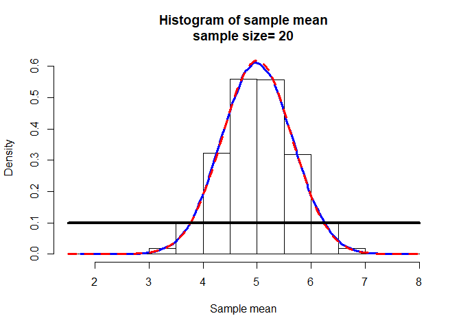<!-- -->

##Record the plots

```r
mycltu(n=1,iter=10000,a=0,b=10)
```

<!-- -->

```r
mycltu(n=2,iter=10000,a=0,b=10)
```

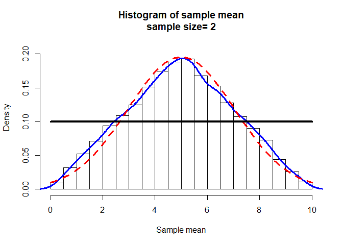<!-- -->

```r
mycltu(n=3,iter=10000,a=0,b=10)
```

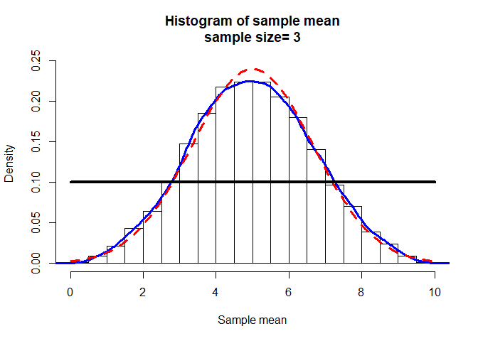<!-- -->

```r
mycltu(n=5,iter=10000,a=0,b=10)
```

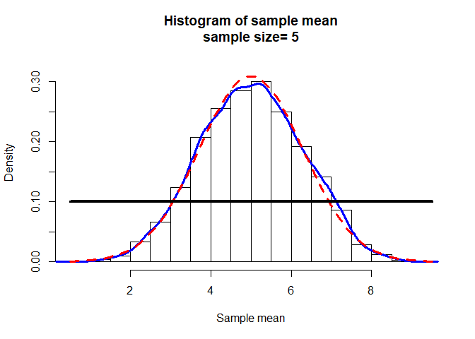<!-- -->

```r
mycltu(n=10,iter=10000,a=0,b=10)
```

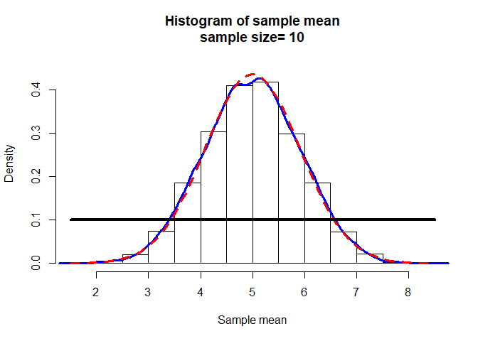<!-- -->

```r
mycltu(n=30,iter=10000,a=0,b=10)
```

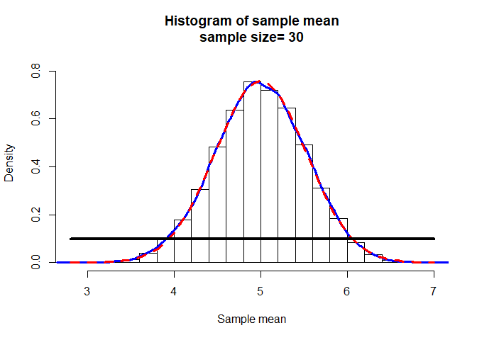<!-- -->

##Conclusion
With increasing the sample size, the sample mean distribution is converging to a normal distribution. This proves the central limit theorem

#Task 4
##mycltb function

```r
mycltb=function(n,iter,p=0.5,...){

## r-random sample from the Binomial
y=rbinom(n*iter,size=n,prob=p)
## Place these numbers into a matrix
## The columns will correspond to the iteration and the rows will equal the sample size n
data=matrix(y,nr=n,nc=iter,byrow=TRUE)
## apply the function mean to the columns (2) of the matrix
## these are placed in a vector w
w=apply(data,2,mean)
## We will make a histogram of the values in w
## How high should we make y axis?
## All the values used to make a histogram are placed in param (nothing is plotted yet)
param=hist(w,plot=FALSE)
## Since the histogram will be a density plot we will find the max density

ymax=max(param$density)
## To be on the safe side we will add 10% more to this
ymax=1.1*ymax

## Now we can make the histogram
## freq=FALSE means take a density
hist(w,freq=FALSE,  ylim=c(0,ymax),
main=paste("Histogram of sample mean","\n", "sample size= ",n,sep=""),
xlab="Sample mean",...)
## add a density curve made from the sample distribution
#lines(density(w),col="Blue",lwd=3) # add a density plot
## Add a theoretical normal curve 
curve(dnorm(x,mean=n*p,sd=sqrt(p*(1-p))),add=TRUE,col="Red",lty=2,lwd=3) 

}
```

##plot with p=0.3

```r
mycltb(n=4,iter=10000,p=0.3)
```

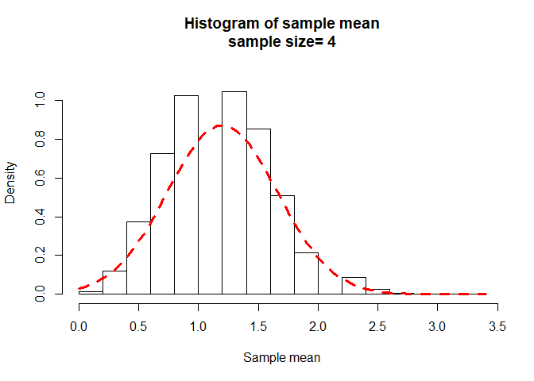<!-- -->

```r
mycltb(n=5,iter=10000,p=0.3)
```

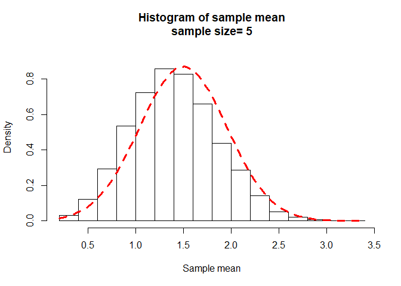<!-- -->

```r
mycltb(n=10,iter=10000,p=0.3)
```

<!-- -->

```r
mycltb(n=20,iter=10000,p=0.3)
```

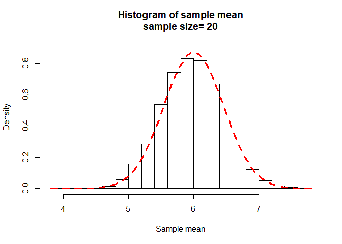<!-- -->

##plot with p=0.7

```r
mycltb(n=4,iter=10000,p=0.7)
```

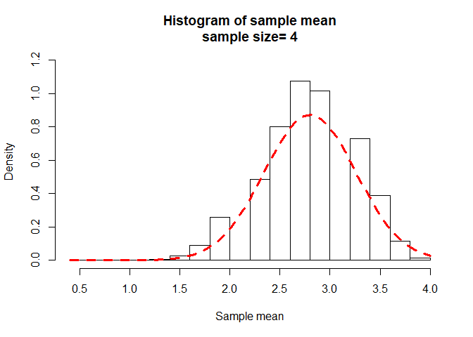<!-- -->

```r
mycltb(n=5,iter=10000,p=0.7)
```

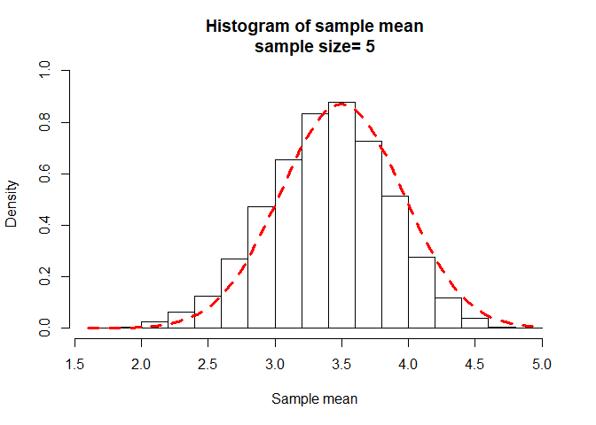<!-- -->

```r
mycltb(n=10,iter=10000,p=0.7)
```

<!-- -->

```r
mycltb(n=20,iter=10000,p=0.7)
```

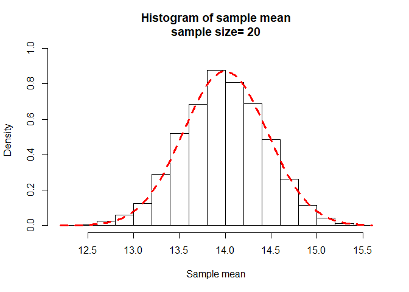<!-- -->

##plot with p=0.5

```r
mycltb(n=4,iter=10000,p=0.5)
```

<!-- -->

```r
mycltb(n=5,iter=10000,p=0.5)
```

<!-- -->

```r
mycltb(n=10,iter=10000,p=0.5)
```

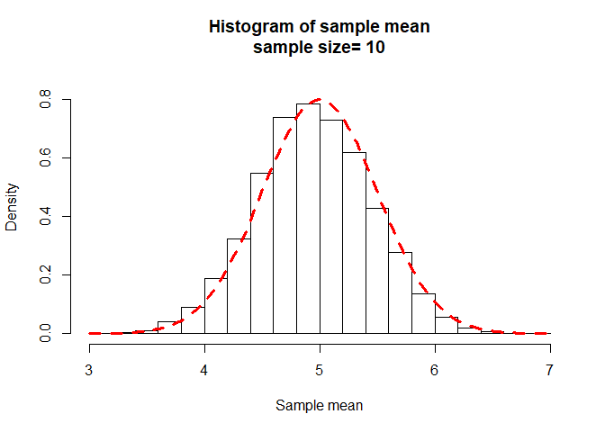<!-- -->

```r
mycltb(n=20,iter=10000,p=0.5)
```

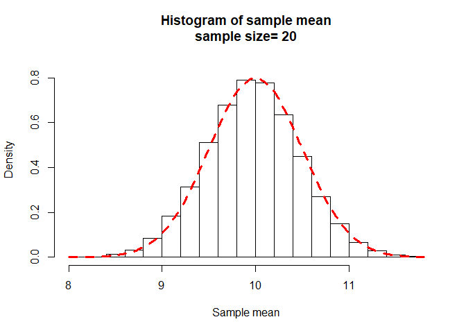<!-- -->

##Conclusion
With increasing the sample size, the sample mean distribution is converging to a normal distribution. This proves the central limit theorem for the same sample size., increase in the binomial probability p leads to the increase of the expected value of the sample mean.

#Task 5
##mycltp function

```r
mycltp=function(n,iter,lambda=10,...){

## r-random sample from the Poisson
y=rpois(n*iter,lambda=lambda)
## Place these numbers into a matrix
## The columns will correspond to the iteration and the rows will equal the sample size n
data=matrix(y,nr=n,nc=iter,byrow=TRUE)
## apply the function mean to the columns (2) of the matrix
## these are placed in a vector w
w=apply(data,2,mean)
## We will make a histogram of the values in w
## How high should we make y axis?
## All the values used to make a histogram are placed in param (nothing is plotted yet)
param=hist(w,plot=FALSE)
## Since the histogram will be a density plot we will find the max density

ymax=max(param$density)
## To be on the safe side we will add 10% more to this
ymax=1.1*ymax

## Make a suitable layout for graphing
layout(matrix(c(1,1,2,3),nr=2,nc=2, byrow=TRUE))

## Now we can make the histogram
hist(w,freq=FALSE,  ylim=c(0,ymax), col=rainbow(max(w)),
main=paste("Histogram of sample mean","\n", "sample size= ",n," iter=",iter," lambda=",lambda,sep=""),
xlab="Sample mean",...)
## add a density curve made from the sample distribution
#lines(density(w),col="Blue",lwd=3) # add a density plot
## Add a theoretical normal curve 
curve(dnorm(x,mean=lambda,sd=sqrt(lambda/n)),add=TRUE,col="Red",lty=2,lwd=3) # add a theoretical curve

# Now make a new plot
# Since y is discrete we should use a barplot
barplot(table(y)/(n*iter),col=rainbow(max(y)), main="Barplot of sampled y", ylab ="Rel. Freq",xlab="y" )
x=0:max(y)
plot(x,dpois(x,lambda=lambda),type="h",lwd=5,col=rainbow(max(y)),
main="Probability function for Poisson", ylab="Probability",xlab="y")
}
```

##Plots with lambda=4

```r
mycltp(n=2,iter=10000, lambda = 4)
```

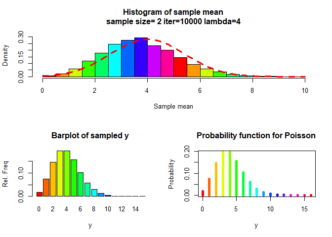<!-- -->

```r
mycltp(n=3,iter=10000, lambda = 4)
```

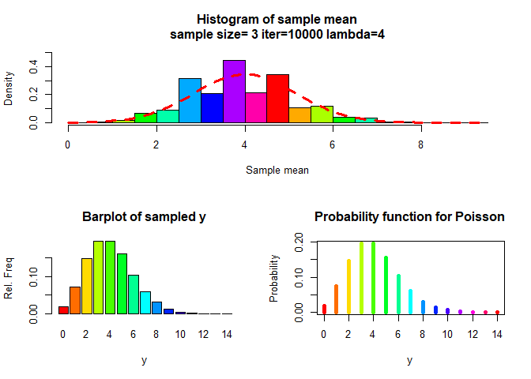<!-- -->

```r
mycltp(n=5,iter=10000, lambda = 4)
```

<!-- -->

```r
mycltp(n=10,iter=10000, lambda = 4)
```

<!-- -->

```r
mycltp(n=20,iter=10000, lambda = 4)
```

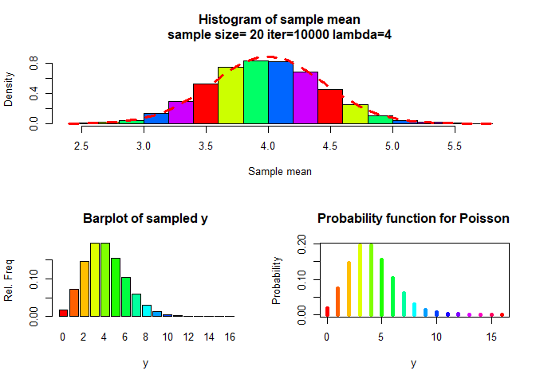<!-- -->

##Plots with lambda=10

```r
mycltp(n=2,iter=10000, lambda = 10)
```

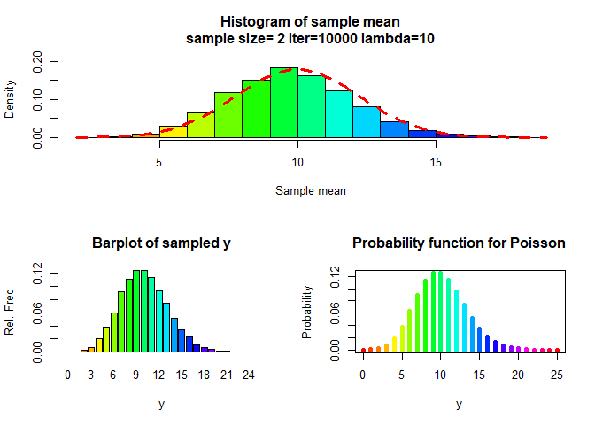<!-- -->

```r
mycltp(n=3,iter=10000, lambda = 10)
```

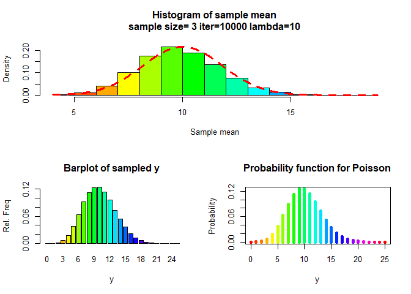<!-- -->

```r
mycltp(n=5,iter=10000, lambda = 10)
```

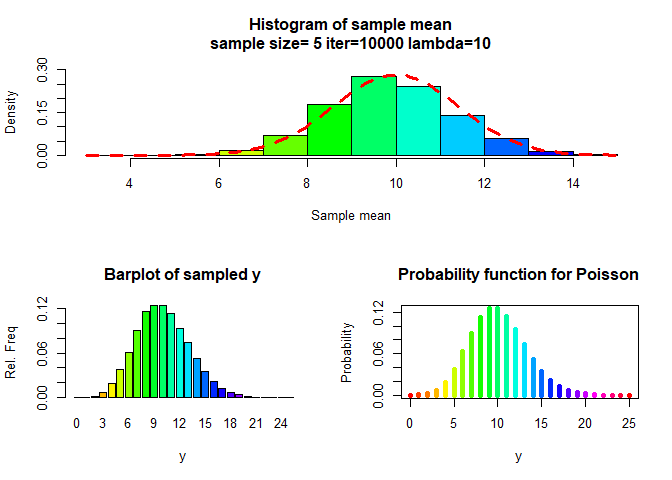<!-- -->

```r
mycltp(n=10,iter=10000, lambda = 10)
```

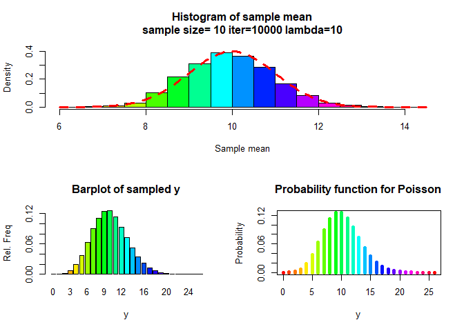<!-- -->

```r
mycltp(n=20,iter=10000, lambda = 10)
```

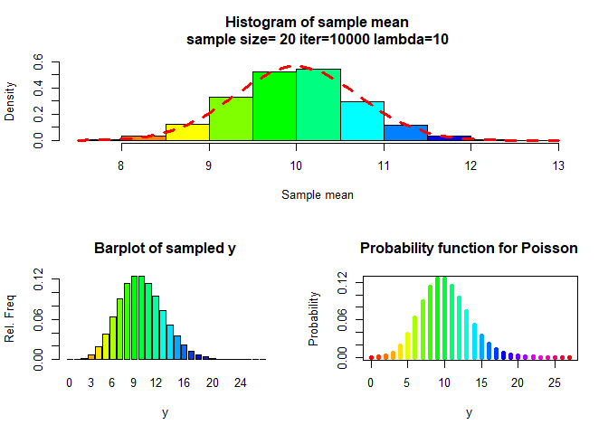<!-- -->

#Task 6
##mycltpx function

```r
mycltpx=function(n,iter,lambda=10,...){

## r-random sample from the Poisson
y=rpois(n*iter,lambda=lambda)
## Place these numbers into a matrix
## The columns will correspond to the iteration and the rows will equal the sample size n
data=matrix(y,nr=n,nc=iter,byrow=TRUE)
## apply the function mean to the columns (2) of the matrix
## these are placed in a vector w
w=apply(data,2,sum)
## We will make a histogram of the values in w
## How high should we make y axis?
## All the values used to make a histogram are placed in param (nothing is plotted yet)
param=hist(w,plot=FALSE)
## Since the histogram will be a density plot we will find the max density

ymax=max(param$density)
## To be on the safe side we will add 10% more to this
ymax=1.1*ymax

## Make a suitable layout for graphing
layout(matrix(c(1,1,2,3),nr=2,nc=2, byrow=TRUE))

## Now we can make the histogram
hist(w,freq=FALSE,  ylim=c(0,ymax), col=rainbow(max(w)),
main=paste("Histogram of sum","\n", "sample size= ",n," iter=",iter," lambda=",lambda,sep=""),
xlab="Sample Sum",...)
## add a density curve made from the sample distribution
#lines(density(w),col="Blue",lwd=3) # add a density plot
## Add a theoretical normal curve 
curve(dnorm(x,mean=lambda,sd=sqrt(lambda/n)),add=TRUE,col="Red",lty=2,lwd=3) # add a theoretical curve

# Now make a new plot
# Since y is discrete we should use a barplot
barplot(table(y)/(n*iter),col=rainbow(max(y)), main="Barplot of sampled y", ylab ="Rel. Freq",xlab="y" )
x=0:max(y)
plot(x,dpois(x,lambda=lambda),type="h",lwd=5,col=rainbow(max(y)),
main="Probability function for Poisson", ylab="Probability",xlab="y")
}
```

##Plots with lambda=4

```r
mycltpx(n=2,iter=10000, lambda = 4)
```

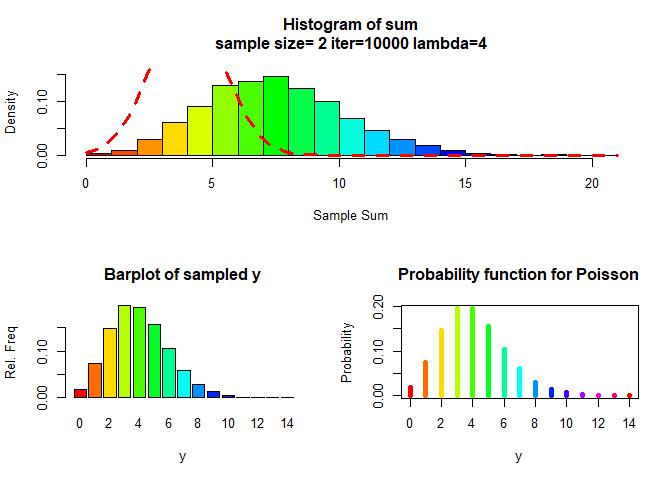<!-- -->

```r
mycltpx(n=3,iter=10000, lambda = 4)
```

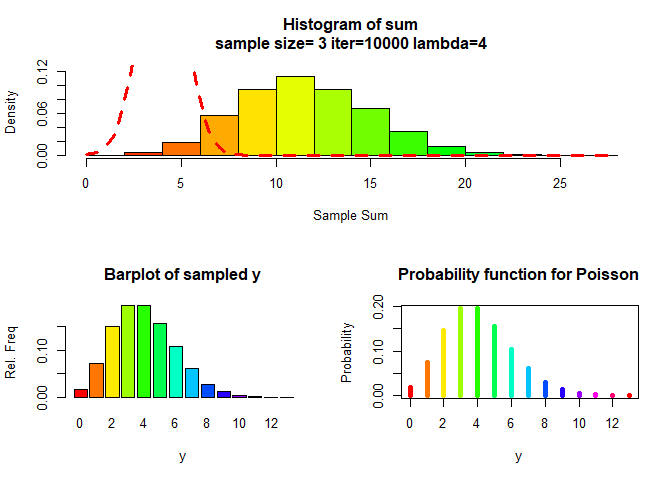<!-- -->

```r
mycltpx(n=5,iter=10000, lambda = 4)
```

<!-- -->

```r
mycltpx(n=10,iter=10000, lambda = 4)
```

<!-- -->

```r
mycltpx(n=20,iter=10000, lambda = 4)
```

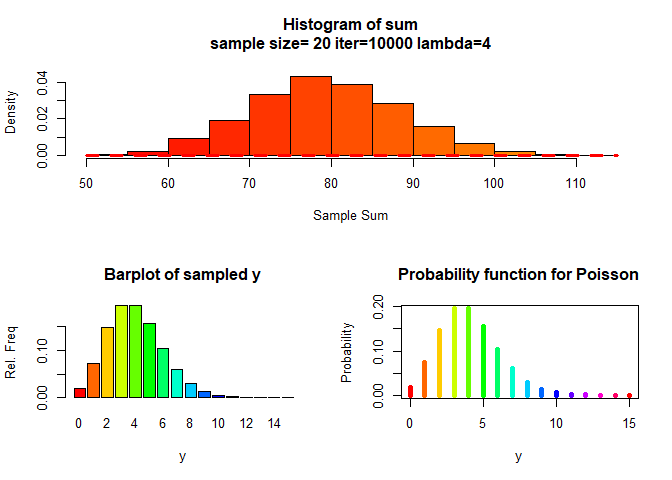<!-- -->

##Plots with lambda=10

```r
mycltpx(n=2,iter=10000, lambda = 10)
```

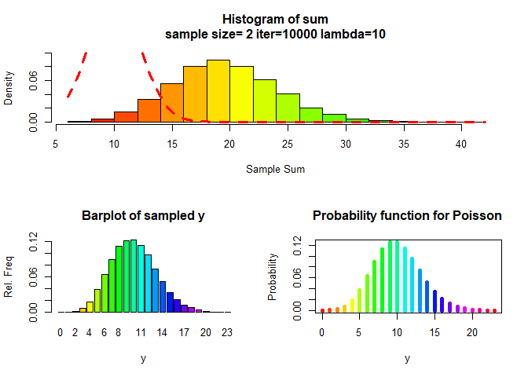<!-- -->

```r
mycltpx(n=3,iter=10000, lambda = 10)
```

<!-- -->

```r
mycltpx(n=5,iter=10000, lambda = 10)
```

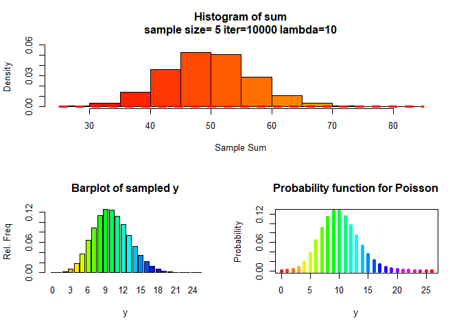<!-- -->

```r
mycltpx(n=10,iter=10000, lambda = 10)
```

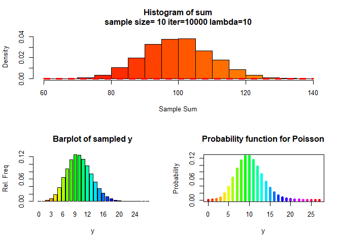<!-- -->

```r
mycltpx(n=20,iter=10000, lambda = 10)
```

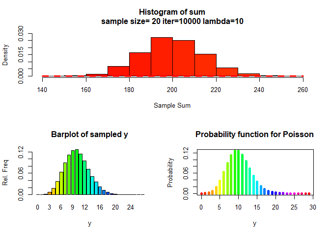<!-- -->


