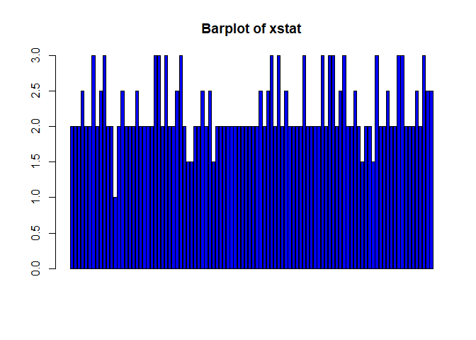

#Task 1

```r
getwd()
```

```
## [1] "C:/Users/prith/OneDrive/Documents/MATH4753_FA18/Lab9"
```

#Task 2
## Code Analysis
```
A. Create a sample with replacement and prob is not given because it is uniform.
B. Calculating the confidence intervals for the given data.
```

##Equal probability
```
Question : As used in the myboot() function, each datum in x will be selected with equal probability. Why is this necessary?
```

```
Answer : Since the data is uniform having given no probability. The samples can be created with uniform distribution.
```

##Replace=TRUE

```r
set.seed(35)
sam=round(rnorm(20,mean=10,sd=4),2)
unique(sample(sam,20,replace=TRUE))
```

```
##  [1]  2.89  8.00 13.46 11.40 12.05  8.62 11.64  7.75 23.35  2.37  6.93
## [12] 16.69
```

```r
unique(sample(sam,20,replace=TRUE))
```

```
##  [1]  8.62 23.35  9.86 11.64 14.76  2.37  8.43 10.53 16.69 11.40 12.05
## [12] 13.46 17.35  6.93
```

```r
unique(sample(sam,20,replace=TRUE))
```

```
##  [1] 11.64  8.00 12.05 11.78  9.86  7.75 23.35  6.93  8.62  2.89 11.40
## [12] 13.46 10.53 14.76
```

```r
unique(sample(sam,20,replace=TRUE))
```

```
##  [1] 11.78  8.43  8.62 14.76  9.82 17.35 10.53 23.35  6.93 11.64 14.26
## [12]  9.86  7.75 13.46  2.89
```

```r
unique(sample(sam,20,replace=TRUE))
```

```
##  [1] 16.69 11.40  2.37 14.76  7.75 23.35 13.46 11.78  9.82 10.53  8.43
```

```
We get a set of unique sample when we run the line each time
```

##Replace=FALSE

```r
unique(sample(sam,20,replace=FALSE))
```

```
##  [1] 14.26 11.64 11.78 10.53  6.93 11.40  8.00  8.62  7.75  9.86 13.46
## [12]  2.89  9.82 16.69 23.35 17.35  2.37  8.43 14.76 12.05
```

```r
unique(sample(sam,20,replace=FALSE))
```

```
##  [1]  6.93 11.40 10.53  2.37  9.82 11.78 14.26 14.76 11.64  2.89 16.69
## [12] 13.46 12.05  7.75 17.35  8.62  9.86  8.43 23.35  8.00
```

```r
unique(sample(sam,20,replace=FALSE))
```

```
##  [1] 11.40  8.62 16.69 11.64 11.78  9.86 17.35 13.46  9.82  6.93  8.00
## [12] 23.35  7.75  2.89 10.53  8.43 14.76  2.37 14.26 12.05
```

```r
unique(sample(sam,20,replace=FALSE))
```

```
##  [1]  7.75 13.46  9.86 14.76  2.37 11.78  6.93  8.62 17.35 23.35  8.43
## [12]  9.82 16.69  2.89  8.00 11.40 11.64 14.26 10.53 12.05
```

```r
unique(sample(sam,20,replace=FALSE))
```

```
##  [1] 23.35  8.62  2.37  6.93  9.82 11.78 13.46 17.35  8.43 14.26 11.64
## [12]  9.86 10.53 14.76  2.89 12.05 11.40  8.00  7.75 16.69
```

```
The sample set we get each time is same. Just re-arranged.
```

##21 sample
```
unique(sample(sam,21,replace=FALSE))
```

```
It says cannot take a larger sample than the population
```

#Task 3

##myboot2() function

```r
myboot2<-function(iter=10000,x,fun="mean",alpha=0.05,cx=1.5,...){  #Notice where the ... is repeated in the code
n=length(x)   #sample size

y=sample(x,n*iter,replace=TRUE)
rs.mat=matrix(y,nr=n,nc=iter,byrow=TRUE)
xstat=apply(rs.mat,2,fun) # xstat is a vector and will have iter values in it 
ci=quantile(xstat,c(alpha/2,1-alpha/2))# Nice way to form a confidence interval
# A histogram follows
# The object para will contain the parameters used to make the histogram
para=hist(xstat,freq=FALSE,las=1,
main=paste("Histogram of Bootstrap sample statistics","\n","alpha=",alpha," iter=",iter,sep=""),
...)

#mat will be a matrix that contains the data, this is done so that I can use apply()
mat=matrix(x,nr=length(x),nc=1,byrow=TRUE)

#pte is the point estimate
#This uses whatever fun is
pte=apply(mat,2,fun)
abline(v=pte,lwd=3,col="Black")# Vertical line
segments(ci[1],0,ci[2],0,lwd=4)      #Make the segment for the ci
text(ci[1],0,paste("(",round(ci[1],2),sep=""),col="Red",cex=cx)
text(ci[2],0,paste(round(ci[2],2),")",sep=""),col="Red",cex=cx)

# plot the point estimate 1/2 way up the density
text(pte,max(para$density)/2,round(pte,2),cex=cx)

return(list(ci=ci,fun=fun,x=x))# Some output to use if necessary
}
```

##Alpha=95%

```r
set.seed(39); sam=rnorm(25,mean=25,sd=10)
myboot2(10000,x=sam,fun=function(x) mean(x),alpha=0.05,xlab="mean(x)",col="Blue",cx=1.5)
```

<!-- -->

```
## $ci
##     2.5%    97.5% 
## 21.31693 26.53540 
## 
## $fun
## function (x) 
## mean(x)
## <bytecode: 0x00000000182c9268>
## 
## $x
##  [1] 23.14434 12.70757 20.72797 19.04018 29.67324 29.21639 14.78348
##  [8] 18.77523 33.37002 34.61627 26.04230 24.40206 32.03731 17.45030
## [15] 19.54464 20.45388 23.83394 30.47815 25.79640 22.67536 10.27711
## [22] 26.77487 37.10044 21.59809 22.50625
```

```r
set.seed(30); sam=rchisq(20,df=3)
myboot2(10000,x=sam,fun=function(x) mean(x),alpha=0.05,xlab="mean(x)",col="Blue",cx=1.5)
```

<!-- -->

```
## $ci
##     2.5%    97.5% 
## 2.052178 3.862641 
## 
## $fun
## function (x) 
## mean(x)
## <bytecode: 0x00000000183d4918>
## 
## $x
##  [1] 0.2531032 1.6194423 5.3578133 7.3134789 0.1194100 5.0344239 5.8189991
##  [8] 4.3689673 1.6690814 3.2533362 0.9050305 2.5730754 1.9610329 2.9675027
## [15] 1.5722396 1.6959031 1.9261106 3.9198072 6.0919801 0.4082447
```

```r
set.seed(40); sam=rgamma(30,shape=2,scale=3)
myboot2(10000,x=sam,fun=function(x) mean(x),alpha=0.05,xlab="mean(x)",col="Blue",cx=1.5)
```

<!-- -->

```
## $ci
##     2.5%    97.5% 
## 5.122351 7.959613 
## 
## $fun
## function (x) 
## mean(x)
## <bytecode: 0x00000000181e9100>
## 
## $x
##  [1]  6.4265012  6.5077401  1.8958495  5.3836641  1.4179366  0.7925928
##  [7]  8.0380097 14.7293204  5.2917468  2.7989621  7.9632983  2.8733832
## [13]  7.4419824  2.2828464  5.9877646 12.9354365  1.4996069  1.7478044
## [19] 12.3674161  8.4093535 10.2053201  8.0243948  6.5178039  7.9118846
## [25]  1.6924333 10.7938057  5.7341134 15.1533278  3.8545321  8.1861897
```

```r
set.seed(10); sam=rbeta(20,shape1=3,shape2=4)
myboot2(10000,x=sam,fun=function(x) mean(x),alpha=0.05,xlab="mean(x)",col="Blue",cx=1.5)
```

<!-- -->

```
## $ci
##      2.5%     97.5% 
## 0.3415605 0.4742732 
## 
## $fun
## function (x) 
## mean(x)
## <bytecode: 0x00000000182f5b78>
## 
## $x
##  [1] 0.4325491 0.3899825 0.1714409 0.3068918 0.4920588 0.5129946 0.1974398
##  [8] 0.3533577 0.1343329 0.3751208 0.6722481 0.5946901 0.3788602 0.6467397
## [15] 0.5914547 0.4476104 0.2407876 0.3877302 0.5336340 0.3074436
```


##Point Estimate

```r
abs(25-23.88)*100/25
```

```
## [1] 4.48
```

```r
abs(3-2.94)*100/3
```

```
## [1] 2
```

```r
abs(6-6.5)*100/6
```

```
## [1] 8.333333
```

```r
abs(0.4286-0.41)*100/0.4286
```

```
## [1] 4.339711
```
 
##Alpha=80%

```r
set.seed(39); sam=rnorm(25,mean=25,sd=10)
myboot2(10000,x=sam,fun=function(x) var(x),alpha=0.20,xlab="var(x)",col="Blue",cx=1.5)
```

<!-- -->

```
## $ci
##      10%      90% 
## 30.45325 58.85675 
## 
## $fun
## function (x) 
## var(x)
## <bytecode: 0x0000000018290998>
## 
## $x
##  [1] 23.14434 12.70757 20.72797 19.04018 29.67324 29.21639 14.78348
##  [8] 18.77523 33.37002 34.61627 26.04230 24.40206 32.03731 17.45030
## [15] 19.54464 20.45388 23.83394 30.47815 25.79640 22.67536 10.27711
## [22] 26.77487 37.10044 21.59809 22.50625
```

```r
set.seed(30); sam=rchisq(20,df=3)
myboot2(10000,x=sam,fun=function(x) var(x),alpha=0.20,xlab="var(x)",col="Blue",cx=1.5)
```

<!-- -->

```
## $ci
##      10%      90% 
## 2.922344 5.689590 
## 
## $fun
## function (x) 
## var(x)
## <bytecode: 0x0000000018e23780>
## 
## $x
##  [1] 0.2531032 1.6194423 5.3578133 7.3134789 0.1194100 5.0344239 5.8189991
##  [8] 4.3689673 1.6690814 3.2533362 0.9050305 2.5730754 1.9610329 2.9675027
## [15] 1.5722396 1.6959031 1.9261106 3.9198072 6.0919801 0.4082447
```

```r
set.seed(40); sam=rgamma(30,shape=2,scale=3)
myboot2(10000,x=sam,fun=function(x) var(x),alpha=0.20,xlab="var(x)",col="Blue",cx=1.5)
```

<!-- -->

```
## $ci
##      10%      90% 
## 11.22596 20.21214 
## 
## $fun
## function (x) 
## var(x)
## <bytecode: 0x0000000018375df8>
## 
## $x
##  [1]  6.4265012  6.5077401  1.8958495  5.3836641  1.4179366  0.7925928
##  [7]  8.0380097 14.7293204  5.2917468  2.7989621  7.9632983  2.8733832
## [13]  7.4419824  2.2828464  5.9877646 12.9354365  1.4996069  1.7478044
## [19] 12.3674161  8.4093535 10.2053201  8.0243948  6.5178039  7.9118846
## [25]  1.6924333 10.7938057  5.7341134 15.1533278  3.8545321  8.1861897
```

```r
set.seed(10); sam=rbeta(20,shape1=3,shape2=4)
myboot2(10000,x=sam,fun=function(x) var(x),alpha=0.20,xlab="var(x)",col="Blue",cx=1.5)
```

<!-- -->

```
## $ci
##        10%        90% 
## 0.01582077 0.03050548 
## 
## $fun
## function (x) 
## var(x)
## <bytecode: 0x0000000015a3bab0>
## 
## $x
##  [1] 0.4325491 0.3899825 0.1714409 0.3068918 0.4920588 0.5129946 0.1974398
##  [8] 0.3533577 0.1343329 0.3751208 0.6722481 0.5946901 0.3788602 0.6467397
## [15] 0.5914547 0.4476104 0.2407876 0.3877302 0.5336340 0.3074436
```

#Task 4
##myboot2() edited

```r
myboot21<-function(iter=10000,x,fun="mean",alpha=0.05,...){  #Notice where the ... is repeated in the code
  n=length(x)   #sample size
  
  y=sample(x,n*iter,replace=TRUE)
  rs.mat=matrix(y,nr=n,nc=iter,byrow=TRUE)
  xstat=apply(rs.mat,2,fun) # xstat is a vector and will have iter values in it 
  ci=quantile(xstat,c(alpha/2,1-alpha/2))# Nice way to form a confidence interval
  # A histogram follows
  # The object para will contain the parameters used to make the histogram
  para=hist(xstat,freq=FALSE,las=1,
            main=paste("Histogram of Bootstrap sample statistics","\n","alpha=",alpha," iter=",iter,sep=""),
            ...)
  
  #mat will be a matrix that contains the data, this is done so that I can use apply()
  mat=matrix(x,nr=length(x),nc=1,byrow=TRUE)
  
  #pte is the point estimate
  #This uses whatever fun is
  pte=apply(mat,2,fun)
  abline(v=pte,lwd=3,col="Black")# Vertical line
  segments(ci[1],0,ci[2],0,lwd=4)      #Make the segment for the ci
  text(ci[1],0,paste("(",round(ci[1],2),sep=""),col="Red",cex=1)
  text(ci[2],0,paste(round(ci[2],2),")",sep=""),col="Red",cex=1)
  
  # plot the point estimate 1/2 way up the density
  text(pte,max(para$density)/2,round(pte,2),cex=1)
  
  m=mean(x)
  return(list(ci=ci,fun=fun,m=m,xstat=xstat))# Some output to use if necessary
}
```

##Barplot

```r
#barplot of xstat
sam=c(1,1,1,2,2,2,2,3,3,3,4,4) 
data=myboot21(100,x=sam,fun="median" ,alpha=0.05,xlab="median(x)",col="Blue")
```

<!-- -->

```r
barplot(data$xstat, main="Barplot of xstat",col="Blue")
```

<!-- -->

##(L,U)
```
From the graph (L,U) = (1.5,3)
```

#Task 5
##Alpha=95%

```r
set.seed(39); sam=rnorm(25,mean=25,sd=10)
myboot2(10000,x=sam,fun=function(x) mean(x)/median(x),alpha=0.05,xlab="mean(x)/median(x)",col="Green",cx=1.5)
```

<!-- -->

```
## $ci
##      2.5%     97.5% 
## 0.9393388 1.1076165 
## 
## $fun
## function (x) 
## mean(x)/median(x)
## <bytecode: 0x0000000018d7c440>
## 
## $x
##  [1] 23.14434 12.70757 20.72797 19.04018 29.67324 29.21639 14.78348
##  [8] 18.77523 33.37002 34.61627 26.04230 24.40206 32.03731 17.45030
## [15] 19.54464 20.45388 23.83394 30.47815 25.79640 22.67536 10.27711
## [22] 26.77487 37.10044 21.59809 22.50625
```

```r
set.seed(30); sam=rchisq(20,df=3)
myboot2(10000,x=sam,fun=function(x) mean(x)/median(x),alpha=0.05,xlab="mean(x)/median(x)",col="Green",cx=1.5)
```

<!-- -->

```
## $ci
##      2.5%     97.5% 
## 0.8805673 1.6513369 
## 
## $fun
## function (x) 
## mean(x)/median(x)
## <bytecode: 0x0000000018242d20>
## 
## $x
##  [1] 0.2531032 1.6194423 5.3578133 7.3134789 0.1194100 5.0344239 5.8189991
##  [8] 4.3689673 1.6690814 3.2533362 0.9050305 2.5730754 1.9610329 2.9675027
## [15] 1.5722396 1.6959031 1.9261106 3.9198072 6.0919801 0.4082447
```

```r
set.seed(40); sam=rgamma(30,shape=2,scale=3)
myboot2(10000,x=sam,fun=function(x) mean(x)/median(x),alpha=0.05,xlab="mean(x)/median(x)",col="Green",cx=1.5)
```

<!-- -->

```
## $ci
##      2.5%     97.5% 
## 0.8705138 1.2395642 
## 
## $fun
## function (x) 
## mean(x)/median(x)
## <bytecode: 0x0000000018a55498>
## 
## $x
##  [1]  6.4265012  6.5077401  1.8958495  5.3836641  1.4179366  0.7925928
##  [7]  8.0380097 14.7293204  5.2917468  2.7989621  7.9632983  2.8733832
## [13]  7.4419824  2.2828464  5.9877646 12.9354365  1.4996069  1.7478044
## [19] 12.3674161  8.4093535 10.2053201  8.0243948  6.5178039  7.9118846
## [25]  1.6924333 10.7938057  5.7341134 15.1533278  3.8545321  8.1861897
```

```r
set.seed(10); sam=rbeta(20,shape1=3,shape2=4)
myboot2(10000,x=sam,fun=function(x) mean(x)/median(x),alpha=0.05,xlab="mean(x)/median(x)",col="Green",cx=1.5) 
```

<!-- -->

```
## $ci
##      2.5%     97.5% 
## 0.9031685 1.1301854 
## 
## $fun
## function (x) 
## mean(x)/median(x)
## <bytecode: 0x0000000018c14088>
## 
## $x
##  [1] 0.4325491 0.3899825 0.1714409 0.3068918 0.4920588 0.5129946 0.1974398
##  [8] 0.3533577 0.1343329 0.3751208 0.6722481 0.5946901 0.3788602 0.6467397
## [15] 0.5914547 0.4476104 0.2407876 0.3877302 0.5336340 0.3074436
```

##Alpha=70%

```r
set.seed(39); sam=rnorm(25,mean=25,sd=10)
myboot2(10000,x=sam,fun=function(x) mean(x)/median(x),alpha=0.3,xlab="mean(x)/median(x)",col="Green",cx=1.5)
```

<!-- -->

```
## $ci
##       15%       85% 
## 0.9787053 1.0642767 
## 
## $fun
## function (x) 
## mean(x)/median(x)
## <bytecode: 0x00000000183a5c60>
## 
## $x
##  [1] 23.14434 12.70757 20.72797 19.04018 29.67324 29.21639 14.78348
##  [8] 18.77523 33.37002 34.61627 26.04230 24.40206 32.03731 17.45030
## [15] 19.54464 20.45388 23.83394 30.47815 25.79640 22.67536 10.27711
## [22] 26.77487 37.10044 21.59809 22.50625
```

```r
set.seed(30); sam=rchisq(20,df=3)
myboot2(10000,x=sam,fun=function(x) mean(x)/median(x),alpha=0.3,xlab="mean(x)/median(x)",col="Green",cx=1.5)
```

<!-- -->

```
## $ci
##      15%      85% 
## 1.020315 1.465416 
## 
## $fun
## function (x) 
## mean(x)/median(x)
## <bytecode: 0x0000000015acdcf8>
## 
## $x
##  [1] 0.2531032 1.6194423 5.3578133 7.3134789 0.1194100 5.0344239 5.8189991
##  [8] 4.3689673 1.6690814 3.2533362 0.9050305 2.5730754 1.9610329 2.9675027
## [15] 1.5722396 1.6959031 1.9261106 3.9198072 6.0919801 0.4082447
```

```r
set.seed(40); sam=rgamma(30,shape=2,scale=3)
myboot2(10000,x=sam,fun=function(x) mean(x)/median(x),alpha=0.3,xlab="mean(x)/median(x)",col="Green",cx=1.5)
```

<!-- -->

```
## $ci
##       15%       85% 
## 0.9319279 1.0960193 
## 
## $fun
## function (x) 
## mean(x)/median(x)
## <bytecode: 0x00000000184151a8>
## 
## $x
##  [1]  6.4265012  6.5077401  1.8958495  5.3836641  1.4179366  0.7925928
##  [7]  8.0380097 14.7293204  5.2917468  2.7989621  7.9632983  2.8733832
## [13]  7.4419824  2.2828464  5.9877646 12.9354365  1.4996069  1.7478044
## [19] 12.3674161  8.4093535 10.2053201  8.0243948  6.5178039  7.9118846
## [25]  1.6924333 10.7938057  5.7341134 15.1533278  3.8545321  8.1861897
```

```r
set.seed(10); sam=rbeta(20,shape1=3,shape2=4)
myboot2(10000,x=sam,fun=function(x) mean(x)/median(x),alpha=0.3,xlab="mean(x)/median(x)",col="Green",cx=1.5) 
```

<!-- -->

```
## $ci
##       15%       85% 
## 0.9541615 1.0741001 
## 
## $fun
## function (x) 
## mean(x)/median(x)
## <bytecode: 0x0000000018d25238>
## 
## $x
##  [1] 0.4325491 0.3899825 0.1714409 0.3068918 0.4920588 0.5129946 0.1974398
##  [8] 0.3533577 0.1343329 0.3751208 0.6722481 0.5946901 0.3788602 0.6467397
## [15] 0.5914547 0.4476104 0.2407876 0.3877302 0.5336340 0.3074436
```

#Task 6
##Distributions

```r
?distributions
```

```
## starting httpd help server ... done
```

##samples
###Cauchy

```r
sam = rcauchy(20, 2, 2)
myboot2(10000,x=sam,fun=function(x) mean(x),alpha=0.20,xlab="mean(x)",col="Red",cx=1.5)
```

<!-- -->

```
## $ci
##      10%      90% 
## 1.689711 4.103838 
## 
## $fun
## function (x) 
## mean(x)
## <bytecode: 0x0000000018ebb608>
## 
## $x
##  [1] -0.9200498 -2.3983426  4.1674576  6.2618749  0.8232276 -5.9991085
##  [7]  2.8892268 11.8171952  9.5857291  0.7816172  4.0088556  4.7340557
## [13] -2.9013738 -0.9028515  3.9815808  5.9240896  1.7214735  4.0333041
## [19]  3.9081773  6.5636300
```

```r
myboot2(10000,x=sam,fun=function(x) median(x),alpha=0.20,xlab="median(x)",col="Red",cx=1.5)
```

<!-- -->

```
## $ci
##      10%      90% 
## 1.721474 4.100381 
## 
## $fun
## function (x) 
## median(x)
## <bytecode: 0x0000000018c43450>
## 
## $x
##  [1] -0.9200498 -2.3983426  4.1674576  6.2618749  0.8232276 -5.9991085
##  [7]  2.8892268 11.8171952  9.5857291  0.7816172  4.0088556  4.7340557
## [13] -2.9013738 -0.9028515  3.9815808  5.9240896  1.7214735  4.0333041
## [19]  3.9081773  6.5636300
```

###Hyper geometric

```r
sam = rhyper(30, 4, 6, 4)
myboot2(10000,x=sam,fun=function(x) mean(x),alpha=0.20,xlab="mean(x)",col="Green",cx=1.5)
```

<!-- -->

```
## $ci
##      10%      90% 
## 1.466667 1.800000 
## 
## $fun
## function (x) 
## mean(x)
## <bytecode: 0x0000000018884ea0>
## 
## $x
##  [1] 2 2 0 1 1 2 3 2 1 1 1 2 1 2 1 2 2 2 1 1 3 3 2 1 1 3 1 1 2 2
```

```r
myboot2(10000,x=sam,fun=function(x) median(x),alpha=0.20,xlab="median(x)",col="Green",cx=1.5)
```

<!-- -->

```
## $ci
## 10% 90% 
##   1   2 
## 
## $fun
## function (x) 
## median(x)
## <bytecode: 0x000000001867f118>
## 
## $x
##  [1] 2 2 0 1 1 2 3 2 1 1 1 2 1 2 1 2 2 2 1 1 3 3 2 1 1 3 1 1 2 2
```


###Poisson

```r
sam = rpois(25, 4)
myboot2(10000,x=sam,fun=function(x) mean(x),alpha=0.20,xlab="mean(x)",col="Blue",cx=1.5)
```

<!-- -->

```
## $ci
##  10%  90% 
## 3.36 4.52 
## 
## $fun
## function (x) 
## mean(x)
## <bytecode: 0x00000000188f7da8>
## 
## $x
##  [1]  6  5  3 12  0  4  5  6  3  3  1  1  3  2  3  4  3  5  4  5  3  3  6
## [24]  4  4
```

```r
myboot2(10000,x=sam,fun=function(x) median(x),alpha=0.20,xlab="median(x)",col="Blue",cx=1.5)
```

<!-- -->

```
## $ci
## 10% 90% 
##   3   4 
## 
## $fun
## function (x) 
## median(x)
## <bytecode: 0x0000000017d82820>
## 
## $x
##  [1]  6  5  3 12  0  4  5  6  3  3  1  1  3  2  3  4  3  5  4  5  3  3  6
## [24]  4  4
```


###Weibull

```r
sam = rweibull(30, 3, 2)
myboot2(10000,x=sam,fun=function(x) mean(x),alpha=0.20,xlab="mean(x)",col="Purple",cx=1.5)
```

<!-- -->

```
## $ci
##      10%      90% 
## 1.662099 1.983959 
## 
## $fun
## function (x) 
## mean(x)
## <bytecode: 0x00000000157ca5c8>
## 
## $x
##  [1] 2.3666257 2.6691697 1.8218763 2.3360800 1.8333688 1.0226909 2.4764065
##  [8] 1.4818711 3.1806792 1.4221513 1.8562429 0.8324536 2.7752238 2.2466381
## [15] 1.4266961 1.5009825 0.9731706 1.9809112 3.3203979 0.6200213 0.5236193
## [22] 1.9994064 2.1842213 1.2825356 2.1580370 1.3859664 2.4116311 1.2218890
## [29] 1.9822501 1.3514998
```

```r
myboot2(10000,x=sam,fun=function(x) median(x),alpha=0.20,xlab="median(x)",col="Purple",cx=1.5)
```

<!-- -->

```
## $ci
##      10%      90% 
## 1.481871 1.999406 
## 
## $fun
## function (x) 
## median(x)
## <bytecode: 0x00000000185148a0>
## 
## $x
##  [1] 2.3666257 2.6691697 1.8218763 2.3360800 1.8333688 1.0226909 2.4764065
##  [8] 1.4818711 3.1806792 1.4221513 1.8562429 0.8324536 2.7752238 2.2466381
## [15] 1.4266961 1.5009825 0.9731706 1.9809112 3.3203979 0.6200213 0.5236193
## [22] 1.9994064 2.1842213 1.2825356 2.1580370 1.3859664 2.4116311 1.2218890
## [29] 1.9822501 1.3514998
```


#Task 7
##sd and quantile

```r
set.seed(68)
sam=rnorm(20,mean=10,sd=4) 
myboot2(10000,x=sam,fun=function(x) sd(x),alpha=0.05,xlab="sd(x)",col="Orange",cx=1.5)
```

<!-- -->

```
## $ci
##     2.5%    97.5% 
## 2.282563 4.580144 
## 
## $fun
## function (x) 
## sd(x)
## <bytecode: 0x0000000018c7fc70>
## 
## $x
##  [1] 15.743750  9.011543  8.487107 12.302301  8.274762 10.033130 14.601905
##  [8] 11.648501 13.546594 13.330691  9.641557  6.760229  6.716014 13.997038
## [15]  9.458889 10.143532  1.155378 11.836486  7.832403 14.664414
```

```r
myboot2(10000,x=sam,fun=function(x) quantile(x),alpha=0.05,xlab="quantile(x)",col="Orange",cx=1.5)
```

<!-- -->

```
## $ci
##      2.5%     97.5% 
##  1.155378 15.743750 
## 
## $fun
## function (x) 
## quantile(x)
## <bytecode: 0x00000000187766c0>
## 
## $x
##  [1] 15.743750  9.011543  8.487107 12.302301  8.274762 10.033130 14.601905
##  [8] 11.648501 13.546594 13.330691  9.641557  6.760229  6.716014 13.997038
## [15]  9.458889 10.143532  1.155378 11.836486  7.832403 14.664414
```


##calculating the mean

```r
alpha2 = qnorm(1-(.05/2),mean=0,sd=1)
left = mean(sam) - alpha2*(4/sqrt(20))
right = mean(sam) + alpha2*(4/sqrt(20))
left
```

```
## [1] 8.706266
```

```r
right
```

```
## [1] 12.21236
```


##mean

```r
set.seed(68)
sam=rnorm(20,mean=10,sd=4)
data=myboot2(10000,x=sam,fun=function(x) mean(x),alpha=0.05,xlab="mean(x)",col="Orange",cx=1.5)
```

<!-- -->

```r
data$ci
```

```
##     2.5%    97.5% 
##  8.88394 11.87990
```


##Comparison
```
The two intervals are very close
```


