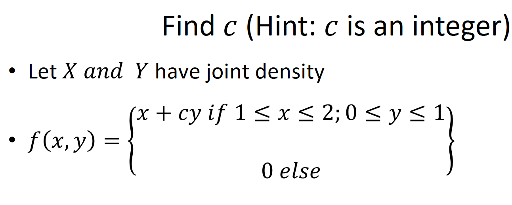

```{r setup, include=FALSE}
knitr::opts_chunk$set(echo = TRUE)
```

# Introduction

Use properties of the joinyt density to find c. You can write on a piece of paper - scan then use `{}` to place it in the rmd document.
Knit to html and place on canvas.




# Working

$$
\begin{align}
\int_{-\infty}^{\infty} \int_{-\infty}^{\infty} f(x,y) dx \;dy &= 1\\
\int_{0}^{1} \int_{1}^{2} x + cy\; dx \;dy &= 1\\
\int_{0}^{1}  \frac{x^2}{2} \biggr\rvert_{1}^{2} + cy\;x\biggr\rvert_{1}^{2}  \;dy &= 1\\
\int_{0}^{1} \frac{4}{2}-\frac{1}{2}+cy(2-1) \; dy &=1\\
\int_{0}^{1} \frac{3}{2}+cy \; dy &=1\\
 \frac{3}{2} y \biggr\rvert_{0}^{1}+c\frac{y^2}{2}\biggr\rvert_{0}^{1} &=1\\
 \frac{3}{2}(1-0)+c\;(\frac{1}{2}-\frac{0}{2}) &= 1\\
 \frac{3}{2} + \frac{c}{2} &= 1\\
 \frac{c}{2} &= 1-\frac{3}{2}\\
 c \; &=-\frac{1}{2}*2\\
 c \; &= -1
\end{align}
$$