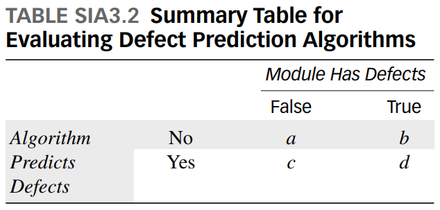

```{r setup, include=FALSE}
knitr::opts_chunk$set(echo = TRUE)
```

# Introduction to the Data

## Data and variables

The data is constructed from the data from the satellite and if there is any defect and the prediction of each alorithm and what they say. If there is any defect in the data then it is *TRUE* and if there is not it is *FALSE*. So we will have 2 columns and 2 rows for each table that shows defects(TRUE, FALSE) and Prediction(Yes, No). The structure of the table can be seen in the summary table below.
We also want to investigate if we are able to predict correctly how dependable 

```{r}
swd=read.csv("swdefects.csv")
head(swd)
```


## Summary Table 
**Create the summary table (TABLE SIA3.2) found on page 125.**
<center>
{ width=80% }
</center>


The four Probabilities are:


>
  1. Accuracy
  2. Detection rate
  3. False alarm rate
  4. Precision
  
The formulas are as follows:

$1. Accuracy: P(Algorithm is correct) = \frac{(a+d)}{(a+b+c+d)}$

$2. Detection Rate: P(predict defect|module has defect)=\frac{d}{(b+d)}$

$3. Fals alarm Rate: P(predict defect|module has no defect)=\frac{c}{(a+c)}$

$4. Precision: P(module has defect|predict defect)=\frac{d}{(d+c)}$


# R functions

##Function for accuracy
```{r accuracy}
acc=function(a,b,c,d)
{
  accuracy = (a+d)/(a+b+c+d)
  round(accuracy,3)
}
```

##Function for detection
```{r detection}
detect=function(b,d)
{
  detectionrate = d/(b+d)
  round(detectionrate,3)
}
```

##Function for False alarm rate
```{r alarm}
falarm=function(a,c)
{
  falsealarm = c/(a+c)
  round(falsealarm,3)
}
```

##Function for Precision rate
```{r precision}
prec=function(c,d)
{
  precision=d/(c+d)
  round(precision,3)
}
```

# Create the tables in Figure SIA3.1
## Function to make table
```{r maketable}
#Creates tables based on the column names given to it.
createtable=function(df,col1,col2, header="Barplot"){
  tab=with(df, table(df[[col1]],df[[col2]]))
  barplot(tab, beside=TRUE, leg=TRUE, main=header)
  tab2=addmargins(tab)
  tab2
}
```

## Creating different tables
### Table for Line of Code
```{r}
tabloc = createtable(swd,"predict.loc.50","defect", header="Line of Code")
tabloc
```

### Table for Cyclomatic complexity
```{r}
tabvg = createtable(swd,"predict.vg.10","defect", header="Cyclomatic Complexity")
tabvg
```

### Table for Essential Complexity
```{r}
tabevg = createtable(swd,"predict.evg.14.5","defect", header="Essential Complexity")
tabevg
```

### Table for Design Complexity
```{r}
tabivg = createtable(swd,"predict.ivg.9.2","defect", header="Design Complexity")
tabivg
```

#Create the table
##Function to create the table given df
```{r allmethods}
allmethods = function(df) # dataframe
{
  tabloc = createtable(df,"predict.loc.50","defect", header="Line of Code")
  tabvg = createtable(df,"predict.vg.10","defect", header="Cyclomatic Complexity")
  tabevg = createtable(df,"predict.evg.14.5","defect", header="Essential Complexity")
  tabivg = createtable(df,"predict.ivg.9.2","defect", header="Design Complexity")
  
  probs=c("Accuracy","Detection Rate","False Alarm Rate", "Precision")
  mths = c("Lines of Code", "Cyclomatic complexity", "Essential complexity", "Design complexity")
  
  mat = matrix(NA, nrow = length(mths), ncol = length(probs), dimnames=list(mths,probs))
  for (i in 1:length(mths)) {
    if(i==1){
      a = tabloc[1,1]
      b = tabloc[1,2]
      c = tabloc[2,1]
      d = tabloc[2,2]
    }
    else if(i==2){
      a = tabvg[1,1]
      b = tabvg[1,2]
      c = tabvg[2,1]
      d = tabvg[2,2]
    }
    else if(i==3){
      a = tabevg[1,1]
      b = tabevg[1,2]
      c = tabevg[2,1]
      d = tabevg[2,2]
    }
    else{
      a = tabivg[1,1]
      b = tabivg[1,2]
      c = tabivg[2,1]
      d = tabivg[2,2]
    }
    #Calculate a,b,c,d here
    for (j in 1:length(probs)) {
      if(j==1){
        mat[i,j] = acc(a,b,c,d)
      }
      else if(j==2){
        mat[i,j] = detect(b,d)
      }
      else if(j==3){
        mat[i,j] = falarm(a,c)
      }
      else{
        mat[i,j] = prec(c,d)
      }
    }
  }
  mat
  
  
  as.table(mat)
}

tab=allmethods(df = swd)
tab
```

##Barplot of all the data
```{r}
barplot(tab, ylab="Probabilities", beside=TRUE, col=rainbow(4), leg=TRUE)
```


