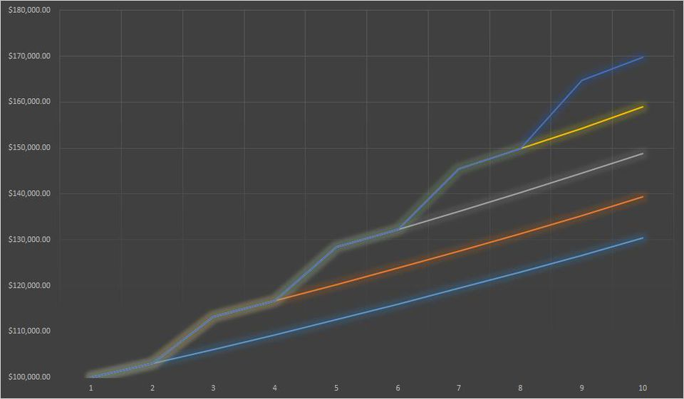

<center>

{ width=30% }

</center>


```{r setup, include=FALSE}
knitr::opts_chunk$set(echo = TRUE)
library(leaflet)
library(dplyr)
```

# My Video

<video controls>
<source src="test1.mp4" type = "video/mp4">
</video>


# Introduction

Salary - A fixed regular payment, typically paid on a monthly or biweekly basis but often expressed as an annual sum, made by an employer to an employee, especially a professional or white-collar worker. 
<center>
{ width=30% }
</center>

The following was taken from [Forbes Articles](https://www.forbes.com/sites/cameronkeng/2014/06/22/employees-that-stay-in-companies-longer-than-2-years-get-paid-50-less/#3ae687b8e07f)

There has been a lot of buzz going around in the software industry about unequal pays to the employees who have been working for a single company longer. and Who recently graduated and gets very good salary. There also have been a lot of articles written about unequal pays to the loyal employees and employees changing their jobs every 3-4 years getting almost 50% hike in salaries.

Those very new to the tech industry, with less than a year of experience, can expect to earn \$50,321 (a year-over-year increase of 9.8 percent). After a year or two, that average salary jumps to \$62,517 (a whooping 24.3 percent increase, year-over-year).

Spend three to five years, and the average leaps yet again, to \$68,040 (a 6.3 percent increase). Between six and ten years in the industry, salaries hit $83,143 (a rise of 6.8 percent).

Breaking the ten-year mark translates into big bucks. Those with 11 to 15 years of experience could expect to pull down \$96,792 (a 3.8 percent increase over last year), while those with more than 15 years average \$115,399 (a 6 percent increase).

Below is the graph that shows us the salary hike when employees jump companies:
{ width=100% }


The data was collected here:

```{r map, echo=FALSE, fig.align='center'}
leaflet() %>%
  setView(lng=-97.445717, lat=35.205894, zoom= 16) %>% 
  addTiles() %>%
  addMarkers(lng=-97.447227, lat=35.209281, popup="We collected data using internet while sitting in the class.") 
```


## What are the variables? 
```{r datacars}
dataset = read.csv("Emp_Salary.csv",header=TRUE,sep=",")
head(dataset)
```

```{r carnames}
names(dataset)
```


### Plot data
```{r}
library(s20x)
pairs20x(dataset)
```

```{r }
library(ggplot2)
g = ggplot(dataset, aes(x = YrsExper, y = Salary, color = EducLev)) + geom_point()
g = g + xlab("Years of Experience") 
g = g + geom_smooth(method = "loess")
g
```


## How were the data collected? 

## What is the story behind the data?

## Why was it gathered? 

## What is your interest in the data?
With the prospects of working in the software industry in the future. It would really cool to analyze the working of the IT industry beforehand and be prepared with what to do and when to do given the circumstances can put me into really good perspective of getting into the market and negotiating for a higher base salary package.

## What problem do you wish to solve?

# Theory needed to carry out SLR
## Main result 1
## Main result 2
## Main result 3 etc

# Validity with mathematical expressions


The following function was taken from [https://rpubs.com/therimalaya/43190](https://rpubs.com/therimalaya/43190)

## Checks on validity

### Straight trend line  

#### Use trendscatter
```{r}
trendscatter(YrsExper~Salary,f=0.5,data=dataset)
```


#### Shapiro-wilk
```{r}
dataset.lm=lm(YrsExper~Salary,data=dataset)
summary(dataset.lm)
normcheck(dataset.lm,shapiro.wilk = TRUE)
```

### Errors distributed Normally
The p-value for the shapiro-wilk test is 0. The null hypothesis in this case would be that the errors are distributed normally.

$$\epsilon_i \sim N(0,\sigma^2)$$

The results of the Shapiro-wilk test indicate that we have enough evidence against to reject the null hypothesis(as the p-value is 0 compared to the standard of comparison 0.05) leading us to the conclusion that the data is not normally distributed.

### Constant variance

#### Residual vs fitted values
```{r}
Yrs.res=residuals(dataset.lm)
Yrs.fit=fitted(dataset.lm)
plot(Yrs.fit,Yrs.res, xlab="Fitted", ylab="Residuals", main="Fitted vs Residuals")
```

#### trendscatter on Residual Vs Fitted
```{r}
trendscatter(Yrs.fit,Yrs.res, xlab="Fitted", ylab="Residuals")
```

### Zero mean value of $\epsilon$
```{r}
plot(dataset.lm, which =1)
```

### Independence of data 

# Model selection if you compared models 

## Use adjusted $R^2$ 
$$R_{adj}^2 =$$


# Analysis of the data

## Make sure you include many great plots

## Add the trend to the data


## Summary lm object

### Interpretation of all tests
### Interpretation of multiple R squared
### Interpretation of all point estimates
## Calculate cis for $\beta$ parameter estimates
### Use of `predict()`
### Use of `ciReg()`

### Check on outliers using cooks plots

Remember to interpret this plot and all other plots


# Conclusion
## Answer your research question
## Suggest ways to improve model or experiment


# References
  Salary Pic - https://insights.dice.com/2016/02/11/how-much-will-experience-increase-my-salary/ 
  Graph - https://www.forbes.com/sites/cameronkeng/2014/06/22/employees-that-stay-in-companies-longer-than-2-years-get-paid-50-less/#1fb8fb8be07f
  
